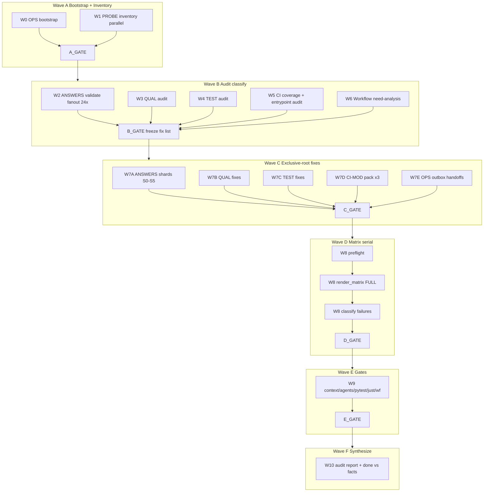

# Plan: Riso Lane PLATFORM — parallel execution blueprint

## 0. Meta

| Field | Value |
|-------|-------|
| Goal slug | `riso-lane-platform` |
| Lane | PLATFORM (Wave 2 integrator) |
| Repo | Riso Copier **maintainer** template (not a rendered app) |
| Facts SSOT | [`facts.md`](./facts.md) |
| Machine DAG | [`plan.taskgraph.json`](./plan.taskgraph.json) (v4 concurrency + locks + shards) |
| First-run mode | **Audit current surfaces** + standing protocol + known backlog |
| Heavy policies accepted | Full matrix after answer changes; investigate **any** red CI but never edit foreign trees |
| Max concurrency | validate×8, answer shards×6, CI modules×3, matrix×1, workflow×1 |

### 0.1 Critique → upgrades

| Gap | Upgrade |
|-----|---------|
| Coarse waves | Leaf IDs `W{wave}.…T{task}` + deps + **JSON taskgraph** |
| Parallel without sharding | Variant shards S0–S5, CI module locks, read-only 24-way validate |
| No integrator | **INTEGRATOR** + merge locks + `FIX_LIST.json` schema |
| No recovery | Ladder R0–R4 |
| No agent prompts | §8 briefs |
| Matrix underspecified | Preflight → full run → classify → **max 1** re-run |
| Coverage vague | Pack of 3 + deferred list in taskgraph |
| No visual DAG | Mermaid + JSON |

### 0.2 `FIX_LIST.json` schema (B_GATE output)

```json
{
  "generated_at": "ISO-8601",
  "matrix_required": false,
  "items": [
    {
      "id": "ans-default-missing-task_runner",
      "owner": "PLATFORM",
      "lock": "L-ANSWERS",
      "shard": "S0",
      "paths": ["samples/default/copier-answers.yml"],
      "action": "set_key",
      "key": "task_runner",
      "value_source": "copier_default|coord_outbox|explicit",
      "verify": ["riso_validate"]
    },
    {
      "id": "foreign-py-quality-task",
      "owner": "PY",
      "lock": null,
      "paths": ["template/files/python/tasks/quality.py.jinja"],
      "action": "outbox",
      "verify": ["outbox_exists"]
    }
  ]
}
```

### 0.3 Full `scripts/ci` leaf inventory (audit classification per module)

Each module gets audit leaf `W5.M.<name>` (read) and optional fix leaf `W7D.M.<name>` (write only if PLATFORM defect + in pack or hot fix).

| Module | Unit test today | First-run action |
|--------|-----------------|------------------|
| `agent_smoke_agents_md.py` | yes | re-run tests if touched |
| `bump_template_npm_deps.py` | no | defer (document) |
| `check_quality_parity.py` | yes | W3 primary |
| `generate_matrix_data.py` | no | **coverage pack W7D.T2** |
| `record_module_success.py` | yes | matrix companion |
| `render_matrix.py` | yes | W8 owner |
| `render_precommit_configs.py` | yes | smoke if precommit path |
| `run_baseline_quickstart.py` | no | defer |
| `run_quality_suite.py` | no | **coverage pack W7D.T1** |
| `sync_template_shadcn_components.py` | no | defer; SAAS handoff if fail |
| `track_doc_publish.py` | yes | leave unless broken |
| `validate_agents_ecosystem.py` | yes | W5.T5 / W9.T2 |
| `validate_dockerfiles.py` | yes | matrix/container path |
| `validate_jinja_templates.py` | no | defer |
| `validate_release_configs.py` | yes | leave unless broken |
| `validate_release_readiness_skill.py` | yes | leave unless broken |
| `validate_saas_combinations.py` | no | defer; SAAS outbox on payload fail |
| `validate_workflows.py` | yes | W9.T6 |
| `verify_context_sync.py` | yes | W5.T4 / W9.T1 |
| `verify_version_sync.py` | no | **coverage pack W7D.T3** |

---

## 1. Solution approach

PLATFORM owns **integration tooling and shared non-language payload**:

| Own (write) | Never write |
|-------------|-------------|
| `scripts/ci/**` | `samples/*/render/**` (regen only) |
| `scripts/render-samples.sh` (+ closely related render entrypoints) | `template/copier.yml`, `hooks/**`, `macros/**`, `module_catalog.json.jinja` |
| `template/files/quality/**` | `template/files/{python,node,go,rust,frontend,electron,tauri}/**` |
| `template/files/testing/**` | `src/riso/**`, `web/**` |
| `samples/*/copier-answers.yml` | lockfiles, secrets |
| `samples/metadata/**` (tool-generated) | unsolicited branches/commits/pushes |
| minimal `.github/workflows/**` glue | inventing Copier keys |

**Method:** inventory → classify (PLATFORM vs foreign) → parallel exclusive-root fixes → batch answer validate → **one** full `render_matrix.py` if answers changed → conditional gates → audit report + outbox.

---

## 2. Team topology (massive parallel)

### 2.1 Roles

| Role | Count | Writes | Responsibility |
|------|------:|--------|----------------|
| **INTEGRATOR** | 1 | ops artifacts, final audit, matrix, workflow glue | DAG scheduling, locks, classification arbitration, Wave D–F |
| **OPS** | 1 | `goals/riso-lane-platform/**` | inbox/outbox/OPERATING/audit markdown |
| **ANSWERS-SHARD-n** | 3–4 | only assigned `samples/<variant>/copier-answers.yml` | drift fix + validate shard |
| **QUAL** | 1 | `template/files/quality/**` | quality fragments + parity |
| **TEST** | 1 | `template/files/testing/**` | testing/e2e helpers |
| **CI-MOD-n** | 3 | one `scripts/ci/<mod>.py` + `tests/unit/ci/test_<mod>.py` | coverage pack |
| **PROBE** | 2–N | none (read-only) | validates, inventories, greps, pytest collect |

### 2.2 Merge locks (hard)

| Lock ID | Resource | Holders | Rule |
|---------|----------|---------|------|
| `L-ANSWERS` | any `copier-answers.yml` | one shard agent per file; no two agents same file | partition by variant set |
| `L-QUAL` | `template/files/quality/**` | QUAL only | |
| `L-TEST` | `template/files/testing/**` | TEST only | |
| `L-CI-<mod>` | pair script+test for module | one CI-MOD agent | different mods parallel |
| `L-MATRIX` | renders + metadata via scripts | INTEGRATOR only | **never** parallel matrix |
| `L-WF` | `.github/workflows/**` | INTEGRATOR only | after script contracts freeze |
| `L-OPS` | goals ops tree | OPS (+ INTEGRATOR finalize) | avoid dual writers on same md |

### 2.3 Variant shards (24 samples)

| Shard | Variants |
|-------|----------|
| **S0** | `default`, `cli-docs`, `ai-tools-off`, `makefile-runner` |
| **S1** | `api-python`, `api-monorepo`, `full-stack`, `rag-enabled` |
| **S2** | `saas-starter`, `mcp-typescript`, `changelog-python`, `changelog-monorepo`, `changelog-full-stack` |
| **S3** | `docs-fumadocs`, `docs-fumadocs-full`, `docs-sphinx`, `docs-docusaurus` |
| **S4** | `go-api`, `go-cli`, `go-mcp`, `electron-app`, `tauri-app` |
| **S5** | `circleci-node`, `gitlab-ci-python` (+ any newly discovered) |

Read-only validate may use **one worker per variant** (24-way). Write fixes use shards S0–S5 (6-way).

---

## 3. Mermaid DAG



---

## 4. Hyperfine task graph

### Wave A — Bootstrap + inventory

#### W0 — OPS bootstrap `[L-OPS]`

| ID | Deps | Type | Task | Verify |
|----|------|------|------|--------|
| **W0.T1** | — | W | `inbox/README.md` + `inbox/_TEMPLATE.md` | template sections: Source, Keys, Variants, Evidence, Done when |
| **W0.T2** | — | W | `outbox/README.md` + `outbox/_TEMPLATE.md` | sections: Owner, Command, Log, Paths, Requested fix, Repro |
| **W0.T3** | — | W | `OPERATING.md` | exclusive/forbidden/triggers/verify/git hygiene |
| **W0.T4** | — | W | `audit/` + `handoffs-draft/` | dirs exist |
| **W0.T5** | W0.T1–4 | W | `SUBAGENT_BRIEFS.md` (short copies of §8) | present |

#### W1 — PROBE inventory (all // )

| ID | Deps | Type | Task | Output |
|----|------|------|------|--------|
| **W1.T1** | — | R | List 24 answer paths | `audit/inventory-variants.txt` |
| **W1.T2** | — | R | `uv run riso prompts --json` (+ key set notes) | `audit/inventory-copier-keys.json` |
| **W1.T3** | — | R | Join `scripts/ci/*.py` vs `tests/unit/ci/test_*.py` | `audit/inventory-ci-coverage.md` |
| **W1.T4** | — | R | `find template/files/quality template/files/testing` | `audit/inventory-payload-files.txt` |
| **W1.T5** | — | R | `rg scripts/ci .github/workflows` | `audit/inventory-workflows.md` |
| **W1.T6** | — | R | Profile distribution `quality_profile`/`task_runner` | `audit/inventory-profiles.md` |
| **W1.T7** | — | R | Pending COORD outbox + PLATFORM inbox | `audit/inventory-inbound.md` |
| **W1.T8** | — | R | Union keys already used in samples (~132 today) | `audit/inventory-answer-key-union.txt` |

**A_GATE:** W0.* + W1.* complete.

---

### Wave B — Audit + classify

#### W2 — Answers validate super-fanout `[read-only, up to 24 workers]`

| ID | Deps | Type | Task | Verify |
|----|------|------|------|--------|
| **W2.T1.\<v\>** | A_GATE | R | For each variant `v`: `uv run riso validate --answers-file samples/<v>/copier-answers.yml --json` | write `audit/validate/<v>.json` |
| **W2.T2** | all W2.T1.* | R | Aggregate failures → table | `audit/answers-drift.md` |
| **W2.T3** | W2.T2 | R | Classify each row: `PLATFORM_FIX` \| `COORD_HANDOFF` \| `IGNORE` | columns in answers-drift.md |
| **W2.T4** | W2.T3 | R | Build patch plan (file → key ops) | `audit/answers-patch-plan.md` |
| **W2.T5** | W2.T4 | R | Partition patch plan into shards S0–S5 | `audit/answers-shards.md` |

**Classification rules**

- Missing key with published default in prompts/copier defaults **and** present in COORD outbox or clearly required by validate → `PLATFORM_FIX`.
- Unknown/extra key or new key without COORD outbox guidance → `COORD_HANDOFF` (do not invent).
- Intentional sample-only optional omissions that validate accepts → `IGNORE`.

#### W3 — QUAL audit `[// W2,W4,W5,W6]`

| ID | Deps | Type | Task | Verify |
|----|------|------|------|--------|
| **W3.T1** | A_GATE | R | `uv run python scripts/ci/check_quality_parity.py` | capture log |
| **W3.T2** | A_GATE | R | `uv run pytest tests/unit/ci/test_check_quality_parity.py -q` | exit 0/fail note |
| **W3.T3** | W3.T1 | R | Review `justfile.quality.jinja`, `makefile.quality.jinja`, `ruff.toml.jinja`, `pylintrc.jinja`, `coverage.cfg.jinja`, `uv_tasks/quality.py.jinja` vs profiles | `audit/quality-review.md` |
| **W3.T4** | W3.T1 | R | If failure path is `template/files/python/tasks/quality.py.jinja` → draft PY handoff | `audit/handoffs-draft/py-quality-task.md` |

#### W4 — TEST audit `[//]`

| ID | Deps | Type | Task | Output |
|----|------|------|------|--------|
| **W4.T1** | A_GATE | R | Map e2e jinja conditions (`quality_profile`, `api_module`, `saas_*`) to samples enabling them | `audit/testing-review.md` |
| **W4.T2** | W4.T1 | R | Flag always-false / broken conditionals / PLATFORM-owned defects | same file |
| **W4.T3** | W4.T1 | R | Product holes → handoff drafts (SAAS/PY/NODE), not fixes | `handoffs-draft/*` |

#### W5 — CI scripts audit `[//]`

| ID | Deps | Type | Task | Output |
|----|------|------|------|--------|
| **W5.T1** | A_GATE | R | `uv run pytest tests/unit/ci/ -q` baseline | log |
| **W5.T2** | W1.T3 | R | Rank untested modules | `audit/COVERAGE_GAPS.md` |
| **W5.T3** | A_GATE | R | `--help` smoke: `render_matrix`, `run_quality_suite`, `generate_matrix_data` | notes in COVERAGE_GAPS |
| **W5.T4** | A_GATE | R | `uv run python scripts/ci/verify_context_sync.py` | classify COORD vs ok |
| **W5.T5** | A_GATE | R | `uv run python scripts/ci/validate_agents_ecosystem.py` | classify |

**Untested modules (current inventory):**
`run_quality_suite`, `generate_matrix_data`, `verify_version_sync`, `validate_jinja_templates`, `validate_saas_combinations`, `run_baseline_quickstart`, `bump_template_npm_deps`, `sync_template_shadcn_components`.

**First-run coverage pack (required progress):** first three in list.

#### W6 — Workflow need-analysis `[//]`

| ID | Deps | Type | Task | Output |
|----|------|------|------|--------|
| **W6.T1** | W1.T5 | R | Map planned script entrypoint changes → existing workflow steps | `audit/workflow-glue.md` |
| **W6.T2** | W6.T1 | R | Decision: `NO_WF_EDIT` (default) or `MINIMAL_WF_EDIT` with exact lines | same |

**B_GATE (INTEGRATOR):** freeze `FIX_LIST.json` with items `{id, owner: PLATFORM|foreign, lock, shard, verify[]}`.

---

### Wave C — Exclusive-root fixes (// by lock)

#### W7A — ANSWERS shards `[L-ANSWERS per file]`

| ID | Deps | Type | Task | Verify |
|----|------|------|------|--------|
| **W7A.T0** | B_GATE | R | INTEGRATOR assigns S0–S5 from patch plan | `audit/answers-shards.md` final |
| **W7A.S\<n\>.T1** | W7A.T0 | W | Apply only `PLATFORM_FIX` rows in shard | diff only assigned variants |
| **W7A.S\<n\>.T2** | W7A.S\<n\>.T1 | R | Re-validate each touched variant in shard | all `riso validate --json` exit 0 |
| **W7A.T3** | all shards | R | INTEGRATOR merges; set `MATRIX_REQUIRED` | `audit/matrix-decision.md` |

#### W7B — QUAL fixes `[L-QUAL // W7A/C/D/E]`

| ID | Deps | Type | Task | Verify |
|----|------|------|------|--------|
| **W7B.T1** | B_GATE | W | Fix PLATFORM-owned quality fragment issues | files only under quality/ |
| **W7B.T2** | W7B.T1 | R | `check_quality_parity.py` + unit test | green or PY outbox |

#### W7C — TEST fixes `[L-TEST //]`

| ID | Deps | Type | Task | Verify |
|----|------|------|------|--------|
| **W7C.T1** | B_GATE | W | Fix PLATFORM-owned testing templates | testing/** only |
| **W7C.T2** | W7C.T1 | R | Note residual foreign gaps | handoff drafts |

#### W7D — CI-MOD coverage pack `[L-CI-<mod> // across mods]`

| ID | Module | Test design sketch | Verify |
|----|--------|--------------------|--------|
| **W7D.T1** | `run_quality_suite.py` | mock subprocess; assert profile `standard`/`strict` selects expected tool stages | `pytest tests/unit/ci/test_run_quality_suite.py -q` |
| **W7D.T2** | `generate_matrix_data.py` | temp metadata inputs → JSON keys `generated_at` / sources | `pytest …/test_generate_matrix_data.py -q` |
| **W7D.T3** | `verify_version_sync.py` | temp files with matching/mismatching versions | `pytest …/test_verify_version_sync.py -q` |
| **W7D.T4** | deferred modules | document intentional skip | COVERAGE_GAPS updated |

#### W7E — Outbox materialization `[L-OPS //]`

| ID | Deps | Type | Task | Verify |
|----|------|------|------|--------|
| **W7E.T1** | B_GATE + drafts | W | Write `outbox/<id>.md` for every foreign item | schema complete, no secrets |
| **W7E.T2** | W7E.T1 | W | Optional: drop pointer into owning lane inbox if exists | no code edits abroad |

**C_GATE:** all PLATFORM fix verifies green; `MATRIX_REQUIRED` decided; outbox complete for known foreign.

---

### Wave D — Full matrix (serial) `[L-MATRIX]`

Accepted policy: **if any answers changed → full matrix**.

| ID | Deps | Type | Task | Verify |
|----|------|------|------|--------|
| **W8.T1** | C_GATE | R | Preflight: `render-samples.sh` present; optional `uv run riso doctor --json` | |
| **W8.T2** | W8.T1 | W* | If `MATRIX_REQUIRED`: `uv run python scripts/ci/render_matrix.py` | process completes; metadata written |
| **W8.T3** | W8.T2 | W* | Optional: `uv run python scripts/ci/generate_matrix_data.py` | if consumers need it |
| **W8.T4** | W8.T2 | R | Parse failures; ownership router → fix PLATFORM or outbox | |
| **W8.T5** | W8.T4 | W*/R | Re-run budget: **max 1** full re-matrix after PLATFORM-only fixes | no infinite loops |
| **W8.T6** | W8.T2 | R | Confirm no hand-edited renders (process attestation in audit) | |

\*Writes only via official scripts.

If `MATRIX_REQUIRED=false`, skip W8.T2–T5 unless human asks or a fix is unprovable without render smoke (document exception).

**D_GATE:** matrix policy satisfied; foreign failures outboxed.

---

### Wave E — Conditional gates + rare WF glue

| ID | Deps | When | Command |
|----|------|------|---------|
| **W9.T1** | D_GATE | context involved or W5.T4 failed for PLATFORM-invokable reasons | `uv run python scripts/ci/verify_context_sync.py` (COORD handoff if SSOT drift) |
| **W9.T2** | D_GATE | agents surfaces / W5.T5 | `uv run python scripts/ci/validate_agents_ecosystem.py` |
| **W9.T3** | D_GATE | any `scripts/ci` change | `uv run pytest tests/unit/ci/ -q` |
| **W9.T4** | D_GATE | broad CI Python edits | `just quality` |
| **W9.T5** | D_GATE | W6 said `MINIMAL_WF_EDIT` | edit workflows under `L-WF` |
| **W9.T6** | W9.T5 | if T5 ran | `uv run python scripts/ci/validate_workflows.py` |

**E_GATE:** applicable commands green or outboxed.

---

### Wave F — Synthesize

| ID | Deps | Task | Output |
|----|------|------|--------|
| **W10.T1** | E_GATE | Write `audit/AUDIT-<YYYYMMDD>.md` | executive summary + tables |
| **W10.T2** | W10.T1 | Map every fact in `facts.md` → evidence or explicit deferral | checklist in audit |
| **W10.T3** | W10.T2 | INTEGRATOR declares done / blocked | session summary |

---

## 5. Ownership router (any red CI)

| Path / symptom | Owner | PLATFORM |
|----------------|-------|----------|
| `scripts/ci/**`, quality/, testing/, sample answers | PLATFORM | fix |
| copier/hooks/macros/catalog/context | COORD | outbox |
| `src/riso/**` | CLI | outbox |
| `template/files/python/**` (incl. tasks/quality) | PY | outbox |
| `node/**` non-saas | NODE | outbox |
| saas / shadcn product | SAAS | outbox |
| go/rust | SYS | outbox |
| electron/tauri | DESKTOP | outbox |
| `web/**` | out of PLATFORM | outbox/ignore |

---

## 6. Recovery ladder

| Level | Trigger | Action |
|-------|---------|--------|
| **R0** | Flaky single validate | re-run once; if still fail, classify |
| **R1** | Shard agent conflict | INTEGRATOR re-partitions variants; restart shard only |
| **R2** | Matrix payload failure | outbox owner; do **not** patch foreign tree; continue other PLATFORM work |
| **R3** | Ambiguous new Copier key | stop answers invention; COORD outbox; leave MATRIX_REQUIRED pending |
| **R4** | Broad `just quality` red in maintainer code PLATFORM owns | fix + pytest; if red in non-owned, outbox |

---

## 7. Verification SSOT

| Gate | Command |
|------|---------|
| Answer file | `uv run riso validate --answers-file samples/<v>/copier-answers.yml --json` |
| Full matrix | `uv run python scripts/ci/render_matrix.py` |
| Quality parity | `uv run python scripts/ci/check_quality_parity.py` |
| CI units | `uv run pytest tests/unit/ci/ -q` |
| Broad quality | `just quality` |
| Context | `uv run python scripts/ci/verify_context_sync.py` |
| Agents | `uv run python scripts/ci/validate_agents_ecosystem.py` |
| Workflows | `uv run python scripts/ci/validate_workflows.py` |

Single-variant render (debug only, not a substitute for full matrix policy):
`./scripts/render-samples.sh --variant NAME --answers samples/NAME/copier-answers.yml`

---

## 8. Subagent brief templates (paste into spawns)

### 8.1 Common preamble (every agent)

```text
You are a PLATFORM subagent for Riso maintainer repo.
Hard rules: no branches/commits/pushes unless human asked; uv run for Python;
no lockfile edits; no secrets; no inventing Copier keys; never hand-edit samples/*/render/;
never edit template/copier.yml, hooks, macros, catalog, src/riso, language trees, web.
If root cause is outside your write root: write handoff draft under
goals/riso-lane-platform/audit/handoffs-draft/ and stop that path.
Your exclusive write root: <ROOT>. Do not write elsewhere.
Return: changed files, commands run, exit codes, open handoffs.
```

### 8.2 ANSWERS-SHARD

```text
Write root: only samples/<variants in shard>/copier-answers.yml
Input: audit/answers-shards.md + answers-patch-plan.md
Do only PLATFORM_FIX rows. Re-validate each touched file with riso validate --json.
```

### 8.3 QUAL / TEST / CI-MOD

```text
QUAL write root: template/files/quality/**
TEST write root: template/files/testing/**
CI-MOD write root: scripts/ci/<mod>.py + tests/unit/ci/test_<mod>.py only
Run listed verify commands before returning.
```

### 8.4 PROBE (read-only)

```text
Write root: NONE (except optional audit/*.json logs if integrator allows audit/ writes).
Prefer writing under goals/riso-lane-platform/audit/ only.
```

---

## 9. Known backlog packs

| Pack | Tasks | Done when |
|------|-------|-----------|
| **B1 Answer currency** | W2, W7A, W8 | drift fixed or COORD-outboxed; validates green; matrix if changed |
| **B2 CI coverage** | W5, W7D | top-3 modules tested or deferred documented |
| **B3 Quality/testing** | W3, W4, W7B, W7C | parity green or PY handoff; testing review filed |
| **B4 Ops protocol** | W0, W7E, W10 | durable inbox/outbox/OPERATING/audit |

---

## 10. Definition of done (first `/goal`)

1. Ops artifacts + audit report exist.
2. Answers: all `PLATFORM_FIX` applied; validates green; `COORD_HANDOFF` outboxed.
3. `MATRIX_REQUIRED` honored with full `render_matrix.py` when true.
4. Quality parity green or PY handoff.
5. Coverage pack progressed (3 modules or documented).
6. Foreign issues only as outbox.
7. No hand-edited renders; no foreign tree edits; no unsolicited git mutation.
8. Wave E commands run as applicable.
9. Every `facts.md` line evidenced or explicitly deferred.

---

## 11. INTEGRATOR runbook (first 15 minutes)

1. Load `plan.taskgraph.json` concurrency + shard maps.
2. Spawn OPS (W0) + PROBE inventory (W1) in parallel.
3. On A_GATE: spawn W2 validate fanout (**max 8** concurrent), W3, W4, W5, W6.
4. Freeze `FIX_LIST.json` (§0.2); spawn W7A shards (≤6) + W7B + W7C + W7D×3 + W7E.
5. Sole owner of W8 matrix (`maxConcurrency.matrix = 1`).
6. W9 gates → W10 audit → stop.

**Do not** start matrix until answers shards re-validate.
**Do not** open a second matrix agent.
**Do not** exceed taskgraph concurrency caps without human override.

## 12. Parallelism proof checklist (for gate reviewers)

- [x] Machine-readable DAG: `plan.taskgraph.json`
- [x] Explicit locks for every write class
- [x] 24-way read validate + 6-way answer write shards
- [x] 3-way CI module coverage pack in parallel
- [x] Serial matrix + serial workflow glue
- [x] Subagent briefs + recovery ladder
- [x] FIX_LIST schema + per-script inventory
- [x] Mermaid wave graph
- [x] Foreign ownership router (investigate any red CI, never foreign edits)
