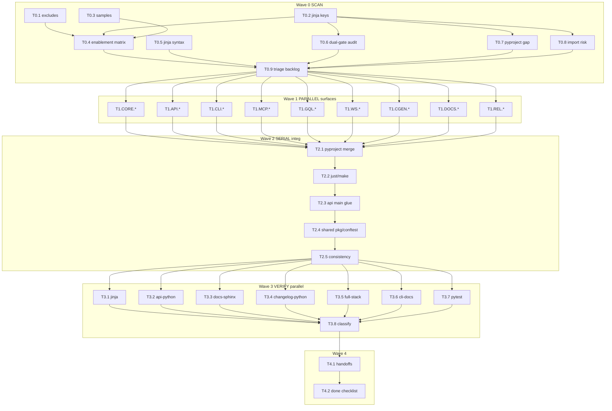

# Plan — Riso Lane PY (v3 · research-backed · parallel task graph)

## 0. Critique of prior plan (why v3)

| Gap in v2 | Fix in v3 |
|-----------|-----------|
| Task graph was surface-sized, not file-cluster sized | Hyperfine clusters + explicit DAG edges |
| Under-specified merge protocol for `pyproject.toml.jinja` | Section-level ownership + single-writer merge queue |
| Weak on real repo behavior of `api_features` | Research: hooks derive `websocket_module` / `graphql_api_module`; Jinja dual-gates are defense-in-depth |
| “Absolute imports” risked mass-churn of valid package-relative imports | Soft rule: package-internal relative OK; cross-package use absolute `{{ package_name }}…` |
| No recovery ladder / agent budget | §8 recovery + §9 budget |
| No machine-readable DAG | §5 Mermaid + §6 task table with IDs |
| Verification not mapped to fact IDs | §7 maps every automated fact |

---

## 1. Goal & non-negotiables

**Write root:** `template/files/python/**` only.
**Also allowed:** `goals/riso-lane-py/**` (handoffs, scratch, this plan).
**Never write:** copier/hooks/macros/module_catalog, other language trees, samples/**, src/riso/**, web/**, lockfiles, secrets.
**Git:** no branch/worktree/commit/push unless human asks.
**Python:** `uv run` only.
**Keys:** never invent; handoff to COORD at `goals/riso-lane-py/handoffs/`.

**Facts:** [`facts.md`](./facts.md) — mission = health + harden + targeted; all surfaces in scope; standard verify = Jinja + `riso validate` + narrow pytest.

---

## 2. Research findings (codebase-grounded)

### 2.1 Tree shape (~157 files)

| Cluster | Path | ~files | Parallel-safe? |
|---------|------|--------|----------------|
| Pack/quality | `pyproject.toml.jinja`, just/Makefile, ruff, coverage, pylint, `tasks/` | ~10 | **Serial** except `tasks/`+ruff/coverage can parallel if not touching pyproject |
| API | `src/{{ package_name }}/api/**` | ~20 | Yes |
| CLI | `src/.../cli/**` + `tests/test_cli*.jinja` | ~25 | Yes |
| MCP | `mcp/**` | ~13 | Yes |
| GQL | `graphql_api/**` + `tests/graphql/**` | ~25 | Yes |
| WS | `websocket/**` + `tests/websocket/**` + **`api/websocket_endpoints.py.jinja`** | ~15 | Yes (endpoints exclusive to WS) |
| CGEN | `codegen/**` + `tests/codegen/**` | ~36 | Yes |
| DOCS | `docs/**` | ~19 | Yes |
| REL | `release/**` | ~3 | Yes |
| Shared pkg | `__init__.py`, `config.py`, `logging.py`, `quickstart.py` | 4 | **Serial (INTEG)** |
| Shared tests | `tests/conftest.py.jinja`, smoke/quickstart | few | **Serial after surfaces** |

### 2.2 Enablement matrix (read-only contract)

| Payload | On when | Mechanism |
|---------|---------|-----------|
| Whole `python/` tree | CLI/API/MCP selects python **or** Sphinx docs | COORD `_exclude` |
| `python/mcp/` | `mcp_module` + python in `mcp_languages` | COORD `_exclude` |
| `python/docs/` | Sphinx-Shibuya | COORD `_exclude` |
| WS dirs + endpoints | WS feature + python API | COORD `_exclude` |
| GQL dirs | GraphQL feature + python API | COORD `_exclude` |
| `python/release/` | `changelog_module` | COORD `_exclude` |
| just vs Makefile | `task_runner` | COORD `_exclude` |
| In-file API body vs stub | `api_module` + python in `api_languages` | **PY Jinja** (`api/main.py.jinja`) |
| In-file GQL/WS hooks in main | dual: legacy module **or** `feature in api_features` | **PY Jinja** |
| CLI scripts entry | `cli_module` + python in `cli_languages` | **PY** pyproject |
| setuptools `mcp` package | `mcp_module` + python | **PY** pyproject |

### 2.3 `api_features` truth (important)

- Samples often use scalar YAML: `none`, `websocket`, or `graphql,websocket`.
- **Hooks** (`template/hooks/pre_gen_project.py::normalize_api_feature_modules`) derive `graphql_api_module` / `websocket_module` from `api_features` before render (substring `feature in raw` for strings; membership for lists).
- **Maintainer** `src/riso/core/generation_gates.normalize_api_features` is stricter (splits commas, drops `none`) — used by CLI validate path, **not** identical to hook string-`in` logic.
- **Implication for PY:** dual-gates using **both** `websocket_module == "enabled"` **and** `"websocket" in api_features` are correct defense-in-depth. Prefer keeping dual-gates. Do **not** invent a new answer key; if stricter list-safe Jinja helper is needed, **COORD handoff** (macro or pre-normalized list in context).

### 2.4 Style facts (avoid thrash)

- Package-internal relative imports (`from .config`, `from ..models`) are pervasive and idiomatic; **do not mass-rewrite**.
- “Absolute imports” fact → enforce for **cross-package** and for imports of `{{ package_name }}.…` from tests/docs examples; leave intra-package relatives.
- `python/justfile.jinja` currently only `import '../quality/justfile.quality'` — quality recipes live in QUAL tree (read-only for PY). PY must not edit `template/files/quality/**`; only ensure the import path / any python-local recipes stay valid.

### 2.5 Packaging observations

- Optional groups `cli`, `api_python`, `websocket`, `mcp` are **always declared** in pyproject; only `graphql_api` and `codegen` are Jinja-gated. Always-on optional groups are acceptable for uv; only change if a group causes install breakage when unused.
- MCP setuptools include is correctly gated; mirror that pattern for any new package roots (via proposal → INTEG).

### 2.6 Sample coverage holes

| Combo | Sample | Notes |
|-------|--------|-------|
| API python | `api-python` | primary |
| Sphinx | `docs-sphinx` | docs + API |
| CLI + API + Sphinx | `changelog-python` | |
| CLI + API + WS + MCP | `full-stack` | best multi-feature |
| CLI only-ish | `cli-docs` | |
| GraphQL | **weak** | `changelog-full-stack` has `graphql,websocket` (PLATFORM); PY still Jinja-checks GQL tree |
| makefile runner | `makefile-runner` | task_runner |

---

## 3. Parallel architecture

### 3.1 Roles

| Role | Count | Writes |
|------|------:|--------|
| SCAN | 1–3 read-only | `goals/riso-lane-py/scratch/**` only |
| Surface agents | up to 9 | exclusive roots only |
| INTEG | **1 serial** | hotspots + final merge |
| VERIFY | 1–N read-mostly | none (or only scratch) |

### 3.2 Exclusive write map (hard)

```
CORE     → tasks/**, ruff.toml*, coverage.cfg.jinja, .pylintrc.jinja
API      → src/{{ package_name }}/api/**  MINUS websocket_endpoints.py.jinja
CLI      → src/{{ package_name }}/cli/**, tests/test_cli*.jinja
MCP      → mcp/**
GQL      → src/{{ package_name }}/graphql_api/**, tests/graphql/**
WS       → src/{{ package_name }}/websocket/**, tests/websocket/**,
           src/{{ package_name }}/api/websocket_endpoints.py.jinja
CGEN     → src/{{ package_name }}/codegen/**, tests/codegen/**
DOCS     → docs/**
REL      → release/**
TESTX    → tests/smoke_test.py, tests/test_quickstart.py.jinja,
           tests/api/** (if not claimed—prefer API owns tests/api/**)
API+     → tests/api/**   (assign to API, not TESTX)

INTEG    → pyproject.toml.jinja, justfile.jinja, Makefile.jinja,
           src/{{ package_name }}/{__init__,config,logging,quickstart}.py.jinja,
           tests/conftest.py.jinja
```

**Forbidden:** two agents open the same file. Proposals go to `goals/riso-lane-py/scratch/proposals/<agent>-<topic>.md`.

### 3.3 pyproject section merge protocol (INTEG)

Treat `pyproject.toml.jinja` as ordered sections; apply proposals in this order only:

1. `[project]` metadata / requires-python
2. `[project.scripts]` / entry-points (CLI, codegen)
3. `[dependency-groups]` — merge keys alphabetically within group; never delete a group another surface needs
4. `[tool.*]` (pytest, taskipy, ty)
5. `[tool.setuptools.*]` (MCP vs non-MCP branches)

Each proposal must list: **section**, **diff intent**, **gates**, **surface**.

---

## 4. Wave model

```text
W0 SCAN ──► W1 SURFACES (parallel) ──► W2 INTEG (serial) ──► W3 VERIFY (parallel) ──► W4 HANDOFF
                │                              ▲
                └── proposals ─────────────────┘
         verify fail (PY) ──► micro W1 owner ──► W2 if hotspot ──► W3
         verify fail (contract) ──► W4 handoff only
```

---

## 5. DAG (Mermaid)



---

## 6. Hyperfine task graph (IDs stable for orchestrators)

**Columns:** ID · Task · Owner · Deps · Par group · Writes · Verify · Fact

### Wave 0 — SCAN (read-only; writes only under `goals/riso-lane-py/scratch/`)

| ID | Task | Owner | Deps | Par | Writes | Verify | Fact |
|----|------|-------|------|-----|--------|--------|------|
| T0.1 | Extract all `_exclude` lines mentioning `python/` from `template/copier.yml` into matrix | SCAN | — | A | scratch | file exists | — |
| T0.2 | Catalog Jinja answer keys under `python/**` (frequency) | SCAN | — | A | scratch | — | — |
| T0.3 | Snapshot python-heavy sample answer combos | SCAN | — | A | scratch | — | — |
| T0.4 | Build enablement matrix: sample × expected paths × in-file gates | SCAN | T0.1–T0.3 | B | `scratch/enablement-matrix.md` | reviewed | jinja-gates-align |
| T0.5 | Run Jinja syntax on all `python/**/*.jinja` | SCAN | — | A | scratch log | exit 0 or fail list | verify-jinja |
| T0.6 | Dual-gate audit GQL/WS (every consumer uses module ∨ api_features) | SCAN | T0.2 | B | scratch | no missing dual where needed | feature-gated-payload |
| T0.7 | pyproject gap: scripts/groups/setuptools vs surfaces | SCAN | T0.2 | B | scratch | — | — |
| T0.8 | Cross-import risk: always-on files hard-import optional surfaces | SCAN | T0.2 | B | scratch | — | feature-gated-payload |
| T0.9 | Triage backlog: tag PY-surface / INTEG / COORD / PLATFORM; priority P0–P2 | INTEG | T0.4–T0.8 | — | `scratch/backlog.md` | every defect tagged | mission-full |

### Wave 1 — surfaces (parallel by Par=C)

#### CORE

| ID | Task | Deps | Writes | Verify |
|----|------|------|--------|--------|
| T1.CORE.1 | `tasks/quality.py.jinja` + `__init__` align with quality expectations | T0.9 | `tasks/**` | jinja parse |
| T1.CORE.2 | `ruff.toml.jinja` / `ruff.toml` / `coverage.cfg.jinja` / `.pylintrc.jinja` | T0.9 | those files | jinja parse |
| T1.CORE.3 | Proposal: just/Makefile only if python-local recipes needed (usually import QUAL only) | T1.CORE.1 | proposal | — |

#### API

| ID | Task | Deps | Writes | Verify |
|----|------|------|--------|--------|
| T1.API.1 | `api/main.py.jinja` stub vs live gate correctness | T0.9 | main | jinja |
| T1.API.2 | middleware + config + models + routes | T0.9 | those dirs | jinja |
| T1.API.3 | `tests/api/**` gates/fixtures match API | T1.API.2 | `tests/api/**` | jinja |
| T1.API.4 | Proposal: `api_python` / `api_python_test` groups, GQL mount already in main | T1.API.1 | proposal | — |

#### CLI

| ID | Task | Deps | Writes | Verify |
|----|------|------|--------|--------|
| T1.CLI.1 | `cli/core/**` + `__main__` | T0.9 | core | jinja |
| T1.CLI.2 | `cli/commands/**` + plugins | T0.9 | commands/plugins | jinja |
| T1.CLI.3 | `tests/test_cli*.jinja` | T1.CLI.1–2 | tests | jinja |
| T1.CLI.4 | Proposal: `[project.scripts]` + cli group + entry-points | T1.CLI.1 | proposal | — |

#### MCP

| ID | Task | Deps | Writes | Verify |
|----|------|------|--------|--------|
| T1.MCP.1 | `mcp/server.py.jinja` + config/errors/`__main__` | T0.9 | root mcp | jinja |
| T1.MCP.2 | tools/resources/prompts | T0.9 | subdirs | jinja |
| T1.MCP.3 | Proposal: setuptools mcp mapping + mcp dep group | T1.MCP.1 | proposal | — |

#### GQL

| ID | Task | Deps | Writes | Verify |
|----|------|------|--------|--------|
| T1.GQL.1 | schema/types/queries/mutations/subscriptions | T0.9 | gql src | dual-gate + jinja |
| T1.GQL.2 | context/auth/dataloaders/errors/complexity/main | T0.9 | gql src | jinja |
| T1.GQL.3 | `tests/graphql/**` | T1.GQL.1–2 | tests | jinja |
| T1.GQL.4 | Proposal: graphql_api dep group gates | T1.GQL.1 | proposal | — |

#### WS

| ID | Task | Deps | Writes | Verify |
|----|------|------|--------|--------|
| T1.WS.1 | websocket package modules | T0.9 | websocket/** | dual-gate + jinja |
| T1.WS.2 | `api/websocket_endpoints.py.jinja` exclusive | T0.9 | that file | jinja |
| T1.WS.3 | `tests/websocket/**` | T1.WS.1 | tests | jinja |
| T1.WS.4 | Proposal: main.py import/setup lines + websocket deps | T1.WS.2 | proposal | — |

#### CGEN

| ID | Task | Deps | Writes | Verify |
|----|------|------|--------|--------|
| T1.CGEN.1 | engine/models/cli | T0.9 | codegen core | jinja |
| T1.CGEN.2 | generation/templates/quality/updates/utils | T0.9 | rest | jinja |
| T1.CGEN.3 | `tests/codegen/**` | T1.CGEN.1–2 | tests | jinja |
| T1.CGEN.4 | Proposal: scaffold script + codegen group | T1.CGEN.1 | proposal | — |

#### DOCS / REL

| ID | Task | Deps | Writes | Verify |
|----|------|------|--------|--------|
| T1.DOCS.1 | `docs/conf.py.jinja` + index/guides | T0.9 | docs | jinja |
| T1.DOCS.2 | static assets only if broken refs | T0.9 | `_static` if needed | — |
| T1.DOCS.3 | Proposal: docs dependency-group pins | T1.DOCS.1 | proposal | — |
| T1.REL.1 | `release/**` changelog helpers | T0.9 | release | jinja |

**Wave 1 exit criteria:** each owner’s root Jinja-parses; proposals filed; no hotspot edits.

### Wave 2 — INTEG serial

| ID | Task | Deps | Writes | Verify |
|----|------|------|--------|--------|
| T2.1 | Merge all pyproject proposals (section order §3.3) | all T1.* | `pyproject.toml.jinja` | jinja parse |
| T2.2 | justfile/Makefile — only if proposals require (else no-op) | T2.1, T1.CORE.3 | just/Makefile | jinja |
| T2.3 | Apply WS/GQL integration proposals to `api/main.py.jinja` **only if** API agent did not already land them; prefer API owns main, INTEG applies only leftover | T1.API.1, T1.WS.4, T1.GQL.* | main if needed | dual-gate intact |
| T2.4 | Shared `config`/`logging`/`quickstart`/`__init__`/`tests/conftest` | T2.1–T2.3 | shared | jinja |
| T2.5 | Repo-wide consistency: no new keys; dual-gates; style soft rules | T2.4 | python/** as needed | checklist |

### Wave 3 — VERIFY (maps to automated facts)

| ID | Task | Deps | Par | Command | Fact |
|----|------|------|-----|---------|------|
| T3.1 | Jinja all python | T2.5 | D | `find template/files/python -name '*.jinja' -print0 \| xargs -0 uv run python scripts/ci/validate_jinja_templates.py` | verify-jinja, jinja-gates-align |
| T3.2 | validate api-python | T2.5 | D | `uv run riso validate --answers-file samples/api-python/copier-answers.yml --json` | verify-riso-validate |
| T3.3 | validate docs-sphinx | T2.5 | D | docs-sphinx | verify-riso-validate |
| T3.4 | validate changelog-python | T2.5 | D | changelog-python | verify-riso-validate |
| T3.5 | validate full-stack | T2.5 | D | full-stack | verify-riso-validate, feature-gated-payload |
| T3.6 | validate cli-docs | T2.5 | D | cli-docs | verify-riso-validate |
| T3.7 | narrow pytest | T2.5 | D | `uv run pytest tests/integration/test_template_rendering.py tests/unit/test_task_runner_templates.py tests/unit/test_template_validate.py -q -n 0` | verify-narrow-pytest |
| T3.8 | Classify failures → PY fix / COORD / PLATFORM | T3.1–T3.7 | — | failure matrix | coord-handoffs-dir |

Optional stretch (not default done): `uv run riso validate --answers-file samples/changelog-full-stack/copier-answers.yml --json` for GraphQL sample path.

### Wave 4 — HANDOFF + CLOSE

| ID | Task | Deps | Writes |
|----|------|------|--------|
| T4.1 | Write `handoffs/*.md` for every non-PY failure | T3.8 | handoffs/ |
| T4.2 | Done checklist vs facts.md | T4.1 | — |
| T4.3 | Confirm no out-of-root writes / no unauthorized git | T4.2 | — |

---

## 7. Verification SSOT

```bash
find template/files/python -name '*.jinja' -print0 | xargs -0 uv run python scripts/ci/validate_jinja_templates.py

uv run riso validate --answers-file samples/api-python/copier-answers.yml --json
uv run riso validate --answers-file samples/docs-sphinx/copier-answers.yml --json
uv run riso validate --answers-file samples/changelog-python/copier-answers.yml --json
uv run riso validate --answers-file samples/full-stack/copier-answers.yml --json
uv run riso validate --answers-file samples/cli-docs/copier-answers.yml --json

uv run pytest tests/integration/test_template_rendering.py \
  tests/unit/test_task_runner_templates.py \
  tests/unit/test_template_validate.py -q -n 0
```

---

## 8. Recovery ladder

1. **Syntax fail (T3.1)** → owning surface re-opens Wave 1 for that path only.
2. **validate fail, message points at python Jinja** → same.
3. **validate fail, missing key / hook / exclude** → stop writing payload; T4.1 COORD handoff.
4. **validate fail, sample answers** → PLATFORM handoff (e.g. `api_features` encoding).
5. **pytest fail in task_runner** → may need QUAL read + CORE/INTEG; still no writes outside python/.
6. **Agent thrash on pyproject** → freeze surfaces; only INTEG edits; re-queue proposals.
7. **Budget exhausted** → ship P0 health (T0 + T3.1 + T3.2 + critical API/CLI) + handoffs for rest.

---

## 9. Agent budget guidance

| Mode | Agents | Notes |
|------|-------:|-------|
| Solo `/goal` | 1 | Sequential W0→W1 order: CORE→API→CLI→MCP→WS→GQL→CGEN→DOCS→REL→W2→W3→W4 |
| Small team | 4 | CORE+INTEG serial person; parallel API+CLI+MCP; then WS+GQL; then CGEN+DOCS+REL |
| Full fan-out | 10 | 9 surfaces + INTEG; SCAN can be same as INTEG |
| Max useful parallel W1 | 9 | Hard cap: exclusive roots |

Rough leaf count: **~45 named tasks**; many are tiny. Orchestrators should batch T1.*.1–3 per surface into one agent call.

---

## 10. Subagent prompt stub

```
Role: PY sub-lane <ID>
WRITE: <exclusive paths only>
READ: copier.yml, hooks, macros, module_catalog, samples answers, tests, docs, scripts/ci, rest of python/ (RO)
NEVER: invent keys; edit contracts; samples; lockfiles; secrets; git push/branch/commit
Dual-gates: keep websocket_module/graphql_api_module OR api_features checks
Style: no mass relative-import rewrites; absolute for cross-package
Output: files touched, residual defects, proposals under goals/riso-lane-py/scratch/proposals/
```

---

## 11. Handoff template

`goals/riso-lane-py/handoffs/<topic>.md`:

- Need / Why PY / Proposed contract / Consuming python paths / Evidence / Owner (COORD|PLATFORM)

Likely early handoffs (hypotheses, not yet proven):

1. Normalize `api_features` in **hook** context to a list (align with `normalize_api_features`) — COORD
2. Add/ensure sample with GraphQL for PLATFORM matrix — PLATFORM
3. Any `_exclude` miss discovered in T0.4 — COORD

---

## 12. Done checklist

- [x] Write root honored
- [x] T3.1 green
- [x] T3.2–T3.6 green or handoffs
- [x] T3.7 green or handoffs
- [x] Dual-gates preserved
- [x] No invented keys
- [x] Handoffs complete
- [x] facts.md satisfied
- [x] No unauthorized git/lock/secret/render edits

## Deviations

- Packaged dual-gate structural checker under `goals/riso-lane-py/scripts/` (goal package write root) instead of maintainer `tests/` (out of PY write scope).
- Added scratch `riso copy` smoke (cli-docs/full-stack) beyond plan’s standard bar; api-python copy hit non-TTY hook OSError (environment/hooks — not payload syntax).

---

## 13. Out of scope

Node/Fumadocs/Docusaurus/SaaS, Go/Rust, desktop, FE, QUAL write tree, `src/riso`, web/, sample answers/render, COORD contracts. Reading QUAL for justfile import parity is OK.
