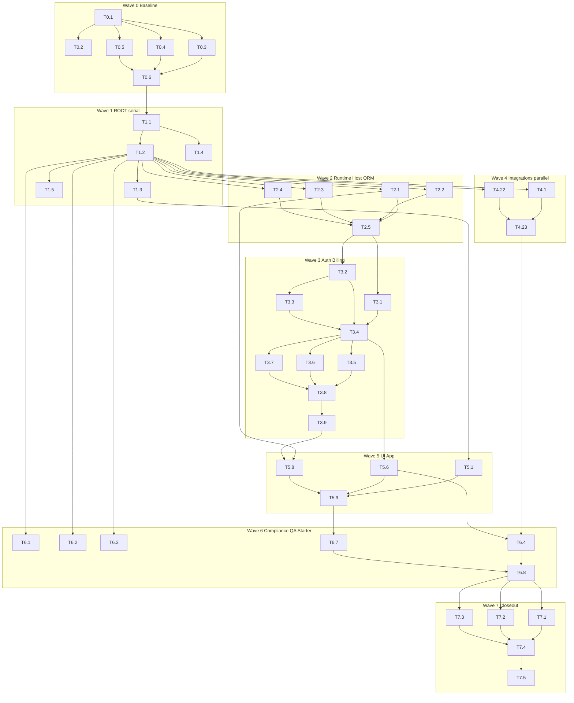

# Plan — Riso Lane SAAS (`riso-lane-saas`)

## Solution approach

Execute a **full module sweep** of the exclusive SAAS write roots:

- `template/files/node/saas/**` (~193 files)
- `template/files/saas-starter/**` (config + README)

…using a **wave-based, massively parallel subagent model** with **exclusive write sub-roots**, a **serial shared-root lock** for collision files, and a **strict 11-variant + combination + jinja** verification closeout.

### Non-negotiables (facts)

| Rule | Detail |
|------|--------|
| Write only | `template/files/node/saas/**`, `template/files/saas-starter/**` |
| Never write | `copier.yml`, hooks, macros, catalog, non-SaaS node, python/go/rust/frontend/desktop, `src/riso/**`, `web/**`, sample answers, `samples/*/render/**` |
| No git ops | branches / worktrees / commits / pushes unless human asks |
| No secrets / lock hand-edits | never print secrets; never hand-edit `uv.lock` / `pnpm-lock.yaml` |
| Tooling | `uv run` for Python; `pnpm` only for SaaS package surfaces when needed |
| Contracts | COORD handoffs only → `goals/riso-lane-saas/handoffs/*.md` |

### Layering contract (read-only; COORD owns schema)

From `template/copier.yml` (do not edit):

```
saas_infra_module
  → runtime / hosting / database / orm / storage / cicd / observability / many app flags
  → saas_auth_module → saas_auth_provider / 2fa / enterprise_bridge
    → saas_billing_module → saas_billing_provider
      → saas_app_module → jobs / email / analytics / …
```

Path-level exclusion already removes whole trees when infra off:

- `node/saas/`
- `saas-starter/`

Shadcn UI primitives are further excluded by COORD `_exclude` rows when `saas_ui_framework != 'shadcn-ui'`. SAAS still keeps file-level Jinja gates coherent where present and proposes COORD handoffs if exclusion gaps appear.

### Parallelization model (subagent teams)

**One SAAS lead** retains ownership of shared collision files. Optional internal fan-out uses **exclusive write sub-roots** (not freestanding agent dims that cross `package.json`):

| Sub-lane ID | Exclusive write roots (under `node/saas/`) | Serial dependency |
|-------------|---------------------------------------------|-------------------|
| `ROOT` | `package.json.jinja`, `tsconfig.json.jinja`, `components.json.jinja`, root Docker/README/CONTRIBUTING, `.env.example.jinja`, `config/**` | Always serial; lead-only |
| `RT-NEXT` | `runtime/nextjs/**` | After ROOT baseline |
| `RT-REMIX` | `runtime/remix/**` | After ROOT baseline; parallel with RT-NEXT |
| `HOST` | `hosting/**` | After ROOT; parallel with RT-* |
| `ORM` | `integrations/orm/**` | After ROOT; coordinates with ROOT package scripts |
| `AUTH` | `integrations/auth/**` | After ORM schema shapes known; parallel OK with HOST |
| `BILL` | `integrations/billing/**` | After AUTH surface stable |
| `INT-*` | each `integrations/{email,jobs,ai,analytics,storage,uploads,realtime,search,security,feature-flags,scheduler,api-docs,observability,marketing,compliance}/**` leaf | After ROOT; most INT-* parallel; any that edit ROOT must queue |
| `UI` | `components/**`, `content/**`, `i18n/**`, `lib/blog/**`, parts of `lib/multi-tenant/**` not shared | After ROOT; parallel with most INT |
| `APP` | `app/**`, `api/**` | After RT + AUTH + BILL as needed |
| `COMP` | `compliance/**` | Parallel late wave |
| `QA` | `tests/**`, `scripts/**`, `.github/**` under saas | After providers it tests |
| `STARTER` | `template/files/saas-starter/**` | After ROOT + major layers documented |

**Hard collision rule:** only one writer at a time on:

- `package.json.jinja`
- `tsconfig.json.jinja`
- `components.json.jinja`
- `config/env.ts.jinja`
- `lib/utils.ts.jinja`
- shared `lib/multi-tenant/**` entrypoints if multiple sub-lanes need them → serialize via lead merge queue

**Subagent dispatch pattern:**

1. Lead runs Wave 0 baseline (read + evidence).
2. Lead applies ROOT fixes serially.
3. Fan-out Wave 1+ with one subagent per exclusive sub-root (prompt includes: owned paths only, forbidden paths, verification commands, handoff path).
4. Lead merges ROOT dependency PRs/patches from subagents as **proposal notes** if they need package.json changes — subagents **must not** edit ROOT; they file `handoffs/root-dep-<id>.md` for lead.
5. Lead re-runs strict matrix after each wave (or continuous on lead).

### Technology matrix anchors (strict verification)

`scripts/ci/validate_saas_combinations.py` matrix dimensions:

| Dimension | Values |
|-----------|--------|
| runtime | nextjs-16, remix-2 |
| hosting | vercel, cloudflare |
| database | neon, supabase |
| orm | prisma, drizzle |
| auth | clerk, authjs |
| billing | stripe, paddle |
| jobs | triggerdev, inngest |
| email | resend, postmark |
| analytics | posthog, amplitude |
| ai | openai, anthropic |
| storage | r2, supabase-storage |
| cicd | github-actions, cloudflare-ci |

**Error rule SAAS templates must respect:** neon + supabase-storage incompatible.  
**Required rule:** billing implies auth.  
**Sample answers (PLATFORM-owned, 11 variants):** all-in-one, b2b-teams-full, b2c-consumer-app, edge-optimized, enterprise-ready, nextjs-vercel-neon-clerk, nextjs-vercel-neon-clerk-workos, nextjs-vercel-supabase-clerk, prelaunch-waitlist, remix-cloudflare-neon-drizzle, vercel-starter.

### COORD handoff template

Path: `goals/riso-lane-saas/handoffs/<kebab-title>.md`

```markdown
# COORD handoff: <title>
- Need:
- Proposed saas_* keys / when / _exclude / catalog rows:
- Why not fixable in node/saas or saas-starter alone:
- Affected samples/variants:
- Verification after COORD applies:
- Owner: SAAS → COORD
```

---

## Hyperfine task graph

IDs are stable for `/goal` execution tracking. `P` = parallelizable with siblings of same wave when write roots disjoint. `S` = serial / lead-only.

### Legend

```
[Wave N] task-id  (S|P)  → writes; depends: … ; verify: …
```

### Wave 0 — Baseline & inventory (lead, S)

| ID | Mode | Work | Depends | Verify |
|----|------|------|---------|--------|
| `T0.1` | S | Create `goals/riso-lane-saas/handoffs/`, optional `evidence/` | — | dirs exist |
| `T0.2` | S | Inventory file counts by sub-root; list unguarded / thinly gated files | T0.1 | inventory note |
| `T0.3` | P* | `riso validate --json` all 11 sample answer files → `evidence/validate-baseline.jsonl` | T0.1 | 11 results captured (*parallel per variant OK; read-only) |
| `T0.4` | S | `validate_saas_combinations.py --json` → evidence | T0.1 | exit recorded |
| `T0.5` | S | `validate_jinja_templates.py` on owned paths → evidence | T0.1 | exit recorded |
| `T0.6` | S | Diff baseline failures → classify: SAAS-owned vs COORD vs PLATFORM | T0.3–T0.5 | triage table in evidence |

\*T0.3 fan-out: 11 read-only validate workers.

### Wave 1 — Shared ROOT lock (lead, S)

| ID | Mode | Work | Depends | Verify |
|----|------|------|---------|--------|
| `T1.1` | S | Audit `package.json.jinja`: runtime/ORM/auth/billing/provider branches vs TECHNOLOGY_MATRIX + sample answers | T0.6 | matrix coverage checklist |
| `T1.2` | S | Fix broken scripts (`dev`/`build`/`db:*`/`test*`/`postinstall`) for nextjs-16 vs remix-2 and prisma vs drizzle | T1.1 | jinja ok; conditional review |
| `T1.3` | S | Align `tsconfig.json.jinja`, `components.json.jinja`, Docker/compose, root README/CONTRIBUTING gates | T1.1 | jinja ok |
| `T1.4` | S | Audit `config/env.ts.jinja` + `.env.example.jinja` for provider env keys (no secret values) | T1.1 | env keys match integrations |
| `T1.5` | S | Emit COORD handoffs for missing/extra answer enums vs template providers | T1.1–T1.4 | handoff files or none |

### Wave 2 — Runtime + hosting + ORM (max parallel)

| ID | Mode | Sub-lane | Write root | Depends | Work | Verify |
|----|------|----------|------------|---------|------|--------|
| `T2.1` | P | RT-NEXT | `runtime/nextjs/**` | T1.2 | App router shells, admin/marketing, health/blog APIs, next-only tests/docs/lib | jinja; nextjs samples |
| `T2.2` | P | RT-REMIX | `runtime/remix/**` | T1.2 | Remix routes/entry; remix vs next isolation | jinja; remix sample |
| `T2.3` | P | HOST | `hosting/**` | T1.2 | vercel + cloudflare configs; hosting×runtime notes | jinja; edge + vercel samples |
| `T2.4` | P | ORM | `integrations/orm/**` | T1.2 | prisma + drizzle schemas/seeds/paths match package.json prisma key | jinja; both ORMs |
| `T2.5` | S | ROOT | `package.json.jinja` only if T2.* filed root-dep | T2.1–T2.4 | Apply queued root deps from subagents | package.json still valid |

### Wave 3 — Auth → Billing (ordered; internal parallel OK)

| ID | Mode | Sub-lane | Write root | Depends | Work | Verify |
|----|------|----------|------------|---------|------|--------|
| `T3.1` | P | AUTH | `integrations/auth/clerk/**` | T2.4, T1.2 | Clerk wiring, runtime package import consistency | clerk samples |
| `T3.2` | P | AUTH | `integrations/auth/authjs/**` | T2.4, T1.2 | Auth.js + adapter coherence | remix/authjs samples |
| `T3.3` | P | AUTH | `integrations/auth/2fa/**`, `helpers.ts.jinja` | T3.2 (2fa is authjs-gated in copier) | 2FA only when provider allows | gates match copier when |
| `T3.4` | S | ROOT | package auth deps if needed | T3.1–T3.3 | lead merge | package.json |
| `T3.5` | P | BILL | `integrations/billing/stripe/**` | T3.4 | client + webhooks | billing-enabled samples |
| `T3.6` | P | BILL | `integrations/billing/paddle/**` | T3.4 | client + webhooks | matrix paddle |
| `T3.7` | P | BILL | `integrations/billing/lemonsqueezy/**` | T3.4 | webhooks; **COORD handoff if prompt lacks lemon** | template vs copier enum |
| `T3.8` | S | BILL | `integrations/billing/service.ts.jinja` | T3.5–T3.7 | shared service provider-safe | jinja |
| `T3.9` | P | APP | `app/api/examples/subscriptions/**` | T3.8 | example routes gated with billing | validate samples |

### Wave 4 — Integrations fan-out (massively parallel)

Each task: exclusive provider tree; **no** package.json edits — file `handoffs/root-dep-int-<name>.md` for lead.

| ID | Mode | Write root | Depends | Notes |
|----|------|------------|---------|-------|
| `T4.1` | P | `integrations/email/resend/**` + shared email templates if exclusive | T1.2 | |
| `T4.2` | P | `integrations/email/postmark/**` | T1.2 | |
| `T4.3` | P | `integrations/email/templates/**` | T1.2 | if shared with both, serialize with lead |
| `T4.4` | P | `integrations/jobs/trigger/**` | T1.2 | maps to `saas_jobs: triggerdev` |
| `T4.5` | P | `integrations/jobs/inngest/**` | T1.2 | |
| `T4.6` | P | `integrations/ai/openai/**` | T1.2 | |
| `T4.7` | P | `integrations/ai/anthropic/**` | T1.2 | |
| `T4.8` | P | `integrations/ai/rag/**` + `vectordb/**` | T1.2 | respects rag/full + vector_db exclusions (COORD) |
| `T4.9` | P | `integrations/analytics/posthog/**` | T1.2 | |
| `T4.10` | P | `integrations/analytics/amplitude/**` | T1.2 | |
| `T4.11` | P | `integrations/storage/r2/**` | T1.2 | neon+r2 OK; neon+supabase-storage error |
| `T4.12` | P | `integrations/storage/supabase/**` | T1.2 | |
| `T4.13` | P | `integrations/uploads/**` | T1.2 | uploadthing / react-dropzone answers |
| `T4.14` | P | `integrations/realtime/**` (ably, pusher, supabase, socketio) | T1.2 | can split further if large |
| `T4.15` | P | `integrations/search/**` + `components/search/**` only if UI lead coordinates | T1.2 | prefer INT owns search integration; UI owns component — sequence if both |
| `T4.16` | P | `integrations/security/**` | T1.2 | |
| `T4.17` | P | `integrations/feature-flags/**` | T1.2 | |
| `T4.18` | P | `integrations/scheduler/**` | T1.2 | |
| `T4.19` | P | `integrations/api-docs/**` | T1.2 | public-api gated |
| `T4.20` | P | `integrations/observability/**` | T1.2 | sentry/datadog/otel/logging flags |
| `T4.21` | P | `integrations/marketing/**` | T1.2 | landing |
| `T4.22` | P | `integrations/compliance/**` | T1.2 | thin bridge to compliance/ |
| `T4.23` | S | ROOT | apply queued INT root-deps | T4.* | package.json |

**Wave 4 concurrency cap guidance:** up to ~12 concurrent INT subagents if harness allows; otherwise batch INT in groups of 6 (email/jobs/ai → analytics/storage/uploads → realtime/search/security → flags/scheduler/api-docs/obs/marketing).

### Wave 5 — UI / app / multi-tenant / i18n

| ID | Mode | Write root | Depends | Work |
|----|------|------------|---------|------|
| `T5.1` | P | `components/ui/**` | T1.3 | Shadcn primitives; confirm COORD _exclude coverage; no false self-gates that break enabled saas |
| `T5.2` | P | `components/{blog,chat,layouts,settings}/**`, `LanguageSwitcher*` | T1.3 | feature components + i18n switcher |
| `T5.3` | P | `content/**`, blog routes already under RT | T2.1 | content gating |
| `T5.4` | P | `i18n/**` | T1.2 | only when `saas_i18n` |
| `T5.5` | P | `lib/blog/**`, `lib/ai/**` | T1.2 | |
| `T5.6` | S | `lib/multi-tenant/**` | T3.4 | tenancy/rbac coherence with answers |
| `T5.7` | P | `lib/utils.ts.jinja` | T1.3 | lead if contested |
| `T5.8` | P | `app/**`, `api/**` remaining | T2.1, T3.9 | examples/users etc. |
| `T5.9` | S | ROOT | ui framework deps if needed | T5.* | package.json |

### Wave 6 — Compliance + QA + starter

| ID | Mode | Write root | Depends | Work |
|----|------|------------|---------|------|
| `T6.1` | P | `compliance/gdpr/**` | T1.2 | |
| `T6.2` | P | `compliance/hipaa/**` | T1.2 | |
| `T6.3` | P | `compliance/soc2/**` | T1.2 | |
| `T6.4` | P | `tests/**`, `scripts/**` under saas | T4.23, T5.6 | fixtures/factories/e2e level |
| `T6.5` | P | `.github/workflows/**`, renovate under saas | T1.2 | cicd answer branches |
| `T6.6` | P | `docs/**` under saas | T1.2 | deployment/architecture docs consistency |
| `T6.7` | S | `template/files/saas-starter/**` | T1.5, T5.6 | config + README aligned with layers |
| `T6.8` | S | ROOT final package/scripts pass | all above | |

### Wave 7 — Strict matrix closeout (lead)

| ID | Mode | Work | Depends | Verify |
|----|------|------|---------|--------|
| `T7.1` | P* | Re-run 11× `riso validate --json` | T6.8 | all pass or only non-owned residuals |
| `T7.2` | S | `validate_saas_combinations.py --json` | T6.8 | pass / owned fixes / handoffs |
| `T7.3` | S | `validate_jinja_templates.py` owned paths | T6.8 | pass |
| `T7.4` | S | `git status --short` → only owned paths + goal package | T7.1–T7.3 | no forbidden writes |
| `T7.5` | S | Final COORD/PLATFORM handoff index `handoffs/README.md` | T7.4 | listed residuals |

---

## DAG (compact)



**Note:** Wave 4 may start after T1.2 in parallel with Waves 2–3 for pure provider trees that do not import unfinished auth/billing APIs; if an INT module imports auth helpers, delay that leaf until T3.4.

---

## Subagent prompt contract (copy for each leaf)

```text
You are SAAS subagent <task-id> on Riso maintainer repo.
WRITE ONLY: <exclusive roots>
FORBIDDEN: copier.yml, hooks, macros, catalog, anything outside node/saas and saas-starter,
  samples/**, src/**, web/**, lockfiles, secrets.
DO NOT edit package.json.jinja / tsconfig / components.json / config/env — file
  goals/riso-lane-saas/handoffs/root-dep-<task-id>.md instead.
Layering: saas_infra → auth → billing → app as already in templates.
Verify: uv run python scripts/ci/validate_jinja_templates.py <touched files>
No branches/commits/pushes.
Return: files changed, residual issues, handoffs created.
```

---

## Verification commands (SSOT)

```bash
# Strict matrix — all saas-starter variants
for f in samples/saas-starter/*/copier-answers.yml; do
  echo "=== $f ==="
  uv run riso validate --answers-file "$f" --json
done

uv run python scripts/ci/validate_saas_combinations.py --json
uv run python scripts/ci/validate_jinja_templates.py \
  template/files/node/saas template/files/saas-starter

# Ownership check
git status --short
```

Optional mid-wave smoke (faster):

```bash
uv run riso validate --answers-file samples/saas-starter/vercel-starter/copier-answers.yml --json
uv run riso validate --answers-file samples/saas-starter/remix-cloudflare-neon-drizzle/copier-answers.yml --json
```

---

## Risks & mitigations

| Risk | Mitigation |
|------|------------|
| Shared package.json races | ROOT lead-only; subagents queue root-deps |
| Full sweep scope (~193 files) | Hyperfine graph + wave caps; do not expand write ownership |
| LemonSqueezy in tree vs stripe/paddle in copier enums | T3.7 COORD handoff if needed |
| Sample answer key drift vs template (`saas_tenancy_model` vs `saas_multi_tenancy_level` etc.) | Detect in T0.6/T1.5; PLATFORM/COORD handoffs — no sample edits |
| Combination script is rule-based (not full render of 4096 combos) | Still required; fix templates for errors; recommended stacks in script |
| Path exclusion is COORD-owned | SAAS documents gaps; may add file-level Jinja only inside owned files |
| Over-parallel harness limits | Batch Wave 4; never parallel writers on same file |
| Human no-commit rule | Local evidence only |

---

## Out of scope

- Non-SaaS NODE (Fumadocs/Docusaurus/api-node outside `node/saas`)
- Python/Go/Rust/frontend/desktop lanes
- Maintainer `web/` wizard
- Copier prompt schema / hooks / macros / catalog edits
- Sample answers & render regeneration (PLATFORM / integrator)

---

## Done condition

1. Waves 0–7 complete (or residual only non-owned, documented in handoffs).  
2. Strict matrix + combination + jinja pass **or** remaining failures exclusively require COORD/PLATFORM.  
3. `git status` shows no forbidden-path writes.  
4. `handoffs/` lists any contract gaps.
