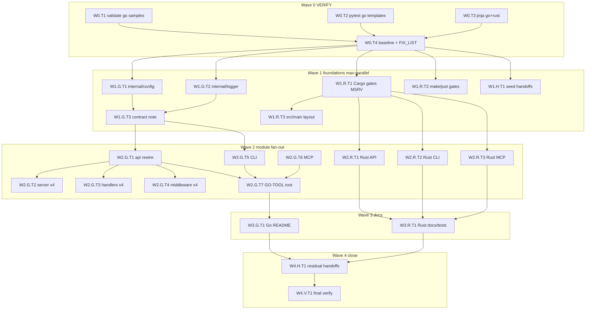

# Plan: Riso Lane SYS — parallel execution blueprint

## 0. Meta

| Field | Value |
|-------|-------|
| Goal slug | `riso-lane-sys` |
| Lane | **SYS** — exclusive owner of Go + Rust scaffold trees |
| Repo | Riso Copier **maintainer** template (not a rendered app) |
| Facts SSOT | [`facts.md`](./facts.md) |
| Machine DAG | [`plan.taskgraph.json`](./plan.taskgraph.json) — waves, deps, locks, critical path, parallel sets |
| File shards | [`plan.fileshards.json`](./plan.fileshards.json) — **79** `*.jinja` files → lock + action + verify |
| Effort policy | **Equal effort** Go ‖ Rust; **coherence + heavy modernization** inside write roots |
| Stack stance | Go: gin/fiber/echo/chi; Rust: **Actix-web + Clap + Tokio** (no Axum API migration) |
| Max concurrency | **6** writers (lock-exclusive); VERIFY unlimited read-only |
| Git | No branches / worktrees / commits / pushes unless human asks |

### 0.1 Critique → upgrades (end-to-end revision)

| Prior gap | Upgrade |
|-----------|---------|
| Coarse waves only | Leaf IDs `W{wave}.{lane}.T{n}` + deps in JSON taskgraph |
| Parallel without locks | File locks `L-GO-*` / `L-RS-*` / `L-HANDOFF` — one writer per lock |
| No import contract | Frozen post-G1 paths: `{{ project_slug }}/internal/{config,logger}` |
| Framework work vague | Server / handlers / middleware as sequential checklist inside GO-API (shared lock) |
| No per-file inventory | **79-file shard map** with lock + action (`plan.fileshards.json`) |
| No agent prompts | §8 spawn briefs + lock ownership |
| No recovery | Ladder R0–R4 (§7) |
| No visual + machine DAG | Mermaid §2 + taskgraph + fileshards |
| Handoffs ad hoc | Seed W1.H + residual W4.H under `handoffs/` |
| Validate/sample confusion | Classify errors (template / answers / CLI); never edit answers |
| Equal effort unenforceable | Wave 2 always fans GO-{API,CLI,MCP} **and** RS-{API,CLI,MCP} together |
| GO-API false parallelism | Explicit: T2–T4 **serial** under one agent (same lock) — avoid thrash |

### 0.1b File-shard counts by lock (from inventory)

| Lock | # jinja files today | Notes |
|------|---------------------|-------|
| L-GO-ROOT | 9 | mod/work/make/just/docker/air/lint/README/config.example |
| L-GO-API | 7 | main + server + handlers×2 + middleware×3 |
| L-GO-CLI | 6 | includes obsolete `cli/internal/*` to migrate/delete |
| L-GO-MCP | 11 | own go.mod + server/tools/resources |
| L-GO-CORE | 0 → N | **create** `go/internal/**` (not in tree yet) |
| L-RS-CORE | 7 | Cargo/Makefile/just/build/rustfmt/src + .env.example |
| L-RS-API | 9 | Actix handlers/models/routes |
| L-RS-CLI | 4 | Clap commands |
| L-RS-MCP | 20 | largest shard — rmcp + transports + tools |
| L-RS-DOCS | 6 | README/QUICKSTART/ARCHITECTURE + rust/tests |

**Parallel scheduling rule:** at most one active writer per lock; schedule the **largest ready lock sets** first (RS-MCP + GO-API + GO-CLI + GO-MCP + RS-API + RS-CLI = 6).

### 0.2 Hard write / forbid roots

**Write:** `template/files/go/**`, `template/files/rust/**`, `goals/riso-lane-sys/**` (docs/handoffs only).

**Never write:** `template/copier.yml`, `hooks/**`, `macros/**`, `module_catalog.json.jinja`, python/node/frontend/electron/tauri/quality/testing, `src/riso/**`, `web/**`, `samples/*/copier-answers.yml`, `samples/*/render/**`, `uv.lock`, `pnpm-lock.yaml`.

### 0.3 Baseline defect register (pre-code)

| ID | Sev | Defect | Close with |
|----|-----|--------|------------|
| **G1** | P0 | `go/api` imports `cli/internal/{config,logger}` but `go/cli/` excluded when CLI off | W1.G + W2.G.T1 |
| **G2** | P1 | Chi/Echo/Fiber middleware/handler thinner than Gin | W2.G.T2–T4 |
| **G3** | P1 | MCP `go.mod` hardcodes `go 1.22` | W2.G.T6 |
| **G4** | P2 | Root Makefile/just/go.mod gates weak on MCP-only | W2.G.T7 |
| **G5** | P2 | `go.work` omits MCP | W2.G.T7 |
| **R1** | P0 | Root Cargo/Makefile gates miss `mcp_languages`; legacy `project_language` | W1.R.T1–T2 |
| **R2** | P1 | MSRV 1.81 vs mcp 1.75 | W1.R.T1 + W2.R.T3 |
| **R3** | P1 | `rust/src/main.rs` vs multi-`[[bin]]` | W1.R.T3 |
| **R4** | P2 | No copier exclude for `rust/cli`/`rust/api` (unlike go) | **COORD handoff** (not SYS) |
| **C1** | P1 | `go_version` when omits mcp | COORD handoff |
| **C2** | P1 | No `samples/rust-*` | PLATFORM handoff |
| **C3** | P1 | `api_features: none` fails multiselect validate on go-api | PLATFORM/COORD (answers) |
| **T1** | P2 | `tests/unit/test_go_templates.py` outside write root | QUAL handoff or human OK |

---

## 1. Solution approach

1. **Wave 0** — measure (validate ×3, pytest go templates, Jinja all go+rust).
2. **Wave 1 foundations in parallel** — GO shared packages ‖ RS root gates/MSRV ‖ seed handoffs.
3. **Wave 2 module fan-out** — GO-API (×3 framework leaves) ‖ GO-CLI ‖ GO-MCP ‖ RS-API ‖ RS-CLI ‖ RS-MCP; then GO-TOOL root files.
4. **Wave 3** — docs/tests polish both languages.
5. **Wave 4** — residual handoffs + final VERIFY + path audit.

**Import contract (after W1.G):**

```text
{{ project_slug }}/internal/config   # was cli/internal/config
{{ project_slug }}/internal/logger   # was cli/internal/logger
FORBIDDEN in go/api: .../cli/internal/*
```

`go/internal/**` is **not** excluded by current copier rules (only `go/cli`, `go/api`, `go/mcp`) → safe shared root when any go component is on.

---

## 2. Visual DAG



**Critical path (JSON):**
`W0.T4 → W1.G.T1/T2 → W2.G.T1 → W2.G.T2 → W2.G.T7 → W3.G.T1 → W4.V.T1`

**Largest parallel set (wave 2):**
`{GA2, GA3, GA4, GC, GM, RA, RC, RM}` under distinct locks — up to **8** theoretical; cap **6** and queue GA4/GM if needed.

---

## 3. Lock table (exclusive writers)

| Lock | Paths | Agent |
|------|-------|-------|
| `L-GO-CORE` | `go/internal/**` | GO-CORE |
| `L-GO-API` | `go/api/**` | GO-API |
| `L-GO-CLI` | `go/cli/**` | GO-CLI |
| `L-GO-MCP` | `go/mcp/**` | GO-MCP |
| `L-GO-ROOT` | root go mod/work/make/just/docker/air/golangci/README/config.example | GO-TOOL |
| `L-RS-CORE` | rust Cargo/Makefile/just/build/rustfmt/src | RS-CORE |
| `L-RS-API` | `rust/api/**` | RS-API |
| `L-RS-CLI` | `rust/cli/**` | RS-CLI |
| `L-RS-MCP` | `rust/mcp/**` | RS-MCP |
| `L-RS-DOCS` | rust README/QUICKSTART/ARCHITECTURE/tests | RS-DOCS |
| `L-HANDOFF` | `goals/riso-lane-sys/handoffs/**` | HANDOFF |

Same lock → **serial**. Different locks → **parallel**.

---

## 4. Hyperfine task graph (human index)

| Artifact | Granularity |
|----------|-------------|
| [`plan.taskgraph.json`](./plan.taskgraph.json) | Wave tasks, deps, locks, agents, critical path, parallel sets |
| [`plan.fileshards.json`](./plan.fileshards.json) | Every existing `*.jinja` path → lock + action + verify |

**How to use both:** schedule wave tasks for orchestration; inside each lock, walk `fileshards` for that lock as a checklist (hyperfine). New `go/internal/**` files appear only after W1.G (not in shards until created — add to FIX_LIST).

Summary of wave tasks:

### Wave 0 — VERIFY (parallel T1–T3 → T4)

| ID | Action | Verify |
|----|--------|--------|
| W0.T1 | `riso validate` go-api, go-cli, go-mcp `--json` | Capture; tag C3 if answers |
| W0.T2 | `pytest tests/unit/test_go_templates.py -q` | Capture |
| W0.T3 | `validate_jinja_templates.py` all go+rust jinja | Capture |
| W0.T4 | Write `baseline.md` + seed `FIX_LIST.json` | Files exist |

### Wave 1 — Foundations (GO-CORE ‖ RS-CORE ‖ HANDOFF)

| ID | Lock | Action |
|----|------|--------|
| W1.G.T1 | L-GO-CORE | New `go/internal/config/*.jinja` (koanf) |
| W1.G.T2 | L-GO-CORE | New `go/internal/logger/*.jinja` (slog) |
| W1.G.T3 | meta | Document import contract |
| W1.R.T1 | L-RS-CORE | Cargo.toml: mcp gate, MSRV 1.81, Actix/Clap/Tokio, fix bad deps |
| W1.R.T2 | L-RS-CORE | Makefile/justfile/build.rs/rustfmt gates |
| W1.R.T3 | L-RS-CORE | Fix `src/main.rs` vs bins |
| W1.H.T1 | L-HANDOFF | COORD go_version+mcp; PLATFORM rust samples; PLATFORM api_features; COORD rust excludes |

### Wave 2 — Modules (max fan-out)

| ID | Lock | Action |
|----|------|--------|
| W2.G.T1 | L-GO-API | Rewire api main/server off `cli/internal` |
| W2.G.T2 | L-GO-API | Server New/Listen/Shutdown **×4 frameworks** |
| W2.G.T3 | L-GO-API | Handlers health/routes **×4** |
| W2.G.T4 | L-GO-API | Middleware cors/logging/recovery **×4** (raise chi/echo/fiber to gin quality) |
| W2.G.T5 | L-GO-CLI | CLI rewire + Cobra polish; drop dead `cli/internal` |
| W2.G.T6 | L-GO-MCP | `go_version` in go.mod; SDK/server/tools/README |
| W2.R.T1 | L-RS-API | Actix API modernization |
| W2.R.T2 | L-RS-CLI | Clap CLI modernization |
| W2.R.T3 | L-RS-MCP | rmcp + MSRV; axum transport only if sse/http |
| W2.G.T7 | L-GO-ROOT | go.mod/work/Makefile/just/Docker/air/golangci/README |

**Note:** W2.G.T2–T4 share `L-GO-API` → **serial under one GO-API agent** (or sequential commits by one worker). Do **not** assign three agents to GO-API.

### Wave 3 — Docs

| ID | Lock | Action |
|----|------|--------|
| W3.R.T1 | L-RS-DOCS | README/QUICKSTART/ARCHITECTURE + rust/tests |
| W3.G.T1 | L-GO-ROOT | Go README four-framework matrix |

### Wave 4 — Close

| ID | Action |
|----|--------|
| W4.H.T1 | Residual handoffs; QUAL note if pytest needs import path updates |
| W4.V.T1 | Full command suite + path audit |

---

## 5. Verification matrix

| Fact | Check |
|------|-------|
| Lane boundary | Diff ⊆ go/**, rust/**, goals/riso-lane-sys/** |
| No contract/sample edits | Forbidden path list empty in status |
| Go API/CLI/MCP coherent | Jinja + `test_go_templates.py` |
| Four frameworks | W2.G.T2–T4 complete; parameterized tests green |
| Rust Actix stack | No actix→axum swap in `rust/api` |
| Handoffs | `handoffs/*.md` for C1–C2,R4,C3,T1 as needed |
| Final | |

```bash
uv run riso validate --answers-file samples/go-api/copier-answers.yml --json
uv run riso validate --answers-file samples/go-cli/copier-answers.yml --json
uv run riso validate --answers-file samples/go-mcp/copier-answers.yml --json
uv run pytest tests/unit/test_go_templates.py -q
uv run python scripts/ci/validate_jinja_templates.py $(find template/files/go template/files/rust -name '*.jinja')
```

If go-api validate fails only with `api_features` multiselect (C3), **do not** edit answers; keep PLATFORM handoff; mark external.

---

## 6. `FIX_LIST.json` schema (wave outputs)

```json
{
  "generated_at": "ISO-8601",
  "items": [
    {
      "id": "G1-api-cli-import",
      "owner": "SYS",
      "lock": "L-GO-CORE",
      "paths": ["template/files/go/internal/config/", "template/files/go/api/"],
      "action": "extract_shared_and_rewire",
      "verify": ["pytest_go_templates", "jinja", "no_cli_internal_in_api"]
    },
    {
      "id": "C1-go-version-mcp",
      "owner": "COORD",
      "lock": null,
      "paths": ["template/copier.yml"],
      "action": "outbox",
      "verify": ["handoff_exists"]
    }
  ]
}
```

---

## 7. Recovery ladder

| Level | Trigger | Action |
|-------|---------|--------|
| **R0** | Single jinja syntax error | Fix in owning lock; re-run W0.T3 scoped |
| **R1** | pytest import path fails after G1 | Prefer QUAL handoff; or human OK to patch `test_go_templates.py` only |
| **R2** | Framework branch incomplete | Stay in L-GO-API; finish checklist gin/fiber/echo/chi before W2.G.T7 |
| **R3** | Two agents touch same lock | Abort second; requeue |
| **R4** | Temptation to edit copier/samples | Stop; write handoff; continue SYS-only |

---

## 8. Subagent spawn briefs

### GO-CORE
> Exclusive: `template/files/go/internal/**`. Create config (koanf) + logger (slog) packages. No api/cli/mcp edits except documenting import paths. Do not touch rust or contracts.

### GO-API
> Exclusive: `template/files/go/api/**`. After shared packages exist, rewire imports off `cli/internal`. Bring **gin, fiber, echo, chi** to parity for server, handlers, middleware. Gin is sample golden path.

### GO-CLI
> Exclusive: `template/files/go/cli/**`. Rewire to shared internal; modernize Cobra; remove obsolete local config/logger if fully migrated.

### GO-MCP
> Exclusive: `template/files/go/mcp/**`. Use `go_version` not hardcoded 1.22; polish SDK server/tools/README.

### GO-TOOL
> Exclusive: go root tooling files only (`go.mod`, `go.work`, Makefile, justfile, Docker, air, golangci, README, config.example). Module-aware; after modules stable.

### RS-CORE
> Exclusive: rust root Cargo/Makefile/just/build/rustfmt/src. Fix gates for `mcp_languages`, MSRV 1.81, layout vs multi-bin. Keep Actix/Clap/Tokio.

### RS-API / RS-CLI / RS-MCP
> Exclusive respective subtrees. Equal effort modernization. No Axum as API framework; MCP transport axum only for sse/http.

### HANDOFF
> Exclusive: `goals/riso-lane-sys/handoffs/**`. Never edit template contracts/samples.

### VERIFY
> Read-only. Run validation commands; never write template trees.

---

## 9. Orchestration recipes

**Solo sequential:**
W0 → W1.G → W1.R → W1.H → W2.G (API then CLI then MCP then TOOL) → W2.R (API/CLI/MCP) → W3 → W4.

**Team (preferred, max 6):**
1. VERIFY (1)
2. GO-CORE + RS-CORE + HANDOFF (3)
3. GO-API + GO-CLI + GO-MCP + RS-API + RS-CLI + RS-MCP (6) — GO-API does T1 then T2–T4 serially
4. GO-TOOL (1) after API+CLI+MCP
5. RS-DOCS + GO-TOOL README (2)
6. HANDOFF residual + VERIFY final

**Anti-patterns:** dual writers on `go.mod`; editing `copier.yml` for R4; Axum API migration; fixing C3 via sample answers; refactoring Python/Node for Go/Rust.

---

## 10. Done condition

- G1 closed (API independent of CLI tree).
- Four Go frameworks coherent; CLI/MCP/tooling modernized.
- Rust gates/MSRV/layout coherent; API/CLI/MCP polished on Actix/Clap/Tokio; docs match.
- Handoffs for C1–C3, R4, T1 filed.
- W4.V.T1 green for template-owned failures; path audit clean.
- Equal-effort Go ‖ Rust evidence in completed wave tasks.
