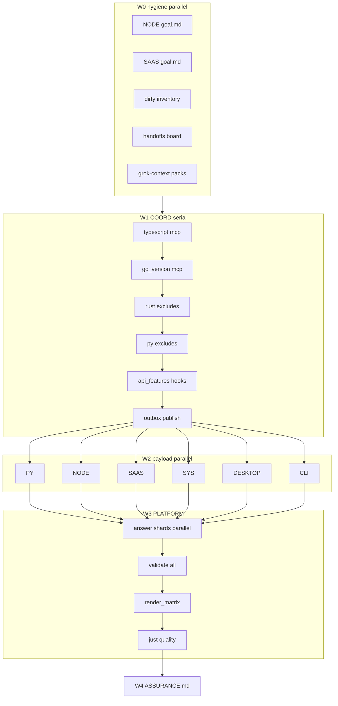

# Plan — Riso lanes assurance (parallel / Grok Build optimized)

## Solution approach

Integrator over eight exclusive-write lanes. Source of truth for ownership/facts is each `goals/riso-lane-*/` package. This umbrella:

1. Closes package gaps (NODE/SAAS `goal.md`)
2. Applies open COORD/PLATFORM handoffs
3. Finishes + planned-refines all lane work (including dirty-tree paths)
4. Full verification: `just quality` + all 23 sample validates + full `render_matrix` + smokes + jinja + targeted pytest
5. Emits `ASSURANCE.md` + residual ledger

**Execution engine preference:** massively parallel **Grok Build** (`grok -p`) / worktree-isolated subagents for disjoint file shards; serial only on COORD and PLATFORM matrix.

**Refine depth:** correctness green first → then planned refine only (SYS heavy, SAAS full sweep, DESKTOP deep features). No new product modules.

**Git:** atomic conventional commits OK without further ask; no force-push; no secrets; lockfiles via package managers only.

Companion machine graph: [`plan.taskgraph.json`](./plan.taskgraph.json)  
Grok prompt packs: [`grok-context/`](./grok-context/) (generated in W0)

---

## Exclusive write locks

| Lane ID | Write roots | File approx |
|---------|-------------|-------------|
| COORD | `template/copier.yml`, `template/hooks/**`, `template/macros/**`, `module_catalog.json.jinja`, `template/prompts/**`, `.github/context/**`, `template/files/.github/context/**` | contract |
| PY | `template/files/python/**` | ~145 jinja |
| NODE | `template/files/node/**` except `node/saas/**` | ~128 jinja |
| SAAS | `template/files/node/saas/**`, `saas-starter/**` | ~195 jinja |
| SYS | `template/files/go/**`, `template/files/rust/**` | ~79 jinja |
| DESKTOP | `template/files/electron/**`, `tauri/**` | ~63 jinja |
| CLI | `src/riso/**`, `tests/unit/test_cli/**` | CLI surface |
| PLATFORM | `scripts/ci/**`, `scripts/render-samples.sh`, `template/files/quality/**`, `testing/**`, `samples/*/copier-answers.yml`, `samples/metadata/**`, minimal `.github/workflows/**` | CI + 23 answers |

Hard forbid everyone: hand-edit `samples/*/render/**`, lockfile hand-edit, secrets, reintroduce `riso-mcp`.

---

## Hyperfine task graph (W0–W4)

IDs are stable. `deps` must complete before start. `parallel_group` tasks may run concurrently if file locks disjoint.

### Legend

- **agent:** recommended subagent type / grok isolation  
- **lock:** exclusive write paths for that leaf  
- **verify:** concrete green command(s)

---

### W0 — Package hygiene (serial fan-out of docs-only tasks)

| ID | Task | deps | parallel_group | lock | agent | verify |
|----|------|------|----------------|------|-------|--------|
| W0-T01 | Write `goals/riso-lane-node/goal.md` from NODE facts/plan | — | W0A | `goals/riso-lane-node/goal.md` | docs | file exists + done bullets match facts |
| W0-T02 | Write `goals/riso-lane-saas/goal.md` from SAAS facts/plan | — | W0A | `goals/riso-lane-saas/goal.md` | docs | file exists |
| W0-T03 | `inventory-dirty.md`: map every dirty path → one lane | — | W0A | `goals/riso-lanes-assurance/inventory-dirty.md` | explore | all dirty paths owned |
| W0-T04 | `handoffs-board.md` triage table (priority, owner, apply wave) | — | W0A | `goals/riso-lanes-assurance/handoffs-board.md` | docs | all open handoffs listed |
| W0-T05 | Materialize `grok-context/*.md` prompt packs per lane | W0-T03,W0-T04 | W0B | `goals/riso-lanes-assurance/grok-context/**` | docs | 8 lane packs + coordinator pack |
| W0-T06 | Emit/refresh `plan.taskgraph.json` checksum of locks | W0-T05 | W0B | `plan.taskgraph.json` | docs | JSON valid |

**W0 join:** W0-T01…T06 green.

---

### W1 — COORD serial contract applies (one writer)

Apply change-ids **one at a time** (same file `copier.yml` / hooks → cannot parallelize writers).

| ID | Task | deps | lock | verify |
|----|------|------|------|--------|
| W1-H01 | Apply `mcp_languages` + `typescript` choice (from PLATFORM outbox) | W0 join | COORD | `uv run riso validate --answers-file samples/mcp-typescript/copier-answers.yml --json` |
| W1-H02 | Apply `go_version` when includes MCP go | W1-H01 | COORD | `uv run riso validate --answers-file samples/go-mcp/copier-answers.yml --json` |
| W1-H03 | Apply rust/cli + rust/api `_exclude` rules | W1-H02 | COORD | grep excludes + dry validate monorepo answers if present |
| W1-H04 | Apply python optional empty-dir `_exclude` tighten | W1-H03 | COORD | validate `samples/cli-docs` |
| W1-H05 | Align hook `api_features` normalize with CLI | W1-H04 | COORD hooks | hooks unit tests if any; validate api-python/full-stack |
| W1-H06 | GraphQL sample coverage policy (COORD only if contract; else mark PLATFORM) | W1-H05 | COORD or residual | board status updated |
| W1-H07 | module_catalog / prompts smoke if rows changed | W1-H01…H06 | COORD catalog | `uv run riso catalog` / `prompts` |
| W1-H08 | Context parity if context touched | W1-H07 | COORD context | `uv run python scripts/ci/verify_context_sync.py` |
| W1-OUT | Publish outbox deltas per change-id under `goals/riso-lane-coord/outbox/` | W1-H08 | goals coord outbox | one md per applied CID |

**W1 join:** all applied or residualed; outbox published; mcp-typescript + go-mcp validate green (or residual with evidence).

**Commit granularity:** one conventional commit per change-id recommended.

---

### W2 — Massively parallel payload

**Barrier:** W1-OUT complete.

Top-level parallel_group **W2-LANES** = {PY, NODE, SAAS, SYS, DESKTOP, CLI} — six concurrent lane leaders.

Within each lane, sub-shards run only if file locks disjoint.

#### PY sub-graph (lock: `template/files/python/**`)

| ID | Task | deps | parallel_group | verify |
|----|------|------|----------------|--------|
| PY-T01 | Inventory + dual-gate audit script run | W1-OUT | PY0 | `goals/riso-lane-py/scripts/check_dual_gates.py` if present |
| PY-T02 | API FastAPI + health/CRUD jinja correctness | PY-T01 | PY1 | validate api-python |
| PY-T03 | GraphQL dual-gate surface | PY-T01 | PY1 | validate full-stack / graphql samples |
| PY-T04 | WebSocket dual-gate surface | PY-T01 | PY1 | validate full-stack |
| PY-T05 | Typer CLI under python | PY-T01 | PY1 | validate cli-docs |
| PY-T06 | FastMCP python mcp | PY-T01 | PY1 | validate mcp-oriented python samples if any |
| PY-T07 | Sphinx docs + packaging/pyproject gates | PY-T01 | PY1 | validate docs-sphinx |
| PY-T08 | Shipped tests / codegen / release helpers | PY-T01 | PY1 | jinja validate python |
| PY-T09 | Join: empty-dir recheck after COORD excludes | PY-T02…T08 | PY2 | scratch render cli-docs no empty optional trees |
| PY-T10 | Planned refine only if green | PY-T09 | PY3 | residual or green |

#### NODE sub-graph (lock: node except saas)

| ID | Task | deps | parallel_group |
|----|------|------|----------------|
| NODE-T01 | Fumadocs templates | W1-OUT | N1 |
| NODE-T02 | Docusaurus templates | W1-OUT | N1 |
| NODE-T03 | TS MCP (post typescript choice) | W1-OUT | N1 |
| NODE-T04 | api-node Fastify | W1-OUT | N1 |
| NODE-T05 | shared-config + workspace fragments (no saas content) | W1-OUT | N1 |
| NODE-T06 | Join validate docs-fumadocs, docs-docusaurus, mcp-typescript | NODE-T01…T05 | N2 |
| NODE-T07 | Planned refine if green | NODE-T06 | N3 |

#### SAAS sub-graph (lock: node/saas + saas-starter) — sequenced then fan-out

| ID | Task | deps | parallel_group | notes |
|----|------|------|----------------|-------|
| SAAS-T01 | Runtime (Next/Remix) shared roots | W1-OUT | S0 | serial first |
| SAAS-T02 | Hosting/DB/ORM wiring | SAAS-T01 | S1 | |
| SAAS-T03 | Auth layer | SAAS-T02 | S2 | |
| SAAS-T04 | Billing layer | SAAS-T03 | S3 | depends auth |
| SAAS-T05a | Integrations batch A | SAAS-T04 | S4 | parallel integrations |
| SAAS-T05b | Integrations batch B | SAAS-T04 | S4 | |
| SAAS-T05c | Integrations batch C | SAAS-T04 | S4 | |
| SAAS-T06 | UI/components | SAAS-T04 | S4 | careful package.json lock |
| SAAS-T07 | Marketing pages | SAAS-T04 | S4 | |
| SAAS-T08 | Compliance | SAAS-T04 | S4 | |
| SAAS-T09 | Observability/tests | SAAS-T05a…T08 | S5 | |
| SAAS-T10 | saas-starter config/README align | SAAS-T09 | S5 | |
| SAAS-T11 | Validate all saas-starter answer variants | SAAS-T10 | S6 | 10+ variants |

**package.json collision rule:** only SAAS-T01/T02/T10 may edit root saas `package.json.jinja` unless shard owns a nested package exclusively.

#### SYS sub-graph (locks: go/**, rust/** — can split GO vs RUST parallel)

| ID | Task | deps | parallel_group |
|----|------|------|----------------|
| SYS-GO-01 | Go shared foundation (API not depending on cli/internal) | W1-OUT | G1 |
| SYS-GO-02 | Go API ×4 frameworks (gin/fiber/echo/chi) | SYS-GO-01 | G2 |
| SYS-GO-03 | Go CLI Cobra | SYS-GO-01 | G2 |
| SYS-GO-04 | Go MCP | SYS-GO-01 | G2 |
| SYS-GO-05 | Go root Makefile/justfile/mod/work/Dockerfile | SYS-GO-02…04 | G3 |
| SYS-RS-01 | Rust root Cargo/tooling/MSRV | W1-OUT | R1 |
| SYS-RS-02 | Rust API Actix | SYS-RS-01 | R2 |
| SYS-RS-03 | Rust CLI Clap | SYS-RS-01 | R2 |
| SYS-RS-04 | Rust MCP | SYS-RS-01 | R2 |
| SYS-RS-05 | Rust docs/tests | SYS-RS-02…04 | R3 |
| SYS-JOIN | validate go-api/cli/mcp + pytest test_go_templates + jinja go/rust | SYS-GO-05, SYS-RS-05 | SJ |
| SYS-H | PLATFORM handoffs still needed? update board | SYS-JOIN | SJ |

#### DESKTOP sub-graph

| ID | Task | deps | parallel_group |
|----|------|------|----------------|
| DESK-E01 | electron-vite main/preload/ipc | W1-OUT | D1 |
| DESK-E02 | electron features: updater/tray/titlebar | W1-OUT | D1 |
| DESK-E03 | electron packaging platforms | W1-OUT | D1 |
| DESK-T01 | tauri core + capabilities | W1-OUT | D1 |
| DESK-T02 | tauri updater/tray/titlebar | W1-OUT | D1 |
| DESK-T03 | tauri packaging | W1-OUT | D1 |
| DESK-JOIN | validate electron-app + tauri-app | DESK-E*, DESK-T* | D2 |
| DESK-H | COORD handoffs forge/non-enum only | DESK-JOIN | D2 |

#### CLI sub-graph

| ID | Task | deps | parallel_group |
|----|------|------|----------------|
| CLI-T01 | doctor JSON envelope | W1-OUT | C1 |
| CLI-T02 | validate/copy/update/recopy/diff paths | W1-OUT | C1 |
| CLI-T03 | catalog/prompts/variants introspection | W1-OUT | C1 |
| CLI-T04 | unit tests expand for changed behavior | CLI-T01…T03 | C2 |
| CLI-JOIN | `riso --help`, `doctor --json`, `pytest tests/unit/test_cli -q` | CLI-T04 | C3 |

**W2 join:** all six lane JOINs green or residual files under `goals/riso-lanes-assurance/residuals/<lane>.md`.

---

### W3 — PLATFORM integrate + full matrix

**Barrier:** W2 join (residuals OK if they don't block answers).

| ID | Task | deps | parallel_group | lock | verify |
|----|------|------|----------------|------|--------|
| PL-T01 | Diff COORD outbox keys vs all 23 answers | W2 join | P0 | answers (read) | board of missing keys |
| PL-T02a | Patch answers shard A (sample names 1–8) | PL-T01 | P1 | those answer files | per-file validate |
| PL-T02b | Patch answers shard B (9–16) | PL-T01 | P1 | those answer files | per-file validate |
| PL-T02c | Patch answers shard C (17–23 + saas-starter variants) | PL-T01 | P1 | those answer files | per-file validate |
| PL-T03 | Create/update rust sample answers if handoff accepted | PL-T02* | P2 | new samples dirs answers only | validate new answers |
| PL-T04 | QUAL/go template test wiring if PLATFORM-owned | PL-T02* | P2 | tests/unit or scripts | pytest |
| PL-T05 | Full validate loop all answers | PL-T02*,PL-T03 | P3 | — | 23/23 or residual log |
| PL-T06 | Full `uv run python scripts/ci/render_matrix.py` | PL-T05 | P4 | renders via script only | exit 0 + smoke logs |
| PL-T07 | `uv run pytest tests/unit/ci/ -q` | PL-T04 | P3 | — | pass |
| PL-T08 | quality/testing parity review | PL-T05 | P3 | quality/** testing/** only if needed | check_quality_parity |
| PL-T09 | `just quality` | PL-T06,PL-T07,PL-T08 | P5 | — | exit 0 |
| PL-T10 | Conditional context/agents validators | PL-T09 | P5 | — | pass if surfaces changed |

**W3 join:** full bar green or residual ledger complete with evidence paths under `goals/riso-lanes-assurance/evidence/`.

**Answer-file parallel rule:** PL-T02a/b/c only if each sample file is exclusive to one shard (true: different files). Never two agents edit same answers file.

---

### W4 — Assurance

| ID | Task | deps | verify |
|----|------|------|--------|
| A-T01 | Write `ASSURANCE.md` mapping every fact → evidence/residual | W3 join | all 22 facts covered |
| A-T02 | Close handoffs-board statuses | A-T01 | no open unowned |
| A-T03 | Final path-lock audit (git status vs lane roots) | A-T01 | no foreign-tree violations |
| A-T04 | Confirm no riso-mcp reintroduction | A-T01 | `rg` clean on src/riso |

**Done:** A-T01…T04 green; failure policy satisfied.

---

## Critical path (longest)

```text
W0 → W1-H01…H08 → W1-OUT
  → SAAS-T01…T11  (usually longest payload)
  → PL-T01 → PL-T02* → PL-T05 → PL-T06 (render_matrix)
  → PL-T09 just quality → A-T01
```

Shortest parallel payload (CLI/DESKTOP) should finish early and free agents for SAAS integration batches or PLATFORM answer shards.

---

## Grok Build CLI workflow optimization

### Principles

1. **One leaf task = one `grok -p` (or subagent) with exclusive lock list**  
2. **Worktrees for write-heavy payload lanes** (`isolation=worktree` / `grok` worktree) when available; merge only at join  
3. **Context packs are short and path-scoped** — never dump full monorepo  
4. **Parent retains synthesis** of ASSURANCE.md and residual policy  

### Context pack schema (`grok-context/<lane>.md`)

Each pack must include only:

```markdown
# Lane <ID>
## Mission (3 lines)
## Exclusive write roots
## Forbidden roots
## Facts file path
## Plan tasks this agent owns (IDs)
## COORD outbox paths to read
## Dirty paths assigned
## Verify commands (copy-paste)
## Handoff template path if blocked
## Done = ...
```

Coordinator pack (`grok-context/COORD.md`) includes ordered W1-H01…H08 only.

Umbrella pack (`grok-context/ASSURANCE.md`) is W4-only.

### Suggested Grok dispatch patterns

```bash
# Example: parallel W2 leaders (after W1)
# Prefer grok-delegate / worktrees when preflight OK

# PY leader
grok -p "$(cat goals/riso-lanes-assurance/grok-context/PY.md)"

# NODE, SAAS, SYS, DESKTOP, CLI similarly in parallel shells/worktrees
```

For hyperfine leaves inside a lane (e.g. SYS-GO-02 vs SYS-RS-02), spawn children with **only** the sub-lock:

- SYS-GO-* → `template/files/go/**`  
- SYS-RS-* → `template/files/rust/**`  

SAAS integration batches S4 may use up to 4 concurrent agents if each owns distinct directories under `node/saas/integrations/**` and none touch `package.json.jinja` (package.json owner = SAAS-T01/T10 only).

### Parent harness rules (Grok / Claude / Codex)

- Preflight: `bash skills/grok-delegate/scripts/preflight.sh` when using grok-delegate  
- Tier-T trivial leaves only for ≤3 reads or ≤1 edit ≤80 LOC; this goal is mostly multi-node → **full lane leaders**, not Tier-T  
- Same-file → serial; disjoint → parallel  
- After each wave join, parent updates `handoffs-board.md` and `evidence/`  

### Evidence capture convention

```text
goals/riso-lanes-assurance/evidence/
  W1-H01-mcp-typescript-validate.json
  W2-PY-validate-api-python.json
  W3-render_matrix.log
  W3-just-quality.log
```

Always `uv run` for Python. Never bare `pytest`.

---

## Open handoffs → task mapping

| Handoff | Task IDs |
|---------|----------|
| PLATFORM `coord-mcp-languages-typescript` | W1-H01 |
| SYS `COORD-go-version-mcp` | W1-H02 |
| SYS `COORD-rust-module-excludes` | W1-H03 |
| PY `exclude-empty-dirs` | W1-H04 + PY-T09 |
| PY `api-features-normalize` | W1-H05 |
| PY `graphql-sample-coverage` | W1-H06 / PL-T02* |
| SYS `PLATFORM-rust-samples` | PL-T03 |
| SYS `PLATFORM-go-api-features-answers` | PL-T02* |
| SYS `QUAL-go-template-tests` | PL-T04 / SYS-JOIN |
| COORD `bootstrap-verify` | W1-OUT smoke |

---

## Full verification bar (W3–W4)

```bash
just quality

for f in samples/*/copier-answers.yml; do
  uv run riso validate --answers-file "$f" --json
done

uv run python scripts/ci/render_matrix.py

uv run python scripts/ci/validate_jinja_templates.py

uv run pytest tests/unit/test_cli/ -q
uv run pytest tests/unit/test_go_templates.py -q
uv run pytest tests/unit/ci/ -q

# conditional
uv run python scripts/ci/verify_context_sync.py
uv run python scripts/ci/validate_agents_ecosystem.py
```

Failure policy: **green or owned residual with evidence** — no silent matrix skip.

---

## Recovery ladder

1. Repro → log under `evidence/`  
2. Foreign tree → residual handoff, no patch  
3. Contract gap → re-enter W1 with new change-id  
4. Matrix flake → one retry; then residual with log path  
5. Worktree merge conflict → lane leader serializes join on that root only  

---

## Risks

| Risk | Mitigation |
|------|------------|
| copier.yml single-writer | W1 fully serial |
| SAAS package.json races | only T01/T02/T10 edit it |
| answer file races | PL-T02a/b/c partition by filename |
| render_matrix time | PLATFORM mise/smoke hardening already present; capture logs |
| over-parallel thrash | max 6 lane leaders + ≤4 SAAS integration workers + 3 answer shards |
| plan annotation loops | execute facts; stop re-parallelizing plan text once gate approved |

---

## Out of scope

No new modules outside lane plans; no hand-render edits; no lockfile hand-edits; no secrets; no riso-mcp; no force-push.

---

## Wave Mermaid



---

## Implementation notes for `/goal`

1. Materialize W0 artifacts first in-session (fast).  
2. Run W1 as single agent with COORD lock.  
3. Spawn up to 6 Grok/worktree agents for W2 using `grok-context/*`.  
4. Join, then PLATFORM with answer shards.  
5. Full matrix + quality.  
6. ASSURANCE.md.  
7. Atomic commits per change-id / lane join as work lands.  
