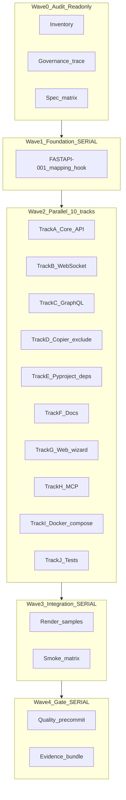

# FastAPI Template Finalization — Audit Report & Parallel Execution Plan

**Status**: Audit complete · **Waves 1–4 implemented** (2026-06-25)\
**Scope**: `api_module=enabled`, `api_languages` includes `python`, satellites WebSocket/GraphQL, cross-surface governance\
**Date**: 2026-06-24\
**Maturity**: **5.2 / 10** · **Ship verdict**: Conditional NO until P0 governance + health probe alignment

______________________________________________________________________

## Executive Summary

| Item               | Verdict                                                                            |
| ------------------ | ---------------------------------------------------------------------------------- |
| Core REST scaffold | Usable demo (factory app, config, health, CRUD, `tests/api/`)                      |
| P0 blocker #1      | `api_features` (wizard/copier) ≠ `graphql_api_module` / `websocket_module` (Jinja) |
| P0 blocker #2      | WebSocket `setup_websocket_routes()` never called from `main.py.jinja`             |
| P0 blocker #3      | Docker/compose probe `/health` vs app route `/health/`                             |
| Quick win #1       | `GET /health` alias on health router                                               |
| Quick win #2       | Deprecate stale `api-python.md.jinja`                                              |
| Quick win #3       | `_examples_db` reset fixture                                                       |

**Governance recommendation**: **Option A** — derive `*_module` from `api_features` in `pre_gen_project.py` (minimal breaking surface). Document MCP direct `websocket_module` as override.

______________________________________________________________________

## Governance Schism (Definitive)

### Toggle map

| Toggle               | Defined                                                    | Consumed                                                            | Samples                                                                |
| -------------------- | ---------------------------------------------------------- | ------------------------------------------------------------------- | ---------------------------------------------------------------------- |
| `api_features`       | `copier.yml` L317–330, web `ModulesConfig.tsx`, `store.ts` | `_exclude` (graphql dirs, docs only)                                | `full-stack`: `websocket`; `changelog-full-stack`: `graphql,websocket` |
| `graphql_api_module` | `_defaults` only (`copier.yml` L63)                        | `graphql_api/*.jinja`, `pyproject.toml.jinja` L84, `module_catalog` | Never in samples                                                       |
| `websocket_module`   | `_defaults` only (`copier.yml` L64)                        | `websocket/*.jinja`, `websocket_endpoints.py.jinja`, docs body      | Never in samples                                                       |

### Proof chain

1. **Sample answers** set `api_features` only — [`samples/full-stack/copier-answers.yml`](../../samples/full-stack/copier-answers.yml) L23.
1. **Template gates** require `websocket_module == "enabled"` — \[`websocket_endpoints.py.jinja`\](../../template/files/python/src/{{ package_name }}/api/websocket_endpoints.py.jinja) L1.
1. **`main.py` does not wire WS** — \[`main.py.jinja`\](../../template/files/python/src/{{ package_name }}/api/main.py.jinja) L74–76 registers only `health` + `examples`.
1. **GraphQL schism**: `_exclude` includes dirs when `'graphql' in api_features` (`copier.yml` L1961–1963) but `schema` definition gated on `graphql_api_module` (`schema.py.jinja` L15) while `main.py.jinja` imports `schema` unconditionally → **broken partial render**.
1. **Docs body vs `_exclude`**: `websockets.md.jinja` L1 gates on `websocket_module`; `_exclude` gates doc on `api_features` → doc can ship while body is empty.
1. **`openapi` ghost**: help text `copier.yml` L323; not in choices L324–328; zero Jinja conditionals.

### Smoke evidence (blocked verification)

[`samples/api-python/smoke-results.json`](../../samples/api-python/smoke-results.json): `api_python` **failed** — `pyproject.toml` `[tool.uv.tasks]` parse + `autodoc2` unsatisfiable. Renders exist on disk during CI but are gitignored locally.

______________________________________________________________________

## Artifact Inventory

| Layer       | Path                                                             | Gate                 | Status                                      |
| ----------- | ---------------------------------------------------------------- | -------------------- | ------------------------------------------- |
| App factory | `template/files/python/src/{{ package_name }}/api/main.py.jinja` | api + python         | Present, no lifespan/WS/GQL                 |
| Config      | `api/config.py.jinja`                                            | api + python         | `RISO_API_*`, `reload=True` default         |
| Health      | `api/routes/health.py.jinja`                                     | api + python         | `/health/`, `/health/ready`, `/health/live` |
| WS bridge   | `api/websocket_endpoints.py.jinja`                               | `websocket_module`   | Orphan (not in main)                        |
| WS package  | `websocket/*.jinja` (11 files)                                   | `websocket_module`   | Complete code, disabled by default          |
| GraphQL     | `python/graphql_api/*.jinja`                                     | Mixed                | Schismatic gates                            |
| Tests API   | `python/tests/api/*.jinja`                                       | api + python         | 4 files, isolation gap                      |
| Tests WS    | `python/tests/websocket/*.jinja`                                 | `websocket_module`   | Gated                                       |
| Tests GQL   | `tests/graphql/*.jinja`                                          | `graphql_api_module` | Gated                                       |
| Docker      | `.docker/Dockerfile.jinja` L122                                  | api + python         | `GET /health`                               |
| Compose     | `docker-compose.yml.jinja` L71                                   | api + python         | `GET /health`                               |

______________________________________________________________________

## Finding Register (27 items)

| ID    | Sev | Lens        | Evidence                              | Recommendation                |
| ----- | --- | ----------- | ------------------------------------- | ----------------------------- |
| F-001 | P0  | Governance  | Toggle map above                      | Option A mapping in pre_gen   |
| F-002 | P0  | WS          | `main.py` L74–76                      | Call `setup_websocket_routes` |
| F-003 | P0  | GQL         | `schema.py` L15 vs `main.py` import   | Unify gate                    |
| F-004 | P0  | Health      | Dockerfile L122 vs `health.py` L22    | `/health` alias               |
| F-005 | P0  | `_exclude`  | No websocket tree exclusion           | Mirror graphql pattern        |
| F-006 | P0  | Ghost       | `openapi` in help                     | Remove or implement           |
| F-007 | P1  | Arch        | No lifespan in main                   | Lifespan stub                 |
| F-008 | P1  | Config      | `reload=True` L76–78                  | Default false                 |
| F-009 | P1  | Config      | `@lru_cache` get_config               | Test cache_clear fixture      |
| F-010 | P1  | Security    | CORS `*` methods/headers              | Prod tightening               |
| F-011 | P1  | Errors      | New UUID per error L44                | X-Request-ID propagation      |
| F-012 | P1  | Tests       | `_examples_db` L33                    | Autouse reset                 |
| F-013 | P1  | Docs        | `api-python.md` phantom test path     | Consolidate docs              |
| F-014 | P1  | Coverage    | `coverage.cfg` ghost test             | Fix omit paths                |
| F-015 | P1  | MCP         | `session.py` L120 `websocket_module`  | Add `api_features` step       |
| F-016 | P1  | Catalog     | `module_catalog` `graphql_api_module` | Align prompt_keys             |
| F-017 | P1  | Smoke       | autodoc2 / tool.uv.tasks              | Fix pyproject template        |
| F-018 | P2  | K8s         | No `/health/startup`                  | Add or fix doc                |
| F-019 | P2  | Examples    | UpdateRequest no validator            | model_validator               |
| F-020 | P2  | Docker      | HEALTHCHECK 30s/10s vs spec 005       | Align timing                  |
| F-021 | P2  | Docker      | bare `python -m uvicorn` CMD          | `uv run` or document          |
| F-022 | P2  | Integration | `test_inter_service` doc vs impl      | Honest scope                  |
| F-023 | P2  | Deps        | `websocket` group not auto-included   | default-groups when enabled   |
| F-024 | P3  | 010         | No `api_versioning/`                  | Stub or docs-only flag        |
| F-025 | P3  | 011         | No `rate_limiting/`                   | Optional slowapi              |
| F-026 | P3  | Parity      | Node `/health` vs Python `/health/`   | Cross-stack table             |
| F-027 | P3  | Metrics     | Spec 006 metrics endpoint             | `/metrics` stub optional      |

______________________________________________________________________

## Spec Compliance Matrix

| Spec                 | Requirement                   | Implementation         | Test                       | Doc                   | Verdict               |
| -------------------- | ----------------------------- | ---------------------- | -------------------------- | --------------------- | --------------------- |
| 006 US1              | Runnable FastAPI + health 200 | `main.py`, `health.py` | `tests/api/test_health.py` | `api-fastapi.md`      | **PASS** (core)       |
| 006 Security headers | Baseline headers              | Missing                | None                       | patterns.md only      | **FAIL**              |
| 006 Metrics          | Metrics endpoint              | Missing                | None                       | spec claims           | **FAIL**              |
| 008 US1              | WS connection                 | Code exists; unwired   | Gated                      | Wrong enable key      | **PARTIAL**           |
| 008 US2–5            | Heartbeat, auth, broadcast    | `websocket/` package   | Gated tests                | `websockets.md`       | **PARTIAL**           |
| 007 US1              | GraphQL queries               | `graphql_api/`         | Gated                      | `graphql.md`          | **FAIL** (governance) |
| 010                  | URL versioning                | None                   | None                       | `fastapi-patterns.md` | **FAIL**              |
| 011                  | HTTP rate limit               | None                   | None                       | `fastapi-patterns.md` | **FAIL**              |
| 005 FR-004           | `/health`, 5s, 3×2s           | Path OK; timing wrong  | None                       | Drift                 | **PARTIAL**           |
| 005 UID 1000         | Non-root                      | Dockerfile L94–95      | validate_dockerfiles       | —                     | **PASS**              |
| 001 OpenAPI          | Baseline contract             | `/docs`, `/redoc`      | api tests                  | —                     | **PASS**              |

______________________________________________________________________

## Research Appendix

| Claim                                                                         | Confidence | Source                               |
| ----------------------------------------------------------------------------- | ---------- | ------------------------------------ |
| Lifespan is FastAPI-recommended startup/shutdown                              | 0.95       | fastapi.tiangolo.com/advanced/events |
| Multi-worker uvicorn needs shared-nothing + lifespan awareness                | 0.90       | uvicorn.dev/concepts/lifespan        |
| RFC 7807 increasingly expected for API errors                                 | 0.80       | IETF RFC 7807                        |
| Strawberry mounts via `GraphQLRouter` on FastAPI                              | 0.90       | strawberry.rocks                     |
| tiangolo/full-stack-fastapi-template more opinionated (auth, DB)              | 0.85       | GitHub comparison                    |
| FastAPI redirects `/health` → `/health/` by default (`redirect_slashes=True`) | 0.85       | Starlette routing behavior           |

______________________________________________________________________

## Parallel Subagent Orchestration

### Team topology



### Wave rules

| Wave | Parallelism                     | Blocker     | Subagent types              |
| ---- | ------------------------------- | ----------- | --------------------------- |
| W0   | 100% parallel (readonly)        | None        | generalPurpose × N          |
| W1   | **Serial** — single owner       | None        | 1 implementer               |
| W2   | **10 tracks parallel** after W1 | W1 complete | 1 subagent per track        |
| W3   | Serial render → parallel smoke  | W2 complete | devops + generalPurpose     |
| W4   | Serial gates                    | W3 green    | code-reviewer + implementer |

### Track ownership (Wave 2)

| Track           | Owner focus                                     | Files touched                           | Depends on               |
| --------------- | ----------------------------------------------- | --------------------------------------- | ------------------------ |
| **A** Core API  | `main.py`, config, middleware, health           | `api/*`                                 | FASTAPI-001              |
| **B** WebSocket | wire + endpoints                                | `main.py`, `websocket_endpoints.py`     | FASTAPI-001, FASTAPI-005 |
| **C** GraphQL   | gate unification + mount strategy               | `graphql_api/*`, `main.py`              | FASTAPI-001              |
| **D** Copier    | `_exclude`, prompts, ghost openapi              | `copier.yml`                            | FASTAPI-001              |
| **E** Pyproject | dep groups, smoke blockers                      | `pyproject.toml.jinja`                  | FASTAPI-001              |
| **F** Docs      | SSOT, module docs, fumadocs/docusaurus copies   | `docs/modules/*`, node docs             | Tracks A,B,C             |
| **G** Web       | store, matrix, ReviewOutput, tests              | `web/src/**`                            | FASTAPI-001              |
| **H** MCP       | session, catalog, workflows, answer_validation  | `src/riso/mcp/**`                       | FASTAPI-001              |
| **I** Docker    | Dockerfile, compose, dev dockerfile             | `.docker/*`, `docker-compose.yml.jinja` | FASTAPI-010              |
| **J** Tests     | api/websocket/graphql tests, conftest, coverage | `tests/**`                              | Tracks A,B,C             |

**Cross-track conflict protocol**: `main.py.jinja` owned by Track A; Tracks B/C submit PR patches via shared contract (mount functions only). `copier.yml` owned by Track D only.

______________________________________________________________________

## Hyperfine Task Graph (DAG)

Format: `ID | [P]=parallel OK | deps | track | effort | acceptance`

### Wave 1 — Foundation (SERIAL)

| ID          | P   | Deps | Track | Effort | Task                                                                                                                                                                                                     | Acceptance                                                                               |
| ----------- | --- | ---- | ----- | ------ | -------------------------------------------------------------------------------------------------------------------------------------------------------------------------------------------------------- | ---------------------------------------------------------------------------------------- |
| FASTAPI-001 | —   | —    | D     | S      | Add `normalize_api_features(answers)` in `pre_gen_project.py`: parse `api_features` str/list; set `graphql_api_module`/`websocket_module` to `enabled` when substring present; write back to env context | Unit test: `api_features=websocket` → `websocket_module=enabled`; `none` → both disabled |
| FASTAPI-002 | ✓   | 001  | D     | S      | Add `_exclude` rules for `python/src/.../websocket/`, `python/tests/websocket/`, `api/websocket_endpoints.py` when WS not selected                                                                       | Render `api-python`: no `websocket/manager.py`                                           |
| FASTAPI-003 | ✓   | 001  | D     | S      | Remove `openapi` from `api_features` help in `copier.yml` + `matrix-data.json` OR add choice (decision: **remove**)                                                                                      | grep: no ghost promise                                                                   |
| FASTAPI-004 | ✓   | 001  | H     | S      | MCP: add `api_features` to wizard prompts; map in session answer merge; update `catalog.py` to document `api_features` as SSOT                                                                           | Wizard test emits `api_features`                                                         |
| FASTAPI-005 | ✓   | 001  | D     | S      | `module_catalog.json.jinja`: change `graphql_api`/`websocket_module` `prompt_key` to `api_features` with derived `selected_state` expression                                                             | Catalog JSON renders correct states                                                      |

### Wave 2A — Core API (parallel within track)

| ID          | P   | Deps | Track | Effort | Task                                                                                                      | Acceptance                             |
| ----------- | --- | ---- | ----- | ------ | --------------------------------------------------------------------------------------------------------- | -------------------------------------- |
| FASTAPI-010 | ✓   | 001  | A     | S      | Add `GET /health` route (duplicate handler or `redirect_slashes=False` + both paths) in `health.py.jinja` | `curl /health` and `/health/` both 200 |
| FASTAPI-011 | ✓   | 001  | A     | S      | Add lifespan `@asynccontextmanager` stub (log startup/shutdown) in `main.py.jinja`                        | App starts; logs visible               |
| FASTAPI-012 | ✓   | 001  | A     | S      | Change `reload` default to `False`; document dev override in `config.py.jinja`                            | Prod validator still works             |
| FASTAPI-013 | ✓   | 001  | A     | S      | Add `middleware/request_id.py.jinja`; inject `X-Request-ID`; use in `errors.py.jinja`                     | Same ID in response as request header  |
| FASTAPI-014 | ✓   | 013  | A     | S      | Production CORS: restrict methods/headers when `environment=production`                                   | Test with env override                 |
| FASTAPI-015 | ✓   | 001  | I     | S      | Align Dockerfile HEALTHCHECK: timeout 5s, interval 10s (pragmatic vs spec 2s)                             | validate_dockerfiles.py pass           |
| FASTAPI-016 | ✓   | 010  | I     | S      | Align `docker-compose.yml.jinja` health test URL to canonical `/health`                                   | compose config valid                   |

### Wave 2B — WebSocket (parallel within track)

| ID          | P   | Deps    | Track | Effort | Task                                                                                                     | Acceptance                    |
| ----------- | --- | ------- | ----- | ------ | -------------------------------------------------------------------------------------------------------- | ----------------------------- |
| FASTAPI-020 | ✓   | 001,005 | B     | S      | Import and call `setup_websocket_routes(app)` in `create_app()` when `websocket_module=enabled`          | `/ws` accepts connection      |
| FASTAPI-021 | ✓   | 001     | B     | S      | Remove commented manual-integration block from `websocket_endpoints.py.jinja` bottom; document in README | No dead comments              |
| FASTAPI-022 | ✓   | 001     | E     | S      | Add `websocket` to default dependency install when module enabled in `pyproject.toml.jinja`              | `uv sync` installs websockets |
| FASTAPI-023 | ✓   | 020     | J     | M      | WS smoke test: connect echo via `tests/websocket/` in rendered full-stack                                | pytest websocket pass         |

### Wave 2C — GraphQL (parallel within track)

| ID          | P   | Deps    | Track | Effort | Task                                                                                             | Acceptance                                       |
| ----------- | --- | ------- | ----- | ------ | ------------------------------------------------------------------------------------------------ | ------------------------------------------------ |
| FASTAPI-030 | ✓   | 001     | C     | M      | Wrap entire `graphql_api/main.py.jinja` in `graphql_api_module` guard OR split entry             | No import errors when disabled                   |
| FASTAPI-031 | ✓   | 001     | C     | M      | Move `schema.py.jinja` imports inside `` or use single gate at file top                  | `api_features=graphql` renders importable schema |
| FASTAPI-032 | ✓   | 030,031 | C     | M      | **Decision default**: mount `GraphQLRouter` at `/graphql` on primary `api.main:app` when enabled | Single uvicorn process serves REST+GQL           |
| FASTAPI-033 | ✓   | 032     | J     | M      | `tests/graphql/test_queries.py` passes on rendered `changelog-full-stack`                        | pytest graphql pass                              |

### Wave 2D–J — Additional parallel tasks

| ID          | P   | Deps | Track | Effort | Task                                                                                       | Acceptance                    |
| ----------- | --- | ---- | ----- | ------ | ------------------------------------------------------------------------------------------ | ----------------------------- |
| FASTAPI-040 | ✓   | 001  | E     | M      | Fix smoke blockers: `[tool.uv.tasks]` compatibility, `autodoc2` pin or optional docs group | `api-python` uv sync succeeds |
| FASTAPI-041 | ✓   | 001  | J     | S      | `conftest.py.jinja`: autouse `_examples_db.clear()`; `get_config.cache_clear()`            | Ordered pytest stable         |
| FASTAPI-042 | ✓   | 041  | J     | S      | Add tests: pagination, validation errors, `/health` no-slash                               | New tests green               |
| FASTAPI-043 | ✓   | 001  | F     | S      | Merge `api-python.md.jinja` → redirect stub pointing to `api-fastapi.md.jinja`             | No stale settings.py refs     |
| FASTAPI-044 | ✓   | 043  | F     | S      | Fix `upgrade-guide.md.jinja`, `coverage.cfg.jinja` phantom `test_api_fastapi.py`           | grep zero phantom refs        |
| FASTAPI-045 | ✓   | 001  | F     | S      | Sync `websockets.md.jinja` quickstart to use `api_features=websocket`                      | Doc matches wizard            |
| FASTAPI-046 | ✓   | 001  | G     | S      | `ReviewOutput.tsx`: emit `api_features`; optional comment that `*_module` derived          | Copier command correct        |
| FASTAPI-047 | ✓   | 046  | G     | S      | Update `web/src/__tests__/presets.test.ts`, `validation.test.ts` for mapping expectations  | `pnpm test` pass              |
| FASTAPI-048 | ✓   | 020  | F     | S      | Update `api/README.md.jinja` WS section with auto-wire note                                | README accurate               |
| FASTAPI-049 | ✓   | 010  | J     | S      | `test_inter_service.py.jinja`: narrow docstring to health-only OR add shared_logic check   | Doc matches code              |
| FASTAPI-050 | ✓   | 012  | A     | S      | `ExampleUpdateRequest` model_validator ≥1 field                                            | Empty PUT returns 422         |

### Wave 2 — P2/P3 (parallel, non-blocking for ship)

| ID          | P   | Deps | Track | Effort | Task                                              |
| ----------- | --- | ---- | ----- | ------ | ------------------------------------------------- |
| FASTAPI-060 | ✓   | 011  | A     | S      | Add optional `/health/startup` route              |
| FASTAPI-061 | ✓   | —    | A     | M      | Spec 010 stub: `/v1` router prefix                |
| FASTAPI-062 | ✓   | —    | A     | M      | Spec 011 stub: slowapi optional group             |
| FASTAPI-063 | ✓   | —    | A     | S      | Security headers middleware (optional)            |
| FASTAPI-064 | ✓   | —    | F     | S      | Cross-stack health path table in `api-fastapi.md` |

### Wave 3 — Integration (after W2 tracks complete)

| ID          | P   | Deps    | Task                                                         | Acceptance                   |
| ----------- | --- | ------- | ------------------------------------------------------------ | ---------------------------- |
| FASTAPI-070 | —   | 001–050 | `./scripts/render-samples.sh --variant api-python`           | render succeeds              |
| FASTAPI-071 | ✓   | 070     | `./scripts/render-samples.sh --variant full-stack`           | WS files present + non-empty |
| FASTAPI-072 | ✓   | 071     | `./scripts/render-samples.sh --variant changelog-full-stack` | GQL importable               |
| FASTAPI-073 | ✓   | 070–072 | `uv run python scripts/ci/render_matrix.py`                  | matrix metadata updated      |
| FASTAPI-074 | ✓   | 073     | Record smoke: api_python, websocket, graphql modules         | smoke-results pass           |

### Wave 4 — Release gates

| ID          | Deps | Command                                                     | Gate     |
| ----------- | ---- | ----------------------------------------------------------- | -------- |
| FASTAPI-080 | 074  | `uv run pytest tests/unit/hooks/test_pre_gen_project.py -v` | pass     |
| FASTAPI-081 | 074  | `uv run pytest tests/ -k "api or websocket or graphql" -v`  | pass     |
| FASTAPI-082 | 074  | `uv run python scripts/ci/validate_dockerfiles.py`          | pass     |
| FASTAPI-083 | 074  | `uv run pre-commit run --all-files`                         | pass     |
| FASTAPI-084 | 074  | Rendered: `curl -sf localhost:8000/health`                  | 200 JSON |

______________________________________________________________________

## DAG Edges (critical path)

```
FASTAPI-001
  ├─► FASTAPI-002,003,004,005 (parallel)
  ├─► FASTAPI-010..016 (Track A/I parallel)
  ├─► FASTAPI-020..023 (Track B)
  ├─► FASTAPI-030..033 (Track C)
  └─► FASTAPI-040..050 (Tracks E,F,G,J)

FASTAPI-010 ─► FASTAPI-016, FASTAPI-042, FASTAPI-074
FASTAPI-020 ─► FASTAPI-023, FASTAPI-071
FASTAPI-030,031 ─► FASTAPI-032 ─► FASTAPI-033, FASTAPI-072
FASTAPI-040 ─► FASTAPI-070

FASTAPI-070,071,072 ─► FASTAPI-073 ─► FASTAPI-074 ─► FASTAPI-080..084
```

**Critical path length**: 001 → 040 → 070 → 073 → 074 → 084 (6 serial hops + parallel W2).

______________________________________________________________________

## Subagent Dispatch Manifest (copy-paste for orchestrator)

### Wave 2 launch batch (10 agents, single message)

```yaml
agents:
  - id: track-a-core
    prompt: "Execute FASTAPI-010,011,012,013,014,050. Touch only template/files/python/src/{{ package_name }}/api/. Run targeted tests after."
  - id: track-b-ws
    prompt: "Execute FASTAPI-020,021,022. Wire websocket in main.py. Deps: FASTAPI-001 done."
  - id: track-c-gql
    prompt: "Execute FASTAPI-030,031,032. Unify graphql gates; mount on main app. Deps: FASTAPI-001."
  - id: track-d-copier
    prompt: "Execute FASTAPI-002,003,005. copier.yml + module_catalog only."
  - id: track-e-pyproject
    prompt: "Execute FASTAPI-040,022. pyproject.toml.jinja smoke fixes."
  - id: track-f-docs
    prompt: "Execute FASTAPI-043,044,045,048,064. docs/modules + README. Wait for A,B,C mount decisions."
  - id: track-g-web
    prompt: "Execute FASTAPI-046,047. web/src only."
  - id: track-h-mcp
    prompt: "Execute FASTAPI-004. src/riso/mcp only."
  - id: track-i-docker
    prompt: "Execute FASTAPI-015,016. .docker + docker-compose. Deps: FASTAPI-010."
  - id: track-j-tests
    prompt: "Execute FASTAPI-041,042,049,023,033. tests/** only. Deps: core+WS+GQL wiring."
```

### Merge order (minimize conflicts)

1. Track D (copier) + H (MCP) + E (pyproject)
1. Track A (core main.py)
1. Track B + C (mount patches on main.py — rebase if conflict)
1. Track J (tests)
1. Track F + G (docs/web)
1. Track I (docker)

______________________________________________________________________

## Open Questions (human decisions)

1. **GraphQL deployment**: mount on `api.main:app` (recommended) vs separate `graphql_api.main:app` process?
1. **Governance long-term**: keep Option A derivation permanently vs migrate to Option B (`*_module` prompts only)?
1. **Spec 005 timing**: strict 2s interval vs pragmatic 10s for production Docker?
1. **RFC 7807**: adopt Problem Details or document intentional JSON `detail` shape?
1. **Breaking change**: migration note for projects that set `websocket_module` manually?

______________________________________________________________________

## Documentation Sync Checklist

- [ ] `api-fastapi.md.jinja` — canonical health paths, `api_features`, lifespan
- [ ] `api-python.md.jinja` — redirect/deprecate
- [ ] `websockets.md.jinja` — `api_features=websocket` quickstart
- [ ] `graphql.md.jinja` — mount strategy
- [ ] `module_catalog.json.jinja` — prompt_key alignment
- [ ] `README.md` — governance SSOT paragraph
- [ ] `.github/context/fastapi-patterns.md` — mark 010/011 as optional patterns
- [ ] `upgrade-guide.md.jinja` — fix test paths
- [ ] Node fumadocs/docusaurus api-python copies — health path table

______________________________________________________________________

## Maturity Rubric (post-P0 target: 7.5/10)

| Dimension     | Current | Post-P0+P1 target |
| ------------- | ------- | ----------------- |
| Core REST     | 6.5     | 8.0               |
| Governance    | 2.0     | 8.5               |
| Production    | 4.0     | 6.5               |
| WS satellite  | 3.0     | 7.5               |
| GQL satellite | 2.5     | 7.0               |
| Docs          | 4.5     | 8.0               |
| CI smoke      | 3.0     | 7.5               |

**Ship after**: FASTAPI-001 through FASTAPI-084 green.
