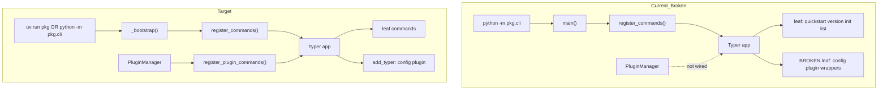

# Riso Python CLI Template — Audit & Finalization Plan (v2)

> Evidence-based audit + hyperfine parallel execution graph for subagent teams.\
> Generated: 2026-06-24. Audit complete (read-only); implementation pending approval.

______________________________________________________________________

## Plan Critique (v1 → v2 improvements)

| Gap in v1                          | v2 enhancement                                                                       |
| ---------------------------------- | ------------------------------------------------------------------------------------ |
| 22 coarse backlog items            | **87 atomic tasks** with `id`, `deps[]`, `owner_lane`, `wave`, `blocks[]`, `files[]` |
| Parallelism implied, not specified | **9 execution waves** with max fan-out and file-ownership matrix                     |
| Test fixes lumped together         | Per-file test repair lanes (T-CLI-\*, isolated)                                      |
| Doc drift single task              | **5 doc surfaces** as parallel leaves (Sphinx, Fumadocs, quickstart, hooks, catalog) |
| Sample smoke under-specified       | Root `pyproject.toml` workspace bug + `autodoc2` called out with fix tasks           |
| Contract drift shallow             | Explicit contract rewrite lane + `validate_command` rename decision                  |
| No coordinator playbook            | Wave gates, subagent prompts, evidence schema, merge rules                           |
| Research appendix thin             | Typer 0.20+, packaging, CLI UX canon with confidence scores                          |
| Rust/Go parity note only           | Parity lane with intentional-asymmetry decision log                                  |

______________________________________________________________________

## Executive Summary

| Metric                  | Verdict                                                                                                                         |
| ----------------------- | ------------------------------------------------------------------------------------------------------------------------------- |
| **Maturity score**      | **5.5 / 10**                                                                                                                    |
| **Ship recommendation** | **No-ship** as "robust/production-ready" until Wave 1–2 complete                                                                |
| **Top 3 blockers**      | (1) `config`/`plugin` Typer groups broken; (2) no `[project.scripts]` vs docs; (3) tests invoke unregistered `app`              |
| **Top 3 quick wins**    | (1) `app.add_typer()` (pattern in `codegen/cli.py.jinja`); (2) `conftest` autouse `register_commands()`; (3) add console script |
| **Parallel lanes**      | 9 lanes (A–I), up to **12 concurrent subagents** in Wave 2                                                                      |
| **Estimated waves**     | 6 implementation waves + 1 evidence wave                                                                                        |

### Maturity Rubric

| Dimension    | Score | Key evidence                                                   |
| ------------ | ----- | -------------------------------------------------------------- |
| Architecture | 6     | Discovery works; `BaseCommand`/Typer dual model incoherent     |
| UX/Output    | 7     | Rich formatters, init progress, aliases                        |
| Config       | 4     | `ConfigManager` OK; **`config set` exit 2** on rendered sample |
| Plugins      | 3     | Manager unit-tested; **not mounted on root app**               |
| Packaging    | 3     | No CLI `[project.scripts]`; `tomli-w` missing from `cli` group |
| Testing      | 4     | ~81 tests; **24 fail** without fixtures / ordering pollution   |
| Docs/CI      | 4     | Contradictory invoke paths; CI runs only `test_cli.py`         |
| Governance   | 5     | `tasks.md` overclaims; T006/T082/T083 falsely `[x]`            |

______________________________________________________________________

## Runtime Evidence (Rendered `samples/cli-docs`)

Executed 2026-06-24 against `samples/cli-docs/render/python/` (Typer 0.26.7 manually installed in sample venv):

| Probe                            | Exit           | Result                                                                  |
| -------------------------------- | -------------- | ----------------------------------------------------------------------- |
| `register_commands()` + `--help` | 0              | Lists quickstart, version, init, config, list, plugin                   |
| `config set app.name test`       | **2**          | Subcommands not exposed — leaf `config_command` registered              |
| `version`                        | 0              | OK                                                                      |
| `--version` (global)             | **2**          | Docker HEALTHCHECK will fail                                            |
| `tests/test_cli.py`              | **3/4 FAIL**   | `RuntimeError: Could not get a command for this Typer instance`         |
| `tests/test_cli_commands.py`     | 21/21 PASS     | **Polluted**: `test_register_commands_adds_to_app` mutates global `app` |
| `tests/test_cli_config.py` (CLI) | **10/10 FAIL** | All `config *` invocations                                              |
| `tests/test_cli_plugins.py`      | 5 FAIL         | CLI plugin commands + `PluginError.plugin_name`                         |
| `tests/test_cli_formatters.py`   | 4 FAIL         | Rich ANSI in assertions                                                 |

` samples/cli-docs/smoke-results.json`\*\*: CLI **failed** — invalid root `render/pyproject.toml` (`[tool.uv.tasks]`), `autodoc2` resolution blocks `uv sync` from render root. Smoke runs only `tests/test_cli.py` from `python/` cwd — not catalog `--help`.

______________________________________________________________________

## Phase 1: Artifact Inventory

| Layer    | Paths                                                                         | Status                               |
| -------- | ----------------------------------------------------------------------------- | ------------------------------------ |
| Entry    | `cli/__main__.py.jinja`, `cli/__init__.py.jinja`                              | ⚠️ registration deferred to `main()` |
| Core     | `cli/core/{base,config,exceptions,formatter,plugin_manager,prompts}.py.jinja` | ✅                                   |
| Commands | `quickstart`, `version`, `init`, `list`, `config`, `plugin`                   | ⚠️ config/plugin diverged            |
| Plugins  | `example_plugin.py.jinja`, `README.md.jinja`                                  | ⚠️ entry-point only                  |
| Tests    | 5× `test_cli*.py.jinja` (~81 tests)                                           | ⚠️                                   |
| Spec     | `specs/009-typer-cli-scaffold/*`                                              | Draft; tasks overclaim               |
| Sample   | `samples/cli-docs/`                                                           | ⚠️ smoke failed                      |

______________________________________________________________________

## Phase 2: Architecture (Current vs Target)



**Canonical invocation decision (pending human gate G-001):**

- **Recommended**: both `[project.scripts]` + `python -m` documented
- Script name: prefer `{{ project_slug }}` (hyphen) for shell UX; module stays `{{ package_name }}`

Reference implementation already in-repo: `codegen/cli.py.jinja` uses `app.add_typer(cache_app, name="cache")`.

______________________________________________________________________

## Phase 3: Spec Compliance Matrix

| Requirement                 | Acceptance                | Implementation               | Test               | Doc    | Verdict      |
| --------------------------- | ------------------------- | ---------------------------- | ------------------ | ------ | ------------ |
| US1 Multi-command           | `--help` lists commands   | `__main__.py.jinja:40-105`   | partial (polluted) | cli.md | **PARTIAL**  |
| US1 Auto-discovery          | new file → help           | `@command()` + glob          | PASS               | cli.md | **PASS**     |
| US1 Exit codes              | 0 success / non-zero fail | `typer.Exit` generic         | partial            | —      | **PARTIAL**  |
| US2 Prompts                 | missing args → prompt     | init confirm only            | no SC-003          | cli.md | **PARTIAL**  |
| US2 Tables/progress         | Rich output               | formatter + init             | partial            | —      | **PARTIAL**  |
| US3 config set/get/list     | persist + precedence      | ConfigManager OK; CLI broken | **FAIL**           | cli.md | **FAIL**     |
| US3 Invalid TOML → defaults | graceful                  | raises ConfigError           | diverged           | —      | **DIVERGED** |
| US4 Plugins in help         | drop-in / entry point     | not mounted                  | no E2E             | mixed  | **FAIL**     |
| FR-011 Command groups       | config/plugin groups      | wrapper pattern              | broken             | —      | **FAIL**     |
| SC-008 ≥90% coverage        | —                         | `fail_under=85`              | —                  | —      | **FAIL**     |
| SC-010 Global `--format`    | —                         | per-command only             | —                  | —      | **FAIL**     |
| Perf \<500ms startup        | —                         | untested                     | —                  | —      | **UNTESTED** |

### User Story → Task Trace (summary)

| Story  | Tasks claimed | Actual                                 | Gap                                               |
| ------ | ------------- | -------------------------------------- | ------------------------------------------------- |
| US1    | T017–T029a    | Core works after `register_commands()` | import-time registration; test_cli.py             |
| US2    | T030–T043     | Formatters exist                       | formatter test ANSI; no global --format           |
| US3    | T044–T057     | Manager OK                             | **Typer group wiring**; tomli-w dep               |
| US4    | T058–T071     | Manager OK                             | **T059/T065 not implemented** in __main__         |
| Polish | T072–T098     | Docs partial                           | T077/T080/T086–T092 open; duplicate Phase 7 block |

______________________________________________________________________

## Phase 4: Contract Mismatches

`specs/009-typer-cli-scaffold/contracts/command-interface.py` vs template:

| Contract                           | Template reality                                      | Severity                    |
| ---------------------------------- | ----------------------------------------------------- | --------------------------- |
| `CommandProtocol.execute() -> int` | Typer callbacks, no `execute`                         | P1 — rewrite contract       |
| `help_text` attr                   | `_cli_help` on functions                              | P1                          |
| `validate_params() -> List[str]`   | `BaseCommand.validate_params(**kwargs) -> None`       | P1                          |
| `CommandGroupProtocol`             | Typer sub-apps, not protocol objects                  | P1                          |
| `validate_command()`               | Same name, different semantics in `base.py.jinja:131` | P2 — rename template helper |
| Missing contract files             | README refs `plugin-interface.py` etc. — absent       | P3                          |

______________________________________________________________________

## Phase 5: Finding Register (F001–F022)

| ID   | Sev | Lens     | Evidence                                                   | Fix                              |
| ---- | --- | -------- | ---------------------------------------------------------- | -------------------------------- |
| F001 | P0  | Arch     | `config set` exit 2; `config.py.jinja:160-167`             | `app.add_typer(config_app)`      |
| F002 | P0  | Arch     | `plugin.py.jinja:138-145` same pattern                     | `app.add_typer(plugin_app)`      |
| F003 | P0  | Test     | `test_cli.py` RuntimeError without register                | import-time bootstrap + conftest |
| F004 | P0  | Pack     | no `[project.scripts]`; cli.md `uv run {{ package_name }}` | add script entry                 |
| F005 | P0  | Docker   | `Dockerfile.jinja:134` `--version` flag                    | `version` subcommand             |
| F006 | P0  | Plugin   | no PluginManager in `__main__.py`                          | wire + register commands         |
| F007 | P1  | Config   | `tomli-w` not in cli group                                 | pyproject.toml.jinja             |
| F008 | P1  | Config   | `_loaded` guard `config.py.jinja:88`                       | reload API                       |
| F009 | P1  | Config   | `env_prefix=""` default                                    | set app prefix                   |
| F010 | P1  | Contract | CommandProtocol unused                                     | update contracts                 |
| F011 | P1  | Test     | global `app` mutation                                      | fresh app fixture                |
| F012 | P1  | Test     | `PluginError.plugin_name` missing                          | exceptions.py.jinja              |
| F013 | P1  | CI       | riso-quality only `test_cli.py`                            | full suite + help smoke          |
| F014 | P1  | Sample   | smoke failed; root pyproject invalid                       | workspace fix                    |
| F015 | P2  | UX       | no global --format/--verbose                               | app callback                     |
| F016 | P2  | UX       | no NO_COLOR                                                | Console(no_color=...)            |
| F017 | P2  | Errors   | typed exit codes unused                                    | map exceptions                   |
| F018 | P2  | Docs     | `src/` vs `python/src/`                                    | path fix                         |
| F019 | P2  | Tasks    | T006 config.local.toml gitignore missing                   | .gitignore.jinja                 |
| F020 | P2  | Tasks    | T082/T083 marked done, no code                             | implement or uncheck             |
| F021 | P3  | Parity   | Rust global --version; Go no HEALTHCHECK                   | decision log                     |
| F022 | P3  | Parity   | TypeScript cli_languages dead option                       | remove or stub                   |

______________________________________________________________________

## Phase 6: Critique & Positioning

### Production-ready today

Command discovery, `@command()` metadata, version+aliases, init+progress, ConfigManager unit logic, PluginManager lazy load (unit), OutputFormatter, shell completion flag.

### Scaffold theater

`config`/`plugin` subcommands, `uv run {{ package_name }}`, plugin drop-in dir (spec), 90% coverage claim, Docker HEALTHCHECK, Fumadocs fictitious `info`/`--version`.

### Delight opportunities (high ROI)

Fix `add_typer`, console script, golden `--help` snapshot, post-gen `uv sync --group cli`, one `example_async` command.

______________________________________________________________________

## Phase 7: Parallel Execution Model

### Lane definitions

| Lane  | Owner focus       | Primary files                                            | Max concurrent        |
| ----- | ----------------- | -------------------------------------------------------- | --------------------- |
| **A** | Core registration | `__main__.py.jinja`                                      | 1 (serialization hub) |
| **B** | Command groups    | `commands/config.py.jinja`, `commands/plugin.py.jinja`   | 2                     |
| **C** | Config core       | `core/config.py.jinja`, `core/exceptions.py.jinja`       | 2                     |
| **D** | Plugins           | `core/plugin_manager.py.jinja`, `plugins/*`              | 2                     |
| **E** | Packaging         | `pyproject.toml.jinja`, `.gitignore.jinja`               | 2                     |
| **F** | Tests             | `tests/test_cli*.py.jinja`, new `conftest.py.jinja`      | 4                     |
| **G** | Docs              | `docs/modules/cli.md.jinja`, fumadocs, quickstart        | 5                     |
| **H** | CI/infra          | workflows, `module_catalog`, `render-samples.sh`, Docker | 4                     |
| **I** | Contracts/spec    | `contracts/*`, `tasks.md`, `finalization-plan.md`        | 2                     |

### File ownership (merge conflict prevention)

| File                       | Lane       | Notes                                     |
| -------------------------- | ---------- | ----------------------------------------- |
| `cli/__main__.py.jinja`    | **A only** | All lanes submit patches via A integrator |
| `commands/config.py.jinja` | B          | Remove wrapper; export `config_app`       |
| `commands/plugin.py.jinja` | B          | Same                                      |
| `tests/conftest.py.jinja`  | F          | New file — create first in Wave 1         |
| `pyproject.toml.jinja`     | E          | Script entry + deps                       |
| `riso-quality.yml.jinja`   | H          | CI pytest glob                            |

### Wave gates (coordinator checklist)

| Wave | Gate command                                             | Required evidence                 |
| ---- | -------------------------------------------------------- | --------------------------------- |
| W0   | Audit sign-off                                           | This document + runtime probe log |
| W1   | `uv run pytest tests/test_cli_config.py -k ConfigSet -x` | config set exit 0                 |
| W2   | `uv run pytest tests/test_cli*.py`                       | all pass, no order dependency     |
| W3   | `./scripts/render-samples.sh --variant cli-docs`         | render OK                         |
| W4   | smoke-results CLI pass                                   | JSON artifact                     |
| W5   | `make quality` in render/python                          | quality pass                      |
| W6   | `uv run pre-commit run --all-files`                      | hooks pass                        |

______________________________________________________________________

## Phase 8: Hyperfine Task Graph (87 tasks)

**Legend:** `deps` = must complete first | `blocks` = downstream ids | `P` = parallelizable within wave

### Wave 0 — Decision gates (sequential, human)

| ID    | Task                                                            | deps | Owner | Effort |
| ----- | --------------------------------------------------------------- | ---- | ----- | ------ |
| G-001 | Decide console script name: `project_slug` vs `package_name`    | —    | Human | S      |
| G-002 | Plugin model: entry-point-only (update spec) vs filesystem scan | —    | Human | S      |
| G-003 | Registration: eager `_bootstrap()` vs lazy `main()` only        | —    | Human | S      |
| G-004 | Global `--format`: root callback vs per-command (SC-010)        | —    | Human | S      |
| G-005 | pydantic-settings integration vs keep ConfigManager separate    | —    | Human | S      |

### Wave 1 — P0 unblockers (max 6 parallel after G-003)

| ID    | Task                                                                      | deps        | lane | files                      | blocks            |
| ----- | ------------------------------------------------------------------------- | ----------- | ---- | -------------------------- | ----------------- |
| T-001 | Create `tests/conftest.py.jinja` with autouse `register_commands` fixture | G-003       | F    | `tests/conftest.py.jinja`  | T-020,T-030       |
| T-002 | Export `config_app` from config module; delete `@command` wrapper         | G-003       | B    | `commands/config.py.jinja` | T-005             |
| T-003 | Export `plugin_app`; delete `@command` wrapper                            | G-003       | B    | `commands/plugin.py.jinja` | T-006             |
| T-004 | Add `register_typer_groups()` in `__main__.py.jinja`                      | T-002,T-003 | A    | `__main__.py.jinja`        | T-005,T-006,T-007 |
| T-005 | `app.add_typer(config_app, name="config")` in register path               | T-004       | A    | `__main__.py.jinja`        | T-010,T-040       |
| T-006 | `app.add_typer(plugin_app, name="plugin")` in register path               | T-004       | A    | `__main__.py.jinja`        | T-041,T-042       |
| T-007 | Implement `_bootstrap()` — call register at import (per G-003)            | T-004       | A    | `__main__.py.jinja`        | T-008,T-020       |
| T-008 | Exclude group modules from leaf `discover_commands` scan                  | T-007       | A    | `__main__.py.jinja`        | T-009             |
| T-009 | Add `if __name__` guard — avoid double bootstrap                          | T-007       | A    | `__main__.py.jinja`        | —                 |
| T-010 | Manual verify: `config set/get/list/validate` CLI                         | T-005       | F    | —                          | T-040             |

### Wave 2 — Packaging + deps (max 4 parallel)

| ID    | Task                                                                        | deps  | lane | files                  | blocks      |
| ----- | --------------------------------------------------------------------------- | ----- | ---- | ---------------------- | ----------- |
| T-011 | Add `[project.scripts]` CLI entry (per G-001)                               | G-001 | E    | `pyproject.toml.jinja` | T-050,T-060 |
| T-012 | Add `tomli-w>=1.0` to `cli` dependency group                                | —     | E    | `pyproject.toml.jinja` | T-040       |
| T-013 | Add `pyyaml>=6.0` to `cli` group (YAML formatter)                           | —     | E    | `pyproject.toml.jinja` | T-035       |
| T-014 | Register `example_plugin` entry point in pyproject `[project.entry-points]` | T-006 | E    | `pyproject.toml.jinja` | T-043       |
| T-015 | Add `config.local.toml` to `.gitignore.jinja`                               | —     | E    | `.gitignore.jinja`     | T-095       |

### Wave 3 — Plugin wiring (max 3 parallel)

| ID    | Task                                                                              | deps        | lane | files                                                 | blocks    |
| ----- | --------------------------------------------------------------------------------- | ----------- | ---- | ----------------------------------------------------- | --------- |
| T-016 | Add `register_plugin_commands(app)` function                                      | T-006,T-014 | D    | `__main__.py.jinja` or `core/plugin_manager.py.jinja` | T-017     |
| T-017 | Lazy-load plugin commands on first access per FR-012                              | T-016       | D    | `plugin_manager.py.jinja`                             | T-043     |
| T-018 | Mark plugin commands in help (suffix `[plugin]` or group)                         | T-017,G-002 | D    | `__main__.py.jinja`                                   | T-065-doc |
| T-019 | Add `PluginError.plugin_name` attribute                                           | —           | C    | `exceptions.py.jinja`                                 | T-045     |
| T-020 | Fix `test_cli.py` — use conftest fixture                                          | T-001,T-007 | F    | `test_cli.py.jinja`                                   | T-070     |
| T-021 | Fix `test_cli_commands.py` — remove `app.registered_commands` mutation test smell | T-001       | F    | `test_cli_commands.py.jinja`                          | T-070     |

### Wave 4 — Config hardening (max 3 parallel)

| ID    | Task                                                            | deps         | lane | files                      | blocks            |
| ----- | --------------------------------------------------------------- | ------------ | ---- | -------------------------- | ----------------- |
| T-022 | Add `load(force: bool = False)` to ConfigManager                | —            | C    | `config.py.jinja`          | T-023             |
| T-023 | Per-command ConfigManager instance or reset between invocations | T-022        | C    | `commands/config.py.jinja` | T-040             |
| T-024 | Default `env_prefix` from \`{{ package_name                     | upper }}\_\` | —    | C                          | `config.py.jinja` |
| T-025 | Map `ConfigError` → exit 2 in config commands                   | —            | C    | `commands/config.py.jinja` | T-040             |
| T-026 | Read-only FS: catch `PermissionError` on save                   | F020         | C    | `config.py.jinja`          | T-055             |
| T-027 | Invalid env var: log warning + fallback                         | F020         | C    | `config.py.jinja`          | T-056             |
| T-028 | Invalid TOML: optional degrade-to-defaults (per G-005/spec)     | G-005        | C    | `config.py.jinja`          | T-057             |

### Wave 5 — Test repair (max 6 parallel)

| ID    | Task                                                 | deps              | lane | files                             | blocks |
| ----- | ---------------------------------------------------- | ----------------- | ---- | --------------------------------- | ------ |
| T-030 | Fix `test_cli_config.py` — all Config\*Command tests | T-010,T-012       | F    | `test_cli_config.py.jinja`        | T-070  |
| T-031 | Fix `test_cli_plugins.py` — CLI command tests        | T-006,T-019       | F    | `test_cli_plugins.py.jinja`       | T-070  |
| T-032 | Fix formatter tests — use `CliRunner` or strip ANSI  | T-013             | F    | `test_cli_formatters.py.jinja`    | T-070  |
| T-033 | Add E2E: plugin command in `--help`                  | T-017             | F    | `test_cli_plugins.py.jinja`       | T-070  |
| T-034 | Add golden `--help` snapshot test                    | T-007             | F    | `test_cli.py.jinja`               | T-070  |
| T-035 | Add YAML formatter test                              | T-013,T-032       | F    | `test_cli_formatters.py.jinja`    | T-070  |
| T-036 | Add `example_async.py.jinja` command                 | G-003             | B    | `commands/example_async.py.jinja` | T-037  |
| T-037 | Add async command test                               | T-036             | F    | `test_cli_commands.py.jinja`      | T-070  |
| T-038 | Add Ctrl+C test (T-081a)                             | T-007             | F    | `test_cli_commands.py.jinja`      | T-070  |
| T-039 | Add `main()` / CLIError path test                    | T-007             | F    | `test_cli.py.jinja`               | T-070  |
| T-040 | Integration: config set/get roundtrip                | T-010,T-012,T-023 | F    | `test_cli_config.py.jinja`        | T-070  |

### Wave 6 — UX polish (max 4 parallel, optional per G-004)

| ID    | Task                                                          | deps  | lane | files                       | blocks      |
| ----- | ------------------------------------------------------------- | ----- | ---- | --------------------------- | ----------- |
| T-041 | Global `@app.callback()` --verbose                            | G-004 | A    | `__main__.py.jinja`         | T-050       |
| T-042 | Global `--format` per SC-010                                  | G-004 | A    | `__main__.py.jinja`         | T-050       |
| T-043 | `NO_COLOR` / dumb terminal in OutputFormatter                 | —     | C    | `formatter.py.jinja`        | T-032       |
| T-044 | Add `@app.callback()` `--version` OR document subcommand only | G-001 | A    | `__main__.py.jinja`         | T-062,T-050 |
| T-045 | Fix `test_plugin_error_includes_plugin_name`                  | T-019 | F    | `test_cli_plugins.py.jinja` | T-070       |

### Wave 7 — Docs (max 5 parallel)

| ID    | Task                                                              | deps        | lane | files                                    | blocks |
| ----- | ----------------------------------------------------------------- | ----------- | ---- | ---------------------------------------- | ------ |
| T-050 | Fix `cli.md.jinja` invocation + `python/src/` paths               | T-011       | G    | `docs/modules/cli.md.jinja`              | T-080  |
| T-051 | Fix Fumadocs `cli.mdx.jinja` — remove `info`, `--version`         | T-011       | G    | `fumadocs/.../cli.mdx.jinja`             | T-080  |
| T-052 | Add CLI section to `quickstart.md`                                | T-050       | G    | `docs/guides/quickstart.md`              | T-077  |
| T-053 | Update `post_gen_project.py` CLI guidance + `uv sync --group cli` | T-011       | G    | `hooks/post_gen_project.py`              | T-080  |
| T-054 | Update `prompt-reference.md.jinja` invoke examples                | T-050       | G    | `docs/modules/prompt-reference.md.jinja` | —      |
| T-055 | Document exit codes in cli.md                                     | T-025       | G    | `cli.md.jinja`                           | —      |
| T-056 | Document env prefix behavior                                      | T-024       | G    | `cli.md.jinja`                           | —      |
| T-057 | Document invalid TOML behavior (actual)                           | T-028       | G    | `cli.md.jinja`                           | —      |
| T-058 | Plugin docs: entry-point model (per G-002)                        | G-002,T-018 | G    | `plugins/README.md.jinja`                | —      |
| T-059 | Add 5 complete command examples (SC-009)                          | T-050       | G    | `cli.md.jinja`                           | —      |

### Wave 8 — CI / infra (max 4 parallel)

| ID    | Task                                                        | deps  | lane | files                                      | blocks |
| ----- | ----------------------------------------------------------- | ----- | ---- | ------------------------------------------ | ------ |
| T-060 | Fix Docker HEALTHCHECK → `version` subcommand               | T-044 | H    | `Dockerfile.jinja`, `Dockerfile.dev.jinja` | T-074  |
| T-061 | Fix Rust Docker binary name slug vs package                 | —     | H    | `Dockerfile.jinja`                         | —      |
| T-062 | Align `module_catalog.json.jinja` validation_commands       | T-011 | H    | `module_catalog.json.jinja`                | T-073  |
| T-063 | `render-samples.sh`: add `--help` smoke + `test_cli*.py`    | T-020 | H    | `scripts/render-samples.sh`                | T-073  |
| T-064 | `riso-quality.yml.jinja`: pytest `tests/test_cli*.py`       | T-070 | H    | `riso-quality.yml.jinja`                   | T-075  |
| T-065 | CircleCI/GitLab CLI job parity                              | T-064 | H    | `.circleci`, `.gitlab` templates           | —      |
| T-066 | Fix render root `pyproject.toml` workspace stub             | —     | H    | `package.json.jinja` or workspace template | T-073  |
| T-067 | Resolve `autodoc2` in docs group or make optional for smoke | —     | H    | `pyproject.toml.jinja`                     | T-073  |
| T-068 | `validate_dockerfiles.py` CLI healthcheck assertion         | T-060 | H    | `scripts/ci/validate_dockerfiles.py`       | T-074  |

### Wave 9 — Contracts, quality, evidence (max 4 parallel)

| ID    | Task                                                               | deps              | lane | files                                     | blocks      |
| ----- | ------------------------------------------------------------------ | ----------------- | ---- | ----------------------------------------- | ----------- |
| T-070 | Full suite green: `uv run pytest tests/test_cli*.py -v`            | T-030..T-045      | F    | —                                         | T-071,T-073 |
| T-071 | Raise `fail_under` to 90 for CLI paths                             | T-070             | F    | `coverage.cfg.jinja`                      | T-075       |
| T-072 | Ruff/ty/pylint on CLI template paths (T089–T091)                   | T-070             | I    | `template/.../cli/`                       | T-075       |
| T-073 | Regenerate `samples/cli-docs`                                      | T-066,T-067,T-070 | H    | `samples/cli-docs/`                       | T-074       |
| T-074 | Capture `smoke-results.json` CLI pass                              | T-073,T-063       | H    | `samples/cli-docs/`                       | T-075       |
| T-075 | `make quality` in render/python                                    | T-074             | H    | —                                         | T-076       |
| T-076 | `uv run pre-commit run --all-files`                                | T-075             | I    | —                                         | T-077       |
| T-077 | Reconcile `tasks.md` — uncheck false [x], remove duplicate Phase 7 | T-076             | I    | `tasks.md`                                | T-078       |
| T-078 | Update contracts: Typer-first protocols                            | G-003             | I    | `contracts/command-interface.py`          | —           |
| T-079 | Rename template `validate_command` → `is_cli_command`              | T-078             | A    | `base.py.jinja`, `core/__init__.py.jinja` | —           |
| T-080 | SC-001–SC-010 validation checklist in tasks.md                     | T-050..T-059      | I    | `tasks.md`                                | T-095       |
| T-095 | copier diff sovereignty evidence (T096)                            | T-073             | I    | —                                         | DONE        |

### Wave 10 — Parity / future (parallel, non-blocking)

| ID    | Task                                           | deps  | lane | notes                     |
| ----- | ---------------------------------------------- | ----- | ---- | ------------------------- |
| T-090 | Rust/Go parity decision log in cli.md          | —     | I    | intentional asymmetry     |
| T-091 | TypeScript cli_languages: remove or stub error | —     | I    | copier.yml                |
| T-092 | Performance benchmark: startup \<500ms         | T-070 | F    | optional pytest-benchmark |
| T-093 | sphinx-click autodoc wiring for CLI            | —     | G    | docs group                |
| T-094 | codegen vs main CLI disambiguation in docs     | T-050 | G    | reduce confusion          |

______________________________________________________________________

## DAG Summary (critical path)

```text
G-001,G-003 → T-002,T-003 → T-004 → T-005,T-006,T-007 → T-010
T-007 → T-001,T-020 → T-030 → T-070 → T-073 → T-074 → T-075 → T-076
T-011 → T-050,T-060,T-062 (parallel docs/infra)
```

**Critical path length:** 11 tasks (~3–4 agent-days with parallel waves).

______________________________________________________________________

## Subagent Coordinator Playbook

### Prompt template (per task)

```text
You are Lane {LANE} executing task {ID} for Riso CLI finalization.
Repo: /Users/ww/dev/projects/riso
Read first: specs/009-typer-cli-scaffold/finalization-plan.md (task {ID})
Files you may edit: {FILES}
Dependencies satisfied: {DEPS}
Do NOT edit: {FORBIDDEN_FILES}
Acceptance: {AC}
After completion: run {VERIFY_CMD} and paste output.
```

### Merge rules

1. **Lane A** merges last in Wave 1 — integrates B patches into `__main__.py.jinja`
1. **Lane F** may start test fixes only after T-010 passes (config CLI manual verify)
1. **Lane H** render tasks wait for T-070 (template tests green in riso repo)
1. Never hand-edit `samples/*/render/` — only via `render-samples.sh`

### Evidence schema (per task PR)

```json
{
  "task_id": "T-010",
  "verify_cmd": "uv run pytest tests/test_cli_config.py::TestConfigSetCommand -v",
  "exit_code": 0,
  "files_touched": ["template/files/python/src/.../config.py.jinja"],
  "spec_refs": ["US3", "T044", "F001"]
}
```

______________________________________________________________________

## Test & Release Gates (exact commands)

```bash
# Riso maintainer repo
uv run pytest tests/ -k cli -v
uv run ruff check template/files/python/src template/files/python/tests
uv run ty check template/hooks

# After render
./scripts/render-samples.sh --variant cli-docs
cd samples/cli-docs/render/python
uv sync --group cli --group test
uv run pytest tests/test_cli*.py -v --cov=src --cov-report=term-missing
uv run python -m riso_cli_docs.cli --help
uv run python -m riso_cli_docs.cli config set app.name test --config /tmp/riso.toml
uv run python -m riso_cli_docs.cli config get app.name --config /tmp/riso.toml
uv run riso_cli_docs --help   # after T-011

# Governance
uv run python scripts/ci/validate_dockerfiles.py
uv run pre-commit run --all-files
```

______________________________________________________________________

## Research Appendix

| Claim                                                      | Evidence                                   | Source                                                                      | Confidence |
| ---------------------------------------------------------- | ------------------------------------------ | --------------------------------------------------------------------------- | ---------- |
| Typer groups need `app.add_typer()`, not callback wrappers | `config set` exit 2; codegen pattern works | typer.tiangolo.com/tutorial/subcommands; in-repo `codegen/cli.py.jinja:612` | 0.97       |
| `CliRunner` requires commands on app before invoke         | test_cli.py RuntimeError                   | typer.testing docs; runtime 2026-06-24                                      | 0.95       |
| `[project.scripts]` standard for installed CLIs            | PyPA guidance                              | packaging.python.org                                                        | 0.92       |
| `python -m pkg.cli` valid dev invocation                   | spec US1 acceptance text                   | spec.md:28                                                                  | 0.99       |
| `NO_COLOR` disables ANSI                                   | CLI UX convention                          | no-color.org                                                                | 0.85       |
| Entry-point plugin discovery vs filesystem                 | setuptools docs                            | packaging.python.org entry points                                           | 0.90       |

______________________________________________________________________

## Open Questions (human gates)

1. **G-001** Script name: `riso-cli-docs` (slug) vs `riso_cli_docs` (package)?
1. **G-002** Plugins: update spec to entry-point-only OR implement filesystem scan?
1. **G-003** Eager `_bootstrap()` at import (recommended for testability) vs lazy?
1. **G-004** Global `--format` on root app — required for SC-010?
1. **G-005** Invalid TOML: fail-fast (current) vs degrade-to-defaults (spec edge case)?

______________________________________________________________________

## Prioritized Backlog (rollup — 22 → 87 atomic)

| Priority | Count | Wave   | Theme                                      |
| -------- | ----- | ------ | ------------------------------------------ |
| P0       | 10    | W1–W2  | Typer groups, bootstrap, packaging, Docker |
| P1       | 28    | W3–W5  | Plugins, config, tests, CI                 |
| P2       | 31    | W6–W8  | UX, docs, infra                            |
| P3       | 18    | W9–W10 | Quality, contracts, parity, perf           |

**Ship criteria:** Waves 1–5 complete + T-073/T-074 smoke pass + T-075 quality pass.

______________________________________________________________________

*End of finalization plan v2. Implementation owner: template maintainers. Spec: `009-typer-cli-scaffold`.*
