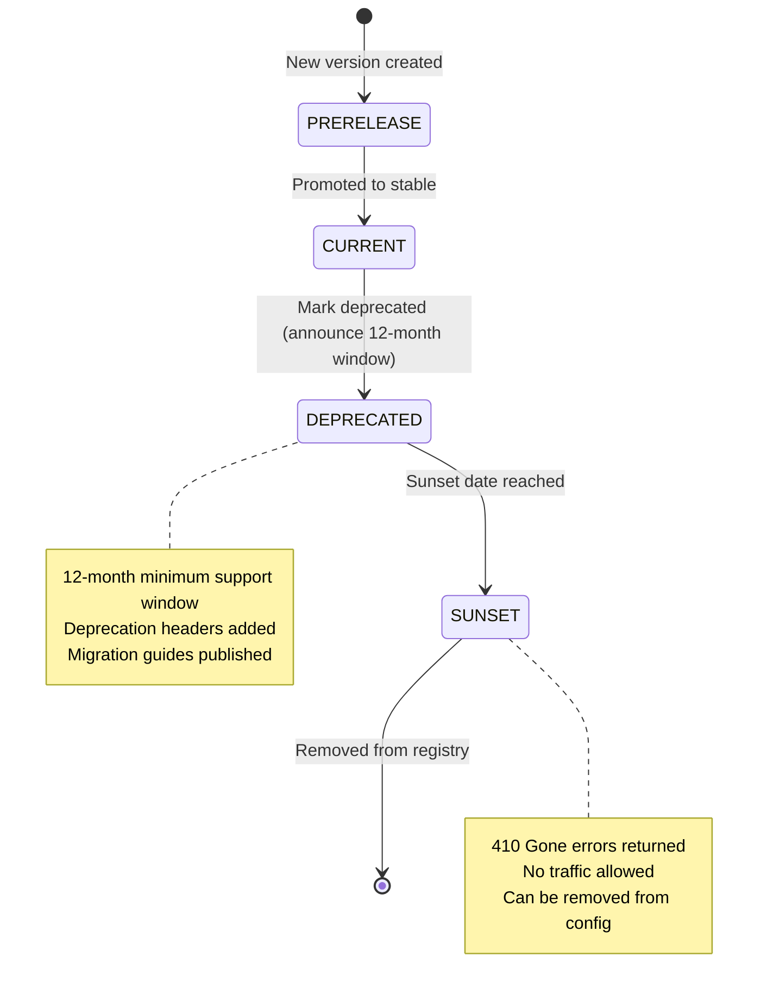

# Data Model: API Versioning Strategy

**Feature**: 010-api-versioning-strategy  
**Date**: 2025-11-02  
**Based on**: [spec.md](./spec.md), [research.md](./research.md)

## Overview

This document defines the data model for the API versioning system, including entities, relationships, validation rules, and state transitions.

## Core Entities

### 1. ConsumerIdentity

**Purpose**: Represents the identity of an API consumer for usage tracking and analytics.

**Attributes**:
- `consumer_id` (str, required): Unique identifier for the consumer
- `source` (enum: API_KEY, OAUTH_CLIENT, CUSTOM_HEADER, IP_ADDRESS): How the identity was extracted
- `raw_value` (str, required): The original value extracted from the request

**Validation Rules**:
- `consumer_id` must be non-empty string
- `source` must be one of the defined enum values

**Extraction Priority** (highest to lowest):
1. `X-API-Key` header → source=API_KEY
2. OAuth client ID from Authorization header → source=OAUTH_CLIENT  
3. `X-Consumer-ID` custom header → source=CUSTOM_HEADER
4. IP address fallback → source=IP_ADDRESS

**Relationships**:
- Referenced by `VersionUsageMetric.consumer_id` and `consumer_source`

---

### 2. VersionMetadata

**Purpose**: Represents a specific version of the API with all its lifecycle metadata.

**Attributes**:
- `version_id` (str, required): Unique version identifier (e.g., "v1", "v2", "v3-beta")
  - Pattern: `^v[0-9]+(-[a-z]+)?$`
  - Examples: "v1", "v2", "v3-alpha", "v3-beta"
- `status` (VersionStatus enum, required): Current lifecycle status
- `release_date` (date, required): Date when version was released to production
- `deprecation_date` (date, optional): Date when version was marked deprecated
- `sunset_date` (date, optional): Date when version will be/was removed
- `description` (str, optional): Human-readable description of the version
- `supported_features` (frozenset[str], default=empty): Set of feature flags enabled in this version
- `breaking_changes_from` (str, optional): Version ID from which breaking changes occurred
- `migration_guide_url` (str, optional): URL to migration documentation
- `opt_in_required` (bool, default=False): Whether version requires explicit opt-in header

**Validation Rules**:
- `version_id` must be unique across all versions
- If `status` is `DEPRECATED`, `deprecation_date` must be set
- If `status` is `SUNSET`, `sunset_date` must be in the past
- If `sunset_date` is set, `deprecation_date` must also be set
- `sunset_date` must be at least 12 months after `deprecation_date` (FR-020: 12-month minimum support window)
- `release_date` must be before `deprecation_date` (if set)
- `deprecation_date` must be before `sunset_date` (if set)
- If `breaking_changes_from` is set, it must reference an existing version
- `migration_guide_url` must match pattern `^https?://` if provided (absolute URL validation)

**State Transitions**:
```
PRERELEASE → CURRENT → DEPRECATED → SUNSET
     ↓          ↓           ↓
   (opt-in)  (default)  (warnings)  (errors)
```

**Invariants**:
- Exactly one version must have status `CURRENT` at any time (default version)
- Once a version reaches `SUNSET`, it cannot transition back
- `VersionMetadata` is immutable (frozen dataclass) for thread safety

### 2. VersionStatus

**Purpose**: Enum representing the lifecycle state of an API version.

**Values**:
- `CURRENT`: Active, stable version (usually the default)
- `DEPRECATED`: Still supported but scheduled for removal, deprecation warnings sent
- `SUNSET`: No longer supported, returns 410 Gone errors
- `PRERELEASE`: Beta/alpha version, requires explicit opt-in

**Business Rules**:
- Only `CURRENT` and `DEPRECATED` versions are discoverable by default
- `PRERELEASE` versions only visible to consumers with opt-in header
- `SUNSET` versions reject all requests immediately

### 3. VersionSpecification

**Purpose**: Represents how a consumer specified their desired version in a request.

**Attributes**:
- `version_id` (str, required): The resolved version identifier
- `source` (SpecificationSource enum, required): Where the version was specified
- `raw_value` (str, required): Original value from request
- `precedence_rank` (int, required): Priority order (1=header, 2=url, 3=query)

**SpecificationSource Enum**:
- `HEADER`: Version from HTTP header (`X-API-Version` or `API-Version`)
- `URL_PATH`: Version from URL path segment (e.g., `/v2/users`)
- `QUERY_PARAM`: Version from query parameter (`?version=v2`)
- `DEFAULT`: No version specified, using default

**Precedence Rules** (FR-016):
1. Header (highest priority)
2. URL path
3. Query parameter
4. Default version (lowest priority)

### 4. VersionRoute

**Purpose**: Maps version identifiers to handler implementations.

**Attributes**:
- `version_id` (str, required): Version this route applies to
- `endpoint_pattern` (str, required): Endpoint path pattern (e.g., "/users", "/orders/{id}")
- `handler` (Callable, required): Version-specific handler function
- `request_schema` (type, optional): Pydantic model or schema for request validation
- `response_schema` (type, optional): Pydantic model or schema for response validation

**Validation Rules**:
- `version_id` must reference an existing version in VersionRegistry
- `endpoint_pattern` must be unique within a version (but can differ across versions)
- Handler must be an async callable for ASGI compatibility

**Relationships**:
- Many `VersionRoute` instances can reference one `VersionMetadata`
- Each version can have different handlers for the same endpoint pattern

### 5. DeprecationNotice

**Purpose**: Communication about version lifecycle for consumers.

**Attributes**:
- `version_id` (str, required): Version being deprecated
- `announced_date` (date, required): When deprecation was announced
- `sunset_date` (date, required): When version will be removed
- `reason` (str, required): Why the version is being deprecated
- `recommended_version` (str, required): Which version consumers should migrate to
- `migration_guide_url` (str, required): URL to migration documentation
- `breaking_changes_summary` (list[str], optional): Key breaking changes to be aware of

**Validation Rules**:
- `sunset_date` must be at least 12 months after `announced_date`
- `recommended_version` must exist and have status `CURRENT` or `DEPRECATED`
- `migration_guide_url` must be a valid URL or relative path

**Usage**:
- Included in `Deprecation` and `Sunset` response headers
- Logged when deprecated version is accessed
- Returned by version discovery endpoint

### 6. VersionRegistry

**Purpose**: Singleton in-memory registry for fast version metadata lookups.

**Attributes**:
- `_versions` (Dict[str, VersionMetadata], private): Version ID → metadata mapping
- `_config_path` (Path, private): Path to YAML configuration file
- `_last_loaded` (datetime, private): Timestamp of last config load

**Methods**:
- `load_from_file(config_path: Path) -> VersionRegistry`: Load config, validate, populate registry
- `get_version(version_id: str) -> Optional[VersionMetadata]`: O(1) lookup by version ID
- `get_current_version() -> Optional[VersionMetadata]`: Get default/current version
- `list_all_versions() -> list[VersionMetadata]`: All versions including sunset
- `list_active_versions() -> list[VersionMetadata]`: Only current, deprecated, prerelease
- `reload() -> None`: Re-load configuration file (for hot-reload)

**Invariants**:
- Singleton pattern - only one instance per application
- Thread-safe for read operations (no write operations after initialization)
- Immutable after load (except for `reload()` calls)

### 8. VersionUsageMetric

**Purpose**: Log entry for version usage tracking and analytics (FR-017).

**Attributes**:
- `timestamp` (datetime, required): When the request was processed
- `version_id` (str, required): Version used for this request
- `endpoint_path` (str, required): API endpoint accessed
- `http_status` (int, required): Response status code
- `latency_ms` (float, required): Request processing time in milliseconds
- `consumer_id` (str, required): Identifier for the API consumer (extracted via ConsumerIdentity priority with IP fallback)
- `consumer_source` (enum: API_KEY, OAUTH_CLIENT, CUSTOM_HEADER, IP_ADDRESS, required): How consumer identity was determined
- `version_source` (SpecificationSource, required): How version was specified (HEADER, URL_PATH, QUERY_PARAM, DEFAULT)
- `is_deprecated_access` (bool, required): Whether accessed version is deprecated

**Usage**:
- Written to structured logs (JSON format)
- Aggregated for deprecation impact analysis
- Used to identify consumers needing migration support
- Monitored for adoption tracking of new versions

**Indexing**:
- Primary: `timestamp` (for time-series queries)
- Secondary: `version_id` (for adoption metrics)
- Secondary: `consumer_id` (for targeted outreach)

## Entity Relationships

```
VersionRegistry (1) ──── (0..*) VersionMetadata
                                     │
                                     │ (1)
                                     │
                                     ▼
VersionSpecification (0..*)  DeprecationNotice (0..1)
                                     │
                                     │ (1)
                                     │
                                     ▼
                              VersionRoute (0..*)  
                                     │
                                     │
                                     ▼
                              VersionUsageMetric (0..*)
                                     │
                                     │ (references)
                                     ▼
                              ConsumerIdentity
```**Relationships**:
1. **VersionRegistry → VersionMetadata**: Registry contains multiple versions (one-to-many)
2. **VersionMetadata → DeprecationNotice**: Each version has at most one deprecation notice (one-to-one optional)
3. **VersionMetadata → VersionRoute**: Each version can have multiple route handlers (one-to-many)
4. **VersionMetadata → VersionUsageMetric**: Each version generates multiple usage logs (one-to-many)
5. **VersionSpecification → VersionMetadata**: Each specification resolves to one version (many-to-one)
6. **VersionUsageMetric → ConsumerIdentity**: Each metric references consumer identity extraction logic (many-to-one pattern)

## State Transitions

### Version Lifecycle



### Request Version Resolution Flow

```
1. Request arrives → Extract version indicators
                     ├─ Header: X-API-Version
                     ├─ URL: /v{N}/...
                     └─ Query: ?version=v{N}
                     
2. Apply precedence → Header > URL > Query > Default

3. Validate version → Check if exists in registry
                     
4. Check lifecycle → SUNSET? → Return 410 Gone
                   → PRERELEASE + no opt-in? → Return 403 Forbidden
                   → DEPRECATED? → Add Deprecation header
                   → CURRENT? → Proceed normally

5. Route to handler → Version-specific endpoint handler

6. Log metrics → VersionUsageMetric entry
```

## Validation Rules Summary

### Configuration File Validation
- All required fields present in YAML
- Date fields in ISO 8601 format
- Version IDs match pattern `^v[0-9]+(-[a-z]+)?$`
- Exactly one version with status `CURRENT`
- All `breaking_changes_from` references exist
- Deprecation/sunset dates respect 12-month minimum window

### Runtime Validation
- Version ID exists in registry (404 if not)
- Version is not sunset (410 if sunset)
- Pre-release versions require opt-in header (403 if missing)
- Contradictory version specifications return 400 Bad Request

### Data Integrity
- VersionMetadata is immutable (frozen dataclass)
- Registry is singleton (one instance per process)
- Version IDs are unique and stable

## Performance Characteristics

| Operation | Complexity | Expected Latency |
|-----------|-----------|------------------|
| Version lookup | O(1) | 50-200ns |
| Version validation | O(1) | 50-200ns |
| Precedence resolution | O(1) | 100-500ns |
| Total routing overhead | O(1) | 0.1-1ms |
| Registry initialization | O(n) | <10ms for 100 versions |

## Storage Requirements

| Entity | Count | Memory per Instance | Total |
|--------|-------|---------------------|-------|
| VersionMetadata | 5 | ~500 bytes | ~2.5 KB |
| VersionRoute | 500 | ~200 bytes | ~100 KB |
| VersionRegistry | 1 | ~10 KB | ~10 KB |
| **Total** | - | - | **~112.5 KB** |

Memory footprint scales linearly with version count and endpoint count.

## Examples

### Version Metadata Instance
```python
v2_metadata = VersionMetadata(
    version_id="v2",
    status=VersionStatus.CURRENT,
    release_date=date(2025, 6, 1),
    deprecation_date=None,
    sunset_date=None,
    description="Enhanced API with improved validation",
    supported_features=frozenset(["basic_crud", "pagination", "advanced_filtering"]),
    breaking_changes_from="v1",
    migration_guide_url="/docs/migrations/v1-to-v2",
    opt_in_required=False
)
```

### Deprecation Notice Instance
```python
v1_deprecation = DeprecationNotice(
    version_id="v1",
    announced_date=date(2025, 6, 1),
    sunset_date=date(2026, 6, 1),
    reason="Performance improvements and breaking schema changes in v2",
    recommended_version="v2",
    migration_guide_url="/docs/migrations/v1-to-v2",
    breaking_changes_summary=[
        "User.email field now required",
        "Date formats changed to ISO 8601",
        "Pagination parameters renamed"
    ]
)
```

### Version Usage Metric Instance
```python
metric = VersionUsageMetric(
    timestamp=datetime.now(UTC),
    version_id="v2",
    endpoint_path="/users",
    http_status=200,
    latency_ms=45.3,
    consumer_id="client_abc123",
    consumer_source=ConsumerSource.API_KEY,
    version_source=SpecificationSource.HEADER,
    is_deprecated_access=False
)
```

## Next Steps

1. Generate API contracts in `/contracts/` directory
2. Create quickstart guide with integration examples
3. Implement data model as Python dataclasses with validation
