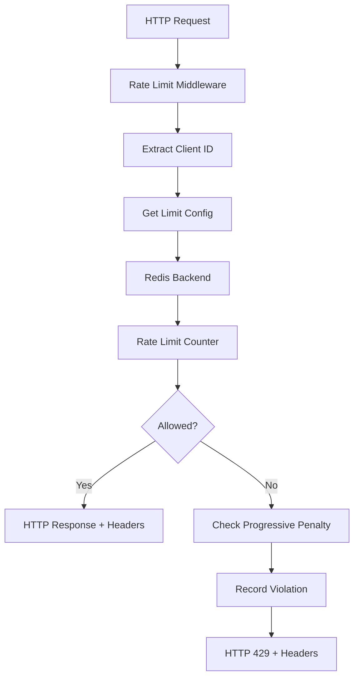

# Data Model: API Rate Limiting & Throttling

**Phase**: 1 (Design & Contracts)  
**Date**: 2025-11-01  
**Status**: Complete

---

## Overview

The rate limiting system uses **Redis** as its primary data store for distributed counter management. This document defines the Redis key structure, data types, and lifecycle for all rate limit entities.

---

## Entities

### 1. Rate Limit Counter

**Purpose**: Tracks token consumption for a specific client/endpoint combination

**Redis Data Structure**: HASH  
**Key Pattern**: `ratelimit:counter:{scope}:{identifier}:{endpoint}`

**Examples**:
```
ratelimit:counter:ip:192.0.2.1:/api/v1/search
ratelimit:counter:user:alice:/api/v1/compute
ratelimit:counter:tier:premium:global
```

**Hash Fields**:
| Field | Type | Description | Example |
|-------|------|-------------|---------|
| `tokens` | float | Current available tokens | `42.5` |
| `last_refill` | float | Unix timestamp of last refill | `1698765432.123` |
| `max_tokens` | int | Maximum tokens (bucket capacity) | `100` |
| `refill_rate` | float | Tokens added per second | `1.666` (100/60s) |

**Lifecycle**:
1. **Creation**: On first request, initialize with `tokens=max_tokens`, `last_refill=now`
2. **Update**: On each request, refill tokens based on elapsed time, then consume requested amount
3. **Expiration**: TTL set to `window * 2` (e.g., 120s for 60s window) for garbage collection

**Operations** (via Lua script):
- `check_and_consume(key, requested_tokens, now)` → `{allowed: bool, remaining: float, reset_at: float}`

**Validation Rules**:
- `tokens` ≥ 0 (never negative)
- `last_refill` ≤ now (monotonic timestamps)
- `max_tokens` > 0
- `refill_rate` > 0

---

### 2. Progressive Penalty Tracker

**Purpose**: Records rate limit violations for progressive penalty calculation

**Redis Data Structure**: ZSET (Sorted Set)  
**Key Pattern**: `ratelimit:penalties:{client_id}`

**Example**: `ratelimit:penalties:192.0.2.1`

**ZSET Members**:
- **Score**: Unix timestamp of violation
- **Member**: Violation ID (timestamp as string, ensures uniqueness)

**Example**:
```
ZADD ratelimit:penalties:192.0.2.1 1698765432.123 "1698765432.123"
ZADD ratelimit:penalties:192.0.2.1 1698765492.456 "1698765492.456"
ZADD ratelimit:penalties:192.0.2.1 1698765552.789 "1698765552.789"
```

**Lifecycle**:
1. **Creation**: On first violation, create ZSET and add timestamp
2. **Update**: On subsequent violations, add new timestamps
3. **Cleanup**: `ZREMRANGEBYSCORE` removes violations older than detection window
4. **Expiration**: TTL set to detection_window (e.g., 3600s for 1 hour)

**Operations**:
- `record_violation(client_id, now)` → Add timestamp to ZSET
- `count_violations(client_id, window_start, now)` → `ZCOUNT` violations in window
- `get_penalty_multiplier(violation_count, config)` → Calculate cooldown multiplier

**Validation Rules**:
- Scores must be valid Unix timestamps
- Members must be unique (using timestamp as member ensures uniqueness)
- ZSET size limited to max 1000 entries per client (protection against memory exhaustion)

---

### 3. Configuration Cache

**Purpose**: In-memory cache of TOML configuration to avoid disk I/O on every request

**Data Structure**: Python dataclass/Pydantic model (not in Redis)

**Schema**:
```python
@dataclass
class LimitConfig:
    limit: int  # Max requests
    window: int  # Time window in seconds
    algorithm: Literal["token_bucket", "sliding_window"] = "token_bucket"
    
    @property
    def refill_rate(self) -> float:
        """Tokens per second."""
        return self.limit / self.window

@dataclass
class EndpointConfig:
    pattern: str  # Endpoint pattern (supports wildcards)
    limit: int
    window: int

@dataclass
class TierConfig:
    name: str  # Tier identifier (anonymous, standard, premium)
    limit: int
    window: int

@dataclass
class ProgressivePenaltyConfig:
    enabled: bool = False
    detection_window: int = 3600
    violation_threshold: int = 3
    penalty_multipliers: list[int] = field(default_factory=lambda: [1, 2, 4, 8])

@dataclass
class RateLimitConfig:
    enabled: bool = True
    default_limit: int = 100
    default_window: int = 60
    trusted_proxy_depth: int = 1
    failure_mode: Literal["fail_open", "fail_closed"] = "fail_open"
    
    redis_url: str
    redis_topology: Literal["single", "sentinel", "cluster"] = "sentinel"
    redis_pool_size: int = 20
    redis_socket_timeout: float = 5.0
    
    endpoints: list[EndpointConfig] = field(default_factory=list)
    tiers: list[TierConfig] = field(default_factory=list)
    progressive_penalties: ProgressivePenaltyConfig = field(default_factory=ProgressivePenaltyConfig)
    exemptions: list[dict] = field(default_factory=list)  # {type: "ip"|"user_id", value: str}
```

**Lifecycle**:
1. **Load**: Read TOML file at startup, parse into Pydantic models
2. **Cache**: Store in memory for fast access
3. **Reload**: On SIGHUP signal or config file change, re-parse and update cache
4. **Validation**: Pydantic validates types, ranges (e.g., limit > 0, window ≥ 1)

**Operations**:
- `get_limit(endpoint, client_id)` → Resolve applicable LimitConfig (endpoint-specific > tier-specific > default)
- `is_exempted(client_id)` → Check if client in exemption list

---

### 4. Rate Limit Headers

**Purpose**: HTTP response headers conveying rate limit status to clients

**Data Structure**: HTTP headers (key-value pairs)

**Schema**:
| Header | Type | Description | Example | Required |
|--------|------|-------------|---------|----------|
| `X-RateLimit-Limit` | int | Maximum requests per window | `100` | Yes |
| `X-RateLimit-Remaining` | int | Remaining requests in current window | `42` | Yes |
| `X-RateLimit-Reset` | int | Unix timestamp when limit resets | `1698765492` | Yes |
| `Retry-After` | int | Seconds until retry (429 responses only) | `30` | Conditional |

**Lifecycle**:
1. **Generation**: After rate limit check, compute from Redis counter state
2. **Injection**: Add to response headers (all responses: 200, 429, 5xx)
3. **Client Parsing**: Client reads headers to implement retry logic

**Validation Rules**:
- `X-RateLimit-Limit` > 0
- `X-RateLimit-Remaining` ≥ 0 and ≤ Limit
- `X-RateLimit-Reset` > now (future timestamp)
- `Retry-After` present only on 429 responses

---

### 5. Client Identifier

**Purpose**: Unique identifier for rate limit enforcement (IP address or user ID)

**Data Structure**: String (stored in Redis keys)

**Extraction Algorithm**:
```python
def extract_client_id(request: Request, config: RateLimitConfig) -> str:
    """
    Extract client identifier with priority:
    1. Authenticated user ID (from JWT)
    2. IP address (from X-Forwarded-For or connection)
    """
    # Check for authentication
    auth_header = request.headers.get("Authorization")
    if auth_header and auth_header.startswith("Bearer "):
        token = auth_header[7:]
        try:
            payload = decode_jwt(token)  # Verify signature
            if "user_id" in payload:
                return f"user:{payload['user_id']}"
        except JWTError:
            pass  # Invalid token, fall back to IP
    
    # Extract IP from X-Forwarded-For (rightmost untrusted IP)
    xff_header = request.headers.get("X-Forwarded-For")
    if xff_header:
        ips = [ip.strip() for ip in xff_header.split(",")]
        if len(ips) > config.trusted_proxy_depth:
            client_ip = ips[-(config.trusted_proxy_depth + 1)]
        else:
            client_ip = ips[0]
    else:
        client_ip = request.client.host
    
    # Normalize IPv6 addresses
    client_ip = str(ipaddress.ip_address(client_ip))
    
    return f"ip:{client_ip}"
```

**Formats**:
- **IP-based**: `ip:192.0.2.1` or `ip:2001:db8::1` (IPv6 canonical form)
- **User-based**: `user:alice` or `user:bob@example.com`

**Validation Rules**:
- IP format: Valid IPv4 or IPv6 address (validated via `ipaddress.ip_address()`)
- User ID format: Non-empty string, max 255 characters
- Prefix required: Must start with `ip:` or `user:`

---

## Relationships



**Key Relationships**:
1. **Request → Client ID** (1:1): Each request maps to exactly one client identifier
2. **Client ID + Endpoint → Counter** (N:1): Multiple requests share the same counter
3. **Client ID → Penalty Tracker** (1:1): One penalty tracker per client
4. **Config → Multiple Endpoints** (1:N): One config defines limits for many endpoints
5. **Request → Headers** (1:1): Every response includes rate limit headers

---

## State Transitions

### Rate Limit Counter State Machine

```
[INITIAL] → (first request) → [INITIALIZED: tokens=max, last_refill=now]
           ↓
[INITIALIZED] → (request within limit) → [ACTIVE: tokens decreased, last_refill updated]
           ↓
[ACTIVE] → (request exceeds limit) → [EXHAUSTED: tokens=0, deny request]
           ↓
[EXHAUSTED] → (time passes > window) → [RESET: tokens=max, last_refill=now]
           ↓
[ANY STATE] → (TTL expires, no requests) → [DELETED: key removed from Redis]
```

**Transitions**:
- **INITIAL → INITIALIZED**: First request for this client/endpoint, create counter
- **INITIALIZED/ACTIVE → ACTIVE**: Request allowed, refill tokens based on elapsed time, consume requested tokens
- **ACTIVE → EXHAUSTED**: Request denied, tokens insufficient
- **EXHAUSTED → RESET**: After `window` seconds, tokens fully replenished
- **ANY → DELETED**: After `TTL` seconds without requests, Redis evicts key

---

## Data Integrity

### Atomicity Guarantees

**Lua Script for Token Bucket**:
```lua
-- EVALSHA <script_sha> 1 <key> <max_tokens> <refill_rate> <requested> <now>
local key = KEYS[1]
local max_tokens = tonumber(ARGV[1])
local refill_rate = tonumber(ARGV[2])
local requested = tonumber(ARGV[3])
local now = tonumber(ARGV[4])

-- Get current state (HGET returns nil if key doesn't exist)
local last_refill = redis.call('HGET', key, 'last_refill')
local tokens = redis.call('HGET', key, 'tokens')

if not last_refill then
  -- Initialize new bucket
  local initial_tokens = max_tokens - requested
  if initial_tokens >= 0 then
    redis.call('HSET', key, 'last_refill', now, 'tokens', initial_tokens, 'max_tokens', max_tokens, 'refill_rate', refill_rate)
    redis.call('EXPIRE', key, 120)  -- 2x window for TTL
    return {1, initial_tokens, now + (max_tokens / refill_rate)}  -- allowed, remaining, reset_at
  else
    -- First request exceeds limit (rare edge case)
    return {0, 0, now}  -- denied, 0 remaining
  end
end

-- Refill tokens based on elapsed time
local elapsed = now - tonumber(last_refill)
local refilled_tokens = math.min(max_tokens, tonumber(tokens) + elapsed * refill_rate)

-- Check if sufficient tokens available
if refilled_tokens >= requested then
  local new_tokens = refilled_tokens - requested
  redis.call('HSET', key, 'last_refill', now, 'tokens', new_tokens)
  local reset_at = now + ((max_tokens - new_tokens) / refill_rate)
  return {1, new_tokens, reset_at}  -- allowed, remaining, reset_at
else
  redis.call('HSET', key, 'last_refill', now, 'tokens', refilled_tokens)
  local reset_at = now + ((max_tokens - refilled_tokens) / refill_rate)
  return {0, refilled_tokens, reset_at}  -- denied, remaining, reset_at
end
```

**Atomicity Properties**:
- **Single Redis Command**: Lua script executes as atomic transaction (no interleaving)
- **No Race Conditions**: Multiple API instances cannot corrupt counter state
- **Consistent Reads**: All fields (tokens, last_refill) read/written in single operation

### Consistency Guarantees

**Redis Replication**:
- **Asynchronous Replication**: Master → Replicas with ~1ms lag
- **Eventual Consistency**: Replicas may lag during high write load
- **Failover Tolerance**: Up to 1 second of counter data loss acceptable (Sentinel failover time)

**Acceptable Inconsistencies**:
- **±1 request accuracy**: Due to replication lag and network timing
- **Brief over-limiting**: During Redis failover, new master may have slightly lower counter values
- **Brief under-limiting**: If client switches API instances mid-burst, may get extra tokens

---

## Performance Characteristics

### Storage Overhead

**Per Rate Limit Counter**:
- Redis HASH: ~100 bytes (4 fields × 25 bytes average)
- Key name: ~50 bytes (`ratelimit:counter:ip:192.0.2.1:/api/v1/search`)
- **Total**: ~150 bytes per active counter

**Per Penalty Tracker**:
- Redis ZSET: ~50 bytes per violation timestamp
- Key name: ~40 bytes (`ratelimit:penalties:192.0.2.1`)
- **Total**: ~90 bytes per violation (typical: 3-10 violations stored)

**Capacity Example**:
- 10,000 active clients × 5 endpoints = 50,000 counters
- 50,000 counters × 150 bytes = 7.5 MB
- 1,000 clients with penalties × 5 violations × 90 bytes = 450 KB
- **Total Memory**: ~8 MB for 10k clients (well within Redis capacity)

### Latency Targets

**Redis Operations**:
- Token bucket Lua script: <2ms P95 (local Redis), <5ms P95 (remote Redis)
- ZSET operations (penalties): <1ms P95
- **Total Middleware Overhead**: <5ms P95 (target), <10ms P99

**Network Latency**:
- Same datacenter: <1ms
- Cross-region: 10-50ms (mitigate via Redis read replicas)

---

## Migration & Versioning

### Schema Versioning

**Version**: 1.0.0 (initial implementation)

**Future Compatibility**:
- Add new hash fields (backward compatible, old code ignores new fields)
- Change key pattern (requires migration script to rename keys)
- New data structures (e.g., sliding window ZSET) use different key prefixes

**Migration Strategy** (for future schema changes):
1. Deploy new code with read-only access to old keys (dual-read)
2. Background job copies data to new keys
3. Switch writes to new keys after 2× window period (all old keys expired)
4. Remove old key read logic after verification

---

## Summary

**Core Entities**:
1. Rate Limit Counter (HASH) - Token bucket state
2. Progressive Penalty Tracker (ZSET) - Violation timestamps
3. Configuration Cache (in-memory) - TOML config
4. Rate Limit Headers (HTTP) - Client-facing status
5. Client Identifier (string) - IP or user ID

**Key Properties**:
- **Atomicity**: Lua scripts ensure no race conditions
- **Consistency**: Eventual consistency with ±1 request accuracy
- **Performance**: <5ms P95 latency, <10MB memory for 10k clients
- **Scalability**: Horizontal (add API instances), Vertical (Redis memory)

**Next Phase**: Contracts generation (OpenAPI spec for rate limit responses)
