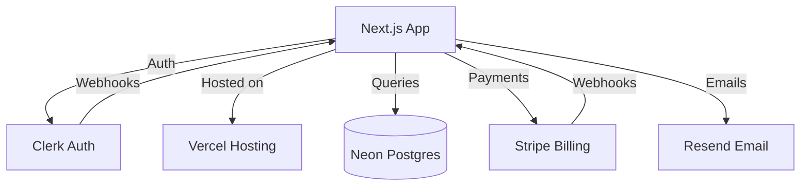

# Configuration Builder API Contract

## Overview

The configuration builder provides interactive UI (web + CLI TUI) for exploring technology options, validating compatibility, estimating costs, and generating configurations.

## Web UI Routes

```
GET  /config-builder              # Main configuration UI
GET  /config-builder/api/options  # Fetch all available options
POST /config-builder/api/validate # Validate current selections
POST /config-builder/api/estimate # Generate cost estimate
POST /config-builder/api/export   # Export configuration
POST /config-builder/api/import   # Import existing config
GET  /config-builder/api/diagram  # Generate architecture diagram
```

## CLI Interface

```bash
# Launch web UI
pnpm config:builder

# Launch terminal UI (TUI)
pnpm config:builder --tui

# Non-interactive mode (use with scripts)
pnpm config:builder --non-interactive \
  --database=neon \
  --auth=clerk \
  --hosting=vercel \
  --export=./my-config.yml
```

## Data Models

### Technology Option

```typescript
interface TechnologyOption {
  id: string;
  label: string;
  category: string;
  useWhen: string;
  metadata: {
    vendor: string;
    pricing: {
      freeTier: boolean;
      startingPrice: string;
      pricingUrl: string;
    };
    features: string[];
    limitations: string[];
    popularity: number; // GitHub stars, npm downloads, etc.
  };
  compatibility: {
    compatibleWith: Record<string, string[]>; // category -> option ids
    incompatibleWith: Record<string, string[]>;
    warnings: Record<string, string>; // condition -> warning message
  };
  integrationComplexity: 'simple' | 'moderate' | 'complex';
  docs: {
    quickstart: string;
    apiReference: string;
    examples: string[];
  };
}
```

### Configuration State

```typescript
interface ConfigurationState {
  id: string;
  name: string;
  description: string;
  createdAt: string;
  updatedAt: string;
  selections: Record<string, string>; // category -> option id
  validation: ValidationResult;
  costEstimate: CostEstimate;
  architectureDiagram: string; // SVG or Mermaid
}
```

### Validation Result

```typescript
interface ValidationResult {
  valid: boolean;
  errors: Array<{
    category: string;
    message: string;
    severity: 'error' | 'warning' | 'info';
    suggestedFix?: {
      category: string;
      suggestedOption: string;
      reason: string;
    };
  }>;
  compatibilityScore: number; // 0-100
  complexityScore: number; // 0-100
  recommendations: string[];
}
```

### Cost Estimate

```typescript
interface CostEstimate {
  currency: 'USD';
  breakdown: Array<{
    category: string;
    service: string;
    costAt1k: number;    // Monthly cost at 1,000 users
    costAt10k: number;   // Monthly cost at 10,000 users
    costAt100k: number;  // Monthly cost at 100,000 users
    billingModel: 'flat' | 'per-user' | 'usage-based' | 'tiered';
    notes: string;
  }>;
  totals: {
    at1k: number;
    at10k: number;
    at100k: number;
  };
  assumptions: string[];
  optimizations: Array<{
    suggestion: string;
    potentialSavings: number;
    tradeoffs: string;
  }>;
}
```

## Web UI Components

### 1. Category Grid

```typescript
interface CategoryCardProps {
  category: {
    id: string;
    name: string;
    description: string;
    required: boolean;
    icon: string;
  };
  options: TechnologyOption[];
  selectedOption: string | null;
  onSelect: (optionId: string) => void;
  validationState: 'valid' | 'warning' | 'error' | null;
}
```

Visual layout:
```
┌─────────────────────────────────────┐
│ 📊 Database                         │
│ Choose your data persistence layer  │
│                                     │
│ ┌─────────┐ ┌─────────┐ ┌─────────┐│
│ │  Neon   │ │Supabase │ │ Planet  ││
│ │    ✓    │ │         │ │ Scale   ││
│ └─────────┘ └─────────┘ └─────────┘│
│ ┌─────────┐                         │
│ │Cockroach│                         │
│ │   DB    │                         │
│ └─────────┘                         │
└─────────────────────────────────────┘
```

### 2. Option Detail Panel

```typescript
interface OptionDetailProps {
  option: TechnologyOption;
  selected: boolean;
  onSelect: () => void;
  compatibilityStatus: {
    compatible: boolean;
    warnings: string[];
    conflicts: string[];
  };
}
```

Shows:
- Detailed description
- Use-when guidance with examples
- Pricing tiers
- Feature comparison table
- Compatibility warnings
- Integration complexity indicator
- Community metrics (GitHub stars, npm downloads)
- Links to documentation

### 3. Cost Estimator Panel

```typescript
interface CostEstimatorProps {
  estimate: CostEstimate;
  userScale: 1000 | 10000 | 100000;
  onScaleChange: (scale: number) => void;
  showOptimizations: boolean;
}
```

Visual layout:
```
┌────────────────────────────────────────┐
│ 💰 Cost Estimate                       │
│                                        │
│ Scale: ○ 1K  ● 10K  ○ 100K users      │
│                                        │
│ ┌────────────────────────────────────┐│
│ │ Service        10K Users   % Total ││
│ │ ─────────────────────────────────  ││
│ │ Vercel         $20/mo      25%     ││
│ │ Neon           $10/mo      12%     ││
│ │ Clerk          $25/mo      31%     ││
│ │ Stripe         $0/mo        0%     ││
│ │ PostHog        $15/mo      19%     ││
│ │ Resend         $10/mo      12%     ││
│ │ ─────────────────────────────────  ││
│ │ Total:         $80/mo              ││
│ └────────────────────────────────────┘│
│                                        │
│ 💡 Optimizations:                     │
│ • Switch Clerk → Auth.js: Save $25/mo │
│ • Use Vercel KV vs Redis: Save $5/mo  │
└────────────────────────────────────────┘
```

### 4. Architecture Diagram Generator

```typescript
interface DiagramGeneratorProps {
  selections: Record<string, string>;
  format: 'mermaid' | 'svg' | 'png';
}
```

Generates:
- Component architecture diagram
- Data flow diagram
- Deployment architecture
- Service interaction map

Example Mermaid output:


## CLI TUI (Terminal UI)

Built with `ink` (React for CLI):

```typescript
interface TUIScreens {
  welcome: WelcomeScreen;
  categorySelection: CategorySelectionScreen;
  optionDetails: OptionDetailsScreen;
  validation: ValidationScreen;
  costEstimate: CostEstimatorScreen;
  export: ExportScreen;
}
```

Navigation:
- Arrow keys: Navigate between options
- Enter: Select option
- Tab: Next category
- Shift+Tab: Previous category
- Space: Show option details
- E: View cost estimate
- V: Validate selections
- X: Export configuration
- Q: Quit

Example TUI screen:
```
┌─ Riso SaaS Starter Configuration ───────────────────────────────────┐
│                                                                      │
│  1. Runtime      : ● Next.js 16      ○ Remix 2.x   ○ SvelteKit     │
│  2. Hosting      : ● Vercel          ○ Cloudflare  ○ Netlify       │
│  3. Database     : ● Neon            ○ Supabase    ○ PlanetScale   │
│  4. ORM          : ● Prisma          ○ Drizzle     ○ Kysely         │
│  5. Auth         : ● Clerk           ○ Auth.js     ○ WorkOS         │
│  6. Billing      : ● Stripe          ○ Paddle                       │
│                                                                      │
│  Progress: 6/14 categories  ✓ Valid  💰 $80/mo @ 10K users         │
│                                                                      │
│  [↑↓] Navigate  [Enter] Select  [Space] Details  [V] Validate      │
│  [E] Estimate  [X] Export  [Q] Quit                                │
└──────────────────────────────────────────────────────────────────────┘
```

## Export Formats

### Copier Answers YAML

```yaml
# Generated by Riso Configuration Builder
# Created: 2025-11-02T10:30:00Z
# Config ID: cfg_abc123

project_name: My SaaS App
project_slug: my-saas-app
saas_starter_module: enabled

# Core infrastructure
saas_runtime: nextjs-16
saas_hosting: vercel
saas_database: neon
saas_orm: prisma
saas_auth: clerk
saas_billing: stripe

# Additional services
saas_search: algolia
saas_cache: redis
saas_feature_flags: posthog
saas_cms: disabled

# Architecture
saas_architecture: multi-tenant-rls
saas_deployment_pattern: blue-green
saas_compliance: soc2

# Development
saas_dev_tools: true
saas_test_level: enhanced

_metadata:
  config_builder_version: "1.0.0"
  estimated_monthly_cost: 125.00
  complexity_score: 72
```

### JSON Export (for programmatic use)

```json
{
  "id": "cfg_abc123",
  "name": "Production B2B SaaS Stack",
  "created": "2025-11-02T10:30:00Z",
  "selections": { ... },
  "validation": { ... },
  "costEstimate": { ... },
  "compatibilityMatrix": { ... }
}
```

## Import Functionality

```typescript
interface ImportConfig {
  source: 'file' | 'url' | 'clipboard';
  data: string | ConfigurationState;
  merge: boolean; // Merge with current or replace
}
```

Supported imports:
- Existing `copier-answers.yml`
- Exported JSON configurations
- GitHub gist URLs
- Clipboard paste

## Comparison Mode

```typescript
interface ComparisonView {
  configs: ConfigurationState[];
  differences: Array<{
    category: string;
    values: Record<string, string>; // config id -> option id
    impact: {
      costDiff: number[];
      complexityDiff: number[];
      features: string[];
    };
  }>;
}
```

Visual layout:
```
┌─ Configuration Comparison ─────────────────────────────┐
│                                                         │
│ Category    Config A      Config B      Config C       │
│ ──────────────────────────────────────────────────     │
│ Database    Neon          Supabase      PlanetScale    │
│ Auth        Clerk         Auth.js       Clerk          │
│ Cache       Redis         KV Store      Disabled       │
│                                                         │
│ Cost @10K   $80/mo        $45/mo        $95/mo         │
│ Complexity  72/100        58/100        85/100         │
│                                                         │
│ Key Differences:                                        │
│ • Config B saves $35/mo but lacks org management       │
│ • Config C adds PlanetScale for better MySQL compat    │
└─────────────────────────────────────────────────────────┘
```

## Real-time Validation

As user selects options:

```typescript
interface LiveValidation {
  onSelectionChange: (category: string, optionId: string) => void;
  debounceMs: 300;
  validationEndpoint: '/api/validate';
  showInlineWarnings: boolean;
  highlightIncompatible: boolean;
}
```

Visual feedback:
- ✅ Green checkmark: Compatible selection
- ⚠️ Yellow warning: Works but has limitations
- ❌ Red X: Incompatible, must change
- Gray out incompatible options automatically

## Persistence

```typescript
interface ConfigPersistence {
  autosave: boolean;
  autosaveInterval: number; // milliseconds
  storage: 'localStorage' | 'sessionStorage' | 'file';
  cloudSync?: {
    enabled: boolean;
    provider: 'github' | 's3';
    credentials: Record<string, string>;
  };
}
```

Local storage schema:
```typescript
interface StoredConfig {
  configs: Record<string, ConfigurationState>;
  activeConfigId: string;
  recentConfigs: string[]; // config IDs
  favorites: string[];
}
```

## Analytics Integration

Track user behavior (anonymized):

```typescript
interface ConfigBuilderAnalytics {
  event: 'option_selected' | 'validation_run' | 'cost_estimated' | 'config_exported';
  properties: {
    category?: string;
    optionId?: string;
    validationResult?: 'valid' | 'warnings' | 'errors';
    costRange?: string;
  };
}
```

Insights collected:
- Most popular technology combinations
- Common validation errors
- Average time to complete configuration
- Export rate (configuration → actual project generation)
